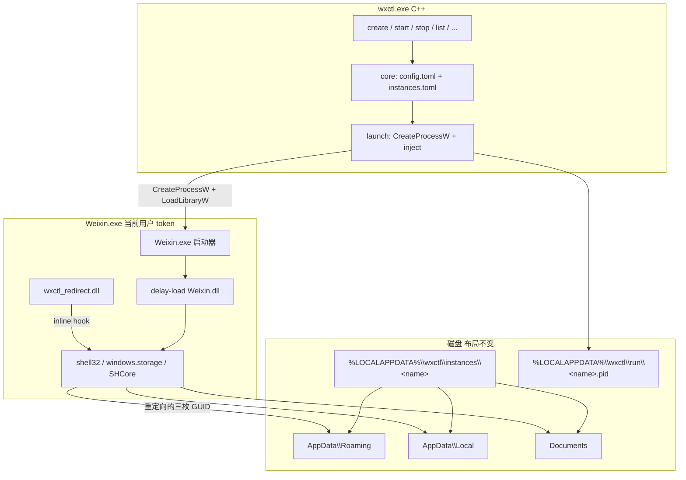

# Windows 原生 C/C++ 重写：最小 Known Folder Hook

- 仓库路径：`docs/changes/windows-cpp-rewrite.md`
- 作者：TBD
- 日期：2026-08-21
- 状态：Draft
- 产品：`wxctl` / `wechatctl`
- 范围：Windows 实现整体切到 C/C++；Linux Go 代码本阶段保留

---

## Overview

当前 Windows 主后端 `windows-redirect`（`internal/backend/windows_redirect.go`）用普通 `exec.Command` 以当前登录用户启动 `Weixin.exe`，只覆盖 `APPDATA` / `LOCALAPPDATA` / `WXCTL_INSTANCE`。2026-08-21 在本机实例 `test` 上实测：**纯环境变量隔离失败**。实例目录几乎空着，真实数据仍写入当前用户：

```text
%APPDATA%\Tencent\xwechat\net_3
%USERPROFILE%\Documents\xwechat_files\wxid_...
```

结论：微信 4 定位 AppData / Documents 走 Known Folder API（`SHGetKnownFolderPath` / `SHGetFolderPath` 一族），不读进程环境变量。`LOCALAPPDATA` 环境变量只被部分系统组件继承（实例 `AppData\Local` 里出现了 `Microsoft\Windows\Caches`）。

下一步不再补 Go、不再做混合栈。Windows 产品改为单一原生树：

```text
C++ CLI（wxctl.exe）
    +
C 注入器（同一可执行文件内）
    +
C hook DLL（wxctl_redirect.dll）
```

只 inline-hook 三个 Known Folder，把查询打到既有实例目录。进程仍是当前 Windows 登录用户。不造用户、不改注册表、不做文件系统虚拟化。

---

## Background & Motivation

### 已经放弃的路线

1. **`windows-user`**（`docs/changes/windows-multi-users.md`）
   独立本地用户 + `CreateProcessWithLogonW`。数据能隔离，但 DWM 灰框、TSF/中文输入法不可用。代码已从仓库删除。本方案**禁止复活**。

2. **纯环境变量 `windows-redirect`**（`docs/changes/windows-profile-redirect.md` 第一阶段）
   已在本机证伪。微信不靠 `APPDATA` / `USERPROFILE` 拼数据路径。

`windows-profile-redirect.md` 第二阶段本来允许「Go CLI + 极小 runtime DLL」。用户明确拒绝混合栈，也不接受 C# / Go c-shared。因此 Windows 侧整体切 C/C++。

### 当前 Go Windows 后端在做什么

`internal/backend/windows_redirect.go`：

- 默认后端名：`windows-redirect`（`internal/backend/windows_platform.go`）
- `exec.Command` / 当前用户 token
- 覆盖 `APPDATA`、`LOCALAPPDATA`、`WXCTL_INSTANCE`
- **不改** `USERPROFILE` / `HOMEDRIVE` / `HOMEPATH`
- CWD = 微信安装目录；自动补 `--user-lib-dir`
- 预创建 `%LOCALAPPDATA%\wxctl\instances\<name>\AppData\Roaming|Local` 和 `Documents`
- 不设 `HideWindow`；detach 用 `CREATE_NEW_PROCESS_GROUP`
- detach 后等约 2 秒确认 `STILL_ACTIVE`
- `stop`：`EnumWindows` + `WM_CLOSE`，超时 `taskkill /T /F`

这些启动约束继续有效。失败的只有「靠环境变量改 Known Folder 结果」这一条。

### 仍必须遵守的坑（`docs/windows-pitfalls.md`）

- `Weixin.exe` 是启动器；真正代码在版本目录 `Weixin.dll`（delay-load）
- CWD 必须是安装目录；传 `--user-lib-dir`
- 微信 4 是 Chromium：**不要** `CREATE_SUSPENDED` + Job Object（会静默退出）
- wxctl **不**绕过微信单实例 mutex；机器上已有外部 hook
- 不要设 HideWindow

### 2026-08-21 PoC 观察（实例 `test`，backend `windows-redirect`）

启动命令：

```text
Weixin.exe --user-lib-dir=C:\Program Files\Tencent\Weixin\4.1.7.33
```

| 位置 | 结果 |
|------|------|
| 实例 `AppData\Roaming` | 空，无 `Tencent\xwechat` |
| 实例 `Documents` | 空，无 `xwechat_files` |
| 实例 `AppData\Local` | 仅 `Microsoft\Windows\Caches` |
| 真实 `%APPDATA%\Tencent\xwechat\net_3` | 10:18:28 有写入 |
| 真实 `%USERPROFILE%\Documents\xwechat_files\wxid_cp9864hnol3122_aae4` | 10:18:29 有写入 |

不要对 `Weixin.exe` / `Weixin.dll` 做 PE import / dumpbin / strings 逆向。后续设计只基于公开 API 和上述文件系统现象。

---

## Goals & Non-Goals

### Goals

- 所有微信实例都以**当前 Windows 登录用户**运行
- 只隔离微信数据目录
- 保持 DWM/主题、TSF/IME、剪贴板、拖拽、托盘
- Hook **仅**下列 Known Folder：
  - `FOLDERID_RoamingAppData` → `<instance>\AppData\Roaming`
  - `FOLDERID_LocalAppData` → `<instance>\AppData\Local`
  - `FOLDERID_Documents` → `<instance>\Documents`
- 继续使用现有磁盘布局和 `instances.toml`，不引入 `instance.json`
- Windows 产品改为 C/C++：CLI + 注入器 + hook DLL 同一原生树
- 保留现有 CLI 产品面：`create`、`start`、`stop`、`restart`、`list`/`ls`、`show`、`status`、`edit`、`remove`/`rm`、`desktop sync`、`config get|set`、`export`、`import`
- Linux `migrate` 不进入 Windows C++ v1
- 先 PoC 再 CLI 对等，最后双账号验收

### Non-Goals（明确不要做）

- 不要创建额外 Windows 用户
- 不要复活 `windows-user` / `CreateProcessWithLogonW` / `LogonUser` / `LoadUserProfile`
- 不要隔离或虚拟化注册表
- 不要依赖 Sandboxie / MSIX / 其它第三方运行时
- 不要 Hook `CreateFile` / `NtCreateFile` / Registry API（除非以后有直接证据）
- 不要做迷你 Sandboxie / 通用文件系统虚拟化
- 不要伪造完整 `USERPROFILE` / `HOMEDRIVE` / `HOMEPATH`
- 不要改 `HKCU\Software\Microsoft\Windows\CurrentVersion\Explorer\User Shell Folders`（用户全局）
- 不要用 `AppInit_DLLs`
- 不要把主进程放进 Job Object
- 不要绕过微信单实例 mutex
- 不要在微信进程里跑 Go runtime / CLR
- 不要长期并行维护一套 Go Windows 后端
- 不要为每个实例复制一份微信
- Windows v1 不做 Linux `migrate`，也不把 Linux Go 一并重写成 C

---

## Key Decisions

1. **Windows 整栈改 C/C++，不保留 Go Windows 后端。**
   用户已否决混合栈。Go 的 `exec.Command` 也无法在不引入 C DLL 的前提下拦截 Known Folder。Windows 上 `go build ./cmd/wxctl` 最终应编不过或明确拒绝，避免再发出已证伪的环境变量后端。

2. **Linux Go 本阶段留在同一仓库，不纳入 Windows v1。**
   `linux-home`（`internal/backend/linux.go`）仍然有效。Windows 重写不阻塞 Linux 用户。是否以后把 Linux 也 port 到 C 见 Open Questions。

3. **隔离机制 = 最小 Known Folder inline hook，不是 IAT-only。**
   `Weixin.exe` 是启动器，真正逻辑在 delay-load 的 `Weixin.dll`。只补 `Weixin.exe` IAT 会漏。Win10+ 上 `shell32!SHGetKnownFolderPath` 还可能转发到 `windows.storage.dll` / `SHCore.dll`。要对**实现模块**做 inline hook。

4. **Hook DLL 用 C + 静态/无 CRT；CLI 用 C++17。**
   注入微信的 DLL 避免 C++ 运行时、异常和动态 CRT。CLI 可以用 C++。工具链：MSVC v143（VS 2022），CMake。clang-cl 可选，不作为门槛。

5. **Detour 库选 MinHook（BSD-2-Clause），vendor 进仓库。**
   只要 hook 3 个 Known Folder 相关导出。MinHook 体积小、源码少、许可清晰。Detours 虽已 MIT，但更大，对这个面过重。

6. **注入方式：当前用户 `CreateProcessW` + `VirtualAllocEx` / `WriteProcessMemory` / `CreateRemoteThread(LoadLibraryW)`。**
   可对主线程使用 `CREATE_SUSPENDED`，但**禁止**再挂 Job Object。注入完成后再 `ResumeThread`。Chromium `--type=` 子进程不作为 v1 文件系统虚拟化范围。

7. **路径通过环境变量传给 DLL，同时继续覆盖 `APPDATA` / `LOCALAPPDATA`。**
   DLL 读 `WXCTL_APPDATA`、`WXCTL_LOCALAPPDATA`、`WXCTL_DOCUMENTS`、`WXCTL_INSTANCE`。父进程其余环境原样复制。不伪造 `USERPROFILE`。继续设 `APPDATA`/`LOCALAPPDATA`，因为 PoC 已证明部分系统组件会读它们。

8. **后端标识仍叫 `windows-redirect`。**
   现有 `instances.toml` 已写这个值。实现从「改环境变量」换成「Known Folder hook」，对用户仍是「当前用户 + 数据目录重定向」。不要新造 `windows-hook`，不要 `instance.json`。

9. **先 PoC，后 CLI 对等，再双账号验收。**
   顺序不可反。没有「数据落到实例目录」的证据，不把 C++ CLI 铺全。

10. **v1 只构建 x64。**
    微信 4 的 `Weixin.exe` 是 64 位。不做 WOW64、不做 ARM64。

---

## Proposed Design

### 仓库策略

```text
wechatctl/
  cmd/wxctl/                 # Linux Go CLI；Windows 构建关闭
  internal/                  # Linux Go；Windows 平台文件删除
  win/                       # Windows 唯一产品实现
    CMakeLists.txt
    include/wxctl/
    src/
      cli/                   # C++17 CLI
      core/                  # 路径、TOML、pid、weixin 版本目录
      launch/                # CreateProcess + 注入
      hook/                  # C11 DLL
      desktop/               # IShellLink 写 .lnk
    third_party/
      minhook/
      tomlplusplus/          # 仅 CLI 使用
    tests/
      kflist/                # 调用 SHGetKnownFolderPath 的测试宿主
  docs/changes/
    windows-cpp-rewrite.md   # 本文
  Taskfile.yml               # Windows 走 CMake；Linux 仍 go build
```

Windows 开发者日常：

```powershell
task build          # 在 Windows 上改为 cmake --build，产出 wxctl.exe + wxctl_redirect.dll
```

Linux 开发者日常不变：

```bash
task build          # go build -o wxctl ./cmd/wxctl
```

Go 侧处理：

- 给 `cmd/wxctl/*.go` 加 `//go:build !windows`
- 删除 Windows 专用 Go 文件，**不要**留一个「还能启动微信但不隔离」的 Go 后端
- 删除文件：
  - `internal/backend/windows_redirect.go`
  - `internal/backend/windows_redirect_test.go`
  - `internal/backend/windows_launch.go`
  - `internal/backend/windows_weixin.go`
  - `internal/backend/windows_platform.go`
  - `internal/config/defaults_windows.go`
  - `internal/paths/paths_windows.go`
  - `internal/desktop/desktop_windows.go`
- 保留 Linux：`internal/backend/linux.go`、`internal/paths/paths_unix.go`、`internal/desktop/desktop_unix.go`、`internal/config/defaults_unix.go`

不要搞 `win/` 与 `internal/backend/windows_*.go` 双轨。

### 语言与工具链

| 目标 | 语言 | 标准 | 运行时 | 说明 |
|------|------|------|--------|------|
| `wxctl_redirect.dll` | C | C11 | 尽量 `/NODEFAULTLIB`；否则 `/MT` | 禁止 C++ 异常、RTTI、动态 CRT。链接 `kernel32`、`ole32`、`shell32`、`advapi32`（若需要） |
| `wxctl.exe` | C++ | C++17 | `/MT`（`MultiThreaded`） | 单文件 CLI，不依赖 VC++ 红包 |
| 测试宿主 `wxctl_kflist.exe` | C | C11 | `/MT` | 只调 Known Folder API，供 hook 单测 |

- 生成器：CMake ≥ 3.24，Visual Studio 17 2022，工具集 `v143`，Windows 10 SDK
- 平台：`x64` only
- `CMAKE_MSVC_RUNTIME_LIBRARY=MultiThreaded`
- UNICODE：`UNICODE` / `_UNICODE`，wchar_t 路径
- clang-cl 不作为 CI 门槛
- MinHook 以源码 vendor 到 `win/third_party/minhook/`，保留其 `LICENSE.txt`
- toml++ 仅链接进 CLI，**禁止**进入 hook DLL

`Taskfile.yml` 增加 Windows 任务，示意：

```yaml
build:
  cmds:
    - cmd: cmake --build build/win --config Release
      platforms: [windows]
    - cmd: go build -o {{.APP}}{{exeExt}} ./cmd/wxctl
      platforms: [linux, darwin]
```

构建产物放仓库根（与现在 `wxctl.exe` 一致），便于本地替换：

```text
wxctl.exe
wxctl_redirect.dll
```

DLL 必须与 exe 同目录。启动时用 `GetModuleFileNameW(NULL, ...)` 拼绝对路径再 `LoadLibraryW`，不要依赖 DLL 搜索顺序。

### 架构



### 启动与注入时序

```mermaid
sequenceDiagram
  participant CLI as wxctl.exe
  participant OS as kernel32
  participant WX as Weixin.exe 主线程
  participant RT as 远程 LoadLibrary 线程
  participant HOOK as wxctl_redirect.dll

  CLI->>CLI: 读 instances.toml / 预建目录
  CLI->>CLI: 复制环境，写入 WXCTL_* 与 APPDATA/LOCALAPPDATA
  CLI->>OS: CreateProcessW(CREATE_SUSPENDED, 无 Job)<br/>CWD=安装目录, --user-lib-dir
  OS-->>CLI: PROCESS_INFORMATION
  CLI->>OS: VirtualAllocEx + WriteProcessMemory(DLL 绝对路径)
  CLI->>RT: CreateRemoteThread(LoadLibraryW)
  RT->>HOOK: DllMain(PROCESS_ATTACH)<br/>只读环境变量，CreateThread(Setup)
  RT-->>CLI: LoadLibrary 返回
  HOOK->>HOOK: Setup：LoadLibrary shell32/windows.storage/SHCore<br/>MinHook 三个 Known Folder 系列导出
  HOOK-->>CLI: 命名 Event Local\\wxctl-hook-ready-&lt;pid&gt;
  CLI->>WX: ResumeThread
  Note over WX: 此后 delay-load Weixin.dll<br/>Known Folder 查询已转向实例目录
  CLI->>CLI: 写 pid 文件；detach 则 2s 内确认 STILL_ACTIVE
```

约束：

- **可以** `CREATE_SUSPENDED`，以便 hook 赶在 `Weixin.dll` 查询目录之前装上
- **不可以** `AssignProcessToJobObject`
- **不可以** `HideWindow` / `CREATE_NO_WINDOW` / `SW_HIDE` 主窗口
- detach 时加 `CREATE_NEW_PROCESS_GROUP` + `CREATE_UNICODE_ENVIRONMENT`，与现 Go 后端一致
- 若发现单独 `CREATE_SUSPENDED`（无 Job）仍导致微信静默退出：改为不挂起启动，主线程 resume 后立刻注入，并在文档里记下。v1 先按挂起注入实现
- 注入失败则终止刚创建的进程，向 CLI 返回明确错误，不要留下未隔离的微信

### Hook 实现

#### 要 hook 的 API

只 hook Known Folder **查询**。v1 列表：

| API | 模块（按顺序尝试） | 重定向条件 |
|-----|-------------------|------------|
| `SHGetKnownFolderPath` | `shell32`、`windows.storage`、`SHCore` | `FOLDERID_RoamingAppData` / `FOLDERID_LocalAppData` / `FOLDERID_Documents` |
| `SHGetFolderPathW` | `shell32` | `CSIDL_APPDATA (0x1A)` / `CSIDL_LOCAL_APPDATA (0x1C)` / `CSIDL_PERSONAL (0x05)`（先 `& ~CSIDL_FLAG_MASK`） |
| `SHGetFolderPathA` | `shell32` | 同上，结果转 ACP |
| `SHGetSpecialFolderPathW` / `A` | `shell32` | 同上 CSIDL |

GUID（公开 Known Folder ID，不是从微信二进制抄的）：

```text
FOLDERID_RoamingAppData  {3EB685DB-65F9-4CF6-A03A-E3EF65729F3D}
FOLDERID_LocalAppData    {F1B32785-6FBA-4FCF-9D55-7B8E7F157091}
FOLDERID_Documents       {FDD39AD0-238F-46AF-ADB4-6C85480369C7}
```

明确**不要**重定向：

- `FOLDERID_Profile` / `CSIDL_PROFILE`（等于伪造 USERPROFILE）
- `FOLDERID_Desktop`、`FOLDERID_Downloads`、`FOLDERID_LocalAppDataLow`、`FOLDERID_ProgramData`
- 其它一切 Known Folder

`KF_FLAG_CREATE` / `CSIDL_FLAG_CREATE`：对重定向路径 `CreateDirectoryW`（已预创建则成功），然后返回实例路径。

`SHGetKnownFolderPath` 返回的字符串必须 `CoTaskMemAlloc`，与原 API 一致。调用方负责 `CoTaskMemFree`。

其它 GUID / CSIDL：原样调用 trampoline。hook 失败时 fail-open：不重定向，但 CLI 必须把安装失败当成 `start` 错误（不能默默用真实 AppData 跑微信）。

#### 为什么不是 IAT-only

- `Weixin.exe` 是 ~3MB 启动器；真正代码在版本目录 `Weixin.dll`，delay-load
- delay-load / `GetProcAddress` 不会走 `Weixin.exe` 的静态 IAT
- Win10+ `shell32` 的部分导出是 forwarder，真正实现可能在 `windows.storage.dll` 或 `SHCore.dll`

因此：对 `GetProcAddress` 拿到的实际代码地址做 MinHook inline hook。若 `shell32` 导出是跳板，跟着跳到目标模块再 hook；同时若 `windows.storage` / `SHCore` 仍有同名导出，一并 hook，避免漏网。

不要解析 `Weixin.exe` / `Weixin.dll` 的 PE import 表。

#### 不要做的 hook

```text
CreateFileW / CreateFileA
NtCreateFile / NtOpenFile
RegOpenKey* / RegCreateKey* / RegOverridePredefKey
CreateProcessW（v1 不为了注入子进程去 hook）
SHGetKnownFolderIDList / IKnownFolder::GetPath   # 除非主进程 PoC 仍写真实 Documents
```

`IKnownFolder` COM 列为 **PoC 失败后的下一步**，不是 v1 默认范围。

#### DLL 内部

文件：`win/src/hook/wxctl_redirect.c`

导出（`.def` 固定名字，避免 C 修饰）：

```c
/* 在 loader lock 之外安装 MinHook。由 DllMain 拉起的工作线程调用。 */
BOOL WxctlRedirectSetup(void);
```

`DllMain`：

1. `DisableThreadLibraryCalls`
2. 读 `WXCTL_APPDATA` / `WXCTL_LOCALAPPDATA` / `WXCTL_DOCUMENTS` / `WXCTL_INSTANCE`
3. 任一关键路径为空则**不 hook**（防止被误加载）
4. `CreateThread(WxctlRedirectSetup)`，不要在 `DllMain` 里 `LoadLibrary` 其它模块
5. Setup 完成后 `SetEvent` 命名事件 `Local\wxctl-hook-ready-<pid>`

Setup：

1. `LoadLibraryW` `shell32.dll`；尝试 `windows.storage.dll`、`SHCore.dll`
2. `MH_Initialize`
3. 对上面 API `MH_CreateHook` + `MH_EnableHook`
4. 成功则 set ready event

日志默认关闭。`WXCTL_HOOK_LOG=1` 时追加写：

```text
%LOCALAPPDATA%\wxctl\logs\<instance>-hook.log
```

不要弹 MessageBox，不要在微信进程里写 stdout。

路径匹配伪代码：

```c
/* 按 Known Folder GUID 返回实例路径；未命中返回 NULL，走原 API。 */
static const wchar_t *lookup_known_folder(REFKNOWNFOLDERID id)
{
    if (IsEqualGUID(id, &FOLDERID_RoamingAppData)) return g_appdata;
    if (IsEqualGUID(id, &FOLDERID_LocalAppData))   return g_localappdata;
    if (IsEqualGUID(id, &FOLDERID_Documents))      return g_documents;
    return NULL;
}
```

### 注入器

文件：`win/src/launch/inject.cpp`（逻辑也可用 C；CLI 侧 C++ 调用）

步骤：

1. `CreateProcessW`，`lpApplicationName` = `Weixin.exe` 绝对路径
2. 命令行：原样附加用户 `--` 后参数；若无 `--user-lib-dir` 且找到版本目录，则追加 `--user-lib-dir=<版本目录>`
3. `lpCurrentDirectory` = 安装目录（`Weixin.exe` 所在目录），移植 `internal/backend/windows_weixin.go` 的 `weixinRuntimeDirs` / `findWeixinVersionDir`
4. `lpEnvironment` = Unicode 环境块
5. `VirtualAllocEx` + `WriteProcessMemory` 写入 `wxctl_redirect.dll` 的 UTF-16 绝对路径
6. `CreateRemoteThread(LoadLibraryW)`
7. `WaitForSingleObject` 远程线程
8. 等 `Local\wxctl-hook-ready-<pid>`，超时（建议 3s）则杀进程并报错
9. `ResumeThread` 主线程
10. 写 `%LOCALAPPDATA%\wxctl\run\<name>.pid`
11. detach：2 秒内 `GetExitCodeProcess == STILL_ACTIVE`，否则报现有文案风格的错误：微信立刻退出，确认多开 hook 是否生效

`LoadLibraryW` 地址用本进程 `GetProcAddress(GetModuleHandleW(L"kernel32.dll"), "LoadLibraryW")`。x64 无 WOW64 重定向问题。

不要：

- `AppInit_DLLs`
- 改 User Shell Folders
- 把 DLL 复制进 `C:\Program Files\Tencent\Weixin\`
- 用 `SetWindowsHookEx` 做注入

### 环境变量

复制父进程完整环境，然后按 Windows 大小写不敏感规则覆盖：

| 变量 | 值 | 目的 |
|------|----|------|
| `WXCTL_APPDATA` | `<home>\AppData\Roaming` | DLL 重定向 Roaming |
| `WXCTL_LOCALAPPDATA` | `<home>\AppData\Local` | DLL 重定向 Local |
| `WXCTL_DOCUMENTS` | `<home>\Documents` | DLL 重定向 Documents |
| `WXCTL_INSTANCE` | 实例名 | 与现常量 `paths.InstanceEnvKey` 一致 |
| `APPDATA` | 同 `WXCTL_APPDATA` | 给仍读环境变量的系统组件（PoC 中 Caches 已证明） |
| `LOCALAPPDATA` | 同 `WXCTL_LOCALAPPDATA` | 同上 |

不要改：

```text
USERPROFILE
HOMEDRIVE
HOMEPATH
PUBLIC
SystemRoot
TEMP / TMP     # 保持当前用户临时目录；不要指到实例目录
```

`TEMP` 不改：避免把系统组件的临时文件政策扩成「伪 Profile」。

### Chromium 子进程

官方子进程类似：

```text
Weixin.exe --user-lib-dir="C:\Program Files\Tencent\Weixin\4.1.7.33" --no-sandbox --type=...
```

v1：只注入 `wxctl start` 创建的那一个主进程。浏览器主进程负责用户数据目录是 Chromium 常规模型。

若双账号 PoC 发现 `--type=` 子进程把文件写到真实 Documents / AppData，再单开 follow-up：在**已注入的主进程**里 hook `CreateProcessW`，对同一 `Weixin.exe` 子进程重复注入。这不是 v1 范围，也不是通用文件系统虚拟化。

### 进程生命周期（对齐现 Go 行为）

| 动作 | 实现 |
|------|------|
| `start` 前台 | 继承 stdio，`WaitForSingleObject` 主进程；退出码透传 |
| `start --detach` | 不继承 stdio，2s 保活检查，`CloseHandle` 后返回 |
| `stop` | `EnumWindows` 对 pid 树顶层窗口 `PostMessage(WM_CLOSE)`；默认等 5s；超时 `taskkill /PID <pid> /T /F` |
| `status` / `list` | 读 pid 文件 + `OpenProcess(PROCESS_QUERY_LIMITED_INFORMATION)` + `GetExitCodeProcess == 259` |
| 已在跑 | `start` 报 `instance %q is already running (pid %d)` |

`DisplayUser` 固定输出 `current-user`。

`backend` 列继续打印 `windows-redirect`。若 `instances.toml` 里仍是 `windows-user`：拒绝 `start`，提示备份数据后重新 `wxctl create`。不要自动删旧本地用户。

### CLI 产品面

C++ CLI 复刻现有 cobra 命令与输出格式，便于肌肉记忆。参数解析用手写小解析器即可（命令集固定），不必引入 CLI11。

必须实现：

```text
wxctl create <name> [--alias] [--tags] [--note]
wxctl list | ls
wxctl show <name>
wxctl start <name> [--detach] [-- wechat-args...]
wxctl stop <name> [--timeout]
wxctl restart <name> [--timeout] [--detach] [-- wechat-args...]
wxctl status
wxctl edit <name> [--alias|--note|--tags|--wechat-bin|--im-module]
wxctl remove|rm <name> [--purge] [--yes]
wxctl desktop sync
wxctl config get [key]
wxctl config set <key> <value>
wxctl export <file>
wxctl import <file>
```

不要在 Windows v1 做 `wxctl migrate`（那是 Linux `~/.local/share/wechat-profiles`）。调用时打印「仅 Linux」并返回非 0。

实例名规则保持：`^[a-zA-Z0-9_-]+$`。中文显示名走 `--alias`。

`list` 表头保持：

```text
NAME  BACKEND  USER  STATUS  PID  SIZE  ALIAS  NOTE
```

快捷方式：用 `IShellLink` / `IPersistFile` 写

```text
%APPDATA%\Microsoft\Windows\Start Menu\Programs\wxctl\wxctl-<name>.lnk
```

目标：`wxctl.exe` 绝对路径；参数：`start <name> --detach`；图标：`Weixin.exe`。不要再调 PowerShell COM。

### 实施顺序（PoC-first）

严格按这个顺序。前一步没过，不开始下一步。

#### Step 1 — 测试宿主 + hook DLL

做一个 `wxctl_kflist.exe`：调用 `SHGetKnownFolderPath` / `SHGetFolderPathW` 打印三个目录。注入器对它执行完整 CreateProcess+inject。断言打印路径等于实例目录，其它 Known Folder 仍是系统值。这一步不启动微信。

#### Step 2 — 注入真实 `Weixin.exe`

用同一注入器启动微信（当前用户、正确 CWD、`--user-lib-dir`）。扫码前先看文件系统：

```text
实例 AppData\Roaming\Tencent\xwechat     必须出现
实例 Documents\xwechat_files             必须出现
真实 %APPDATA%\Tencent\xwechat           本次运行不得新增
真实 %USERPROFILE%\Documents\xwechat_files  本次运行不得新增
```

IME / DWM 目视正常。失败则先扩 Known Folder 列表（`SHGetSpecialFolderPath`、必要时 `IKnownFolder`），**不要**立刻上 `CreateFile` hook。

#### Step 3 — C++ CLI 对等

把 create/list/start/stop/... 接到同一套 launch 代码。读写现有 TOML。

#### Step 4 — 双账号验收

走下面「验收标准」9 条。

---

## API / Interface Changes

对外 CLI 不变。Windows 上二进制来源变了：`go build` 不再产出可用的隔离器。

对微信进程：多加载一个 `wxctl_redirect.dll`。没有新的 RPC、没有本地服务、没有驱动。

环境变量新增三个给 DLL 读（CLI 设置）：

```text
WXCTL_APPDATA
WXCTL_LOCALAPPDATA
WXCTL_DOCUMENTS
```

`WXCTL_INSTANCE` 已存在（`internal/paths/paths.go` 常量 `InstanceEnvKey`）。

C 导出：

```c
#ifdef __cplusplus
extern "C" {
#endif

/* 安装 Known Folder inline hook。成功返回 TRUE。 */
__declspec(dllexport) BOOL WxctlRedirectSetup(void);

#ifdef __cplusplus
}
#endif
```

注入器对外部无稳定 API，只给 `wxctl.exe` 内部 `start` 用。

---

## Data Model Changes

**无 schema 变更。** 继续用现有文件，C++ 必须能读 Go 写出来的 TOML。

```text
%APPDATA%\wxctl\config.toml
%APPDATA%\wxctl\instances.toml
%LOCALAPPDATA%\wxctl\instances\<name>\AppData\Roaming
%LOCALAPPDATA%\wxctl\instances\<name>\AppData\Local
%LOCALAPPDATA%\wxctl\instances\<name>\Documents
%LOCALAPPDATA%\wxctl\run\<name>.pid
%APPDATA%\Microsoft\Windows\Start Menu\Programs\wxctl\wxctl-<name>.lnk
%PUBLIC%\wechatctl-share\
```

不要新增 `instance.json`。`windows-profile-redirect.md` 里的 json 只是早期草案，现项目没用。

### `config.toml`

字段与 `internal/config/config.go` 一致：

```toml
wechat_bin = 'C:\Program Files\Tencent\Weixin\Weixin.exe'
profiles_root = '...'
shared_dir = '...'
im_module = ''
```

Windows 仍保留 `im_module` 键以免 round-trip 丢字段；值空。路径允许 `~` 前缀，解析规则对齐 `paths.ExpandPath`。

探测顺序对齐 `internal/config/defaults_windows.go`：

```text
%ProgramFiles%\Tencent\Weixin\Weixin.exe
%ProgramFiles(x86)%\Tencent\Weixin\Weixin.exe
C:\Program Files\Tencent\Weixin\Weixin.exe
… WeChat\WeChat.exe（旧版候选；v1 启动器仍按 Weixin.exe 为主）
```

找不到就默认 `C:\Program Files\Tencent\Weixin\Weixin.exe`，真正缺失时 `start` 再报错。

### `instances.toml`

```toml
[[instance]]
name = "work"
alias = "公司号"
tags = ["work"]
note = "工作账号"
created_at = 2026-08-21T10:18:28+08:00
wechat_bin = ""
im_module = ""
backend = "windows-redirect"
```

`created_at` 按 RFC3339 读写，兼容 pelletier/go-toml 已写文件。toml++ 放 CLI 里做 marshal。

`backend`：

- 空或 `windows-redirect`：正常
- `windows-user`：拒绝 start/restart，提示重建
- 其它值：拒绝并打印未知后端

`import`：把外来 backend 规范化为 `windows-redirect`（对齐 `normalizeImported`）。导入只建目录和注册表，不搬聊天数据。

### pid 文件

纯文本 PID + 换行，原子写（`.tmp` + `MoveFileEx`）。与 `internal/backend/pid.go` 相同。

### 迁移

已有 `%LOCALAPPDATA%\wxctl\instances\<name>\` 目录直接用。C++ `create` 对已存在目录 `MkDir` 幂等。不要二次搬家，不要改结构。

---

## Alternatives Considered

### 1. 保留 Go CLI + C hook DLL（混合栈）— 拒绝

用户已否决。两套工具链、两份发布物、注入路径还要 Go/C 来回编。Known Folder hook 是 Windows 核心路径，CLI 再留 Go 没有收益。

### 2. C# / Native AOT / EasyHook+CLR — 拒绝

CLR 进 `Weixin.exe`（Chromium）比一张 C DLL 糟得多：运行时、GC 暂停、默认依赖、杀软更敏感。Native AOT 仍不是一张最小 C DLL。EasyHook 对这 3 个 API 过重。

### 3. Go `-buildmode=c-shared` 注入微信 — 拒绝

Go runtime + GC 进 Chromium 进程。体积、线程模型、cgo 初始化都不可控。明确禁止。

### 4. 复活 `windows-user` / `CreateProcessWithLogonW` — 拒绝

灰框和 IME 是跨用户 GUI 的系统限制，不是漏修 HWND（见 `docs/windows-pitfalls.md` §7–8）。与「当前用户 + 只隔离数据目录」目标相反。

### 5. 注册表虚拟化 / Sandboxie / MSIX — 拒绝

目标不是沙箱。注册表目前无隔离需求；微信安装路径等 HKCU 应共享。Sandboxie 有驱动/服务依赖。MSIX 改分发模型，帮不上 Known Folder。

### 6. 宽文件系统 hook（`CreateFile` / `NtCreateFile`）— 拒绝

没有证据表明微信用绝对硬编码 `C:\Users\<login>\Documents\...` 且绕过 Known Folder。先 hook 查询 API。宽 FS hook 就是迷你 Sandboxie，排除。

### 7. 伪造完整 `USERPROFILE` — 拒绝

会把桌面、NTUSER、IME、主题路径一起拖偏。PoC 阶段有意不改 `USERPROFILE`。Documents 用 Known Folder hook 解决。

### 8. 只 hook `Weixin.exe` IAT — 拒绝

启动器 IAT 覆盖不了 delay-load 的 `Weixin.dll`，也覆盖不了 `GetProcAddress` 和 `windows.storage` forwarder。

### 9. Microsoft Detours — 不采用（备选）

Detours 4 已是 MIT，能力完整，体积和 API 面都比 MinHook 大。本需求是 3 组 Known Folder 导出的 inline hook。选 MinHook。若 MinHook 在某台 Win11/未来 ARM 上搞不定，再评估 Detours，不作为 v1。

### 10. 改 HKCU User Shell Folders — 拒绝

这是**用户全局**重定向，所有程序的 Documents/AppData 都会变，且不能按实例切换。直接违反「只隔离微信」。

---

## Security & Privacy Considerations

威胁模型：wxctl 在**当前用户**下启动**当前用户**的微信，再向该进程注入自己的 DLL。不是跨用户、不是提权。

| 风险 | 严重度 | 缓解 |
|------|--------|------|
| Defender / AV 把 `CreateRemoteThread`+`LoadLibrary` 当注入木马 | 中 | 用 DLL 绝对路径；v1 文档说明可能误报；不写 AppInit；后续可 Authenticode（见 Open Questions）。不要关实时保护当「方案」 |
| 第三方向微信进程注入同名 DLL | 低 | 只认 `GetModuleFileName` 拼出的绝对路径；不搜 `PATH` |
| hook 装失败仍启动微信，数据写回真实 Profile | 高 | ready event 超时则杀进程，`start` 失败 |
| 重定向路径来自环境变量，被父进程污染 | 低 | 只有 wxctl 启动的进程才带 `WXCTL_*`；DLL 无这些变量则不 hook |
| 日志里写路径 / 实例名 | 低 | 默认关闭；不写聊天内容、不写 token |
| 注册表 / DPAPI | 无新增 | 不碰注册表；不再保存其它用户密码。旧 `windows-user` 的 DPAPI 问题随该后端消失 |

DLL 搜索顺序：`LoadLibraryW` 只用绝对路径。可在注入前对目标进程 `SetDllDirectoryW(L"")` **不要做**——那是远程再调一个 API，增加攻击面。控制好我们自己的绝对路径即可。

不需要管理员。`create` / `start` / `stop` / `remove --purge` 都在当前用户下跑。

---

## Observability

- CLI：错误走 stderr，风格对齐现 Go（短句、带实例名、带路径）
- pid / list / status：沿用现有字段，不加新守护进程
- hook：`WXCTL_HOOK_LOG=1` 才写 `%LOCALAPPDATA%\wxctl\logs\<instance>-hook.log`，一行一条：时间、API 名、GUID/CSIDL、返回路径
- 不打点、不上报、不联网
- `start` 失败必须能区分：
  - `Weixin.exe` 不存在
  - 注入 / `LoadLibrary` 失败
  - hook ready 超时
  - 进程 2s 内退出（多开 mutex / Chromium 启动失败）

没有单独 metrics。验收靠文件系统时间戳和双账号登录态。

告警：无服务，无告警。开发者靠上述日志。

---

## Rollout Plan

无服务端 feature flag。按 PR 增量合入（见文末 PR Plan）。

1. **文档合入** `docs/changes/windows-cpp-rewrite.md`
2. **PoC 分支**：`win/` 能对 `wxctl_kflist.exe` 证明重定向
3. **微信 PoC**：单实例数据落到 `%LOCALAPPDATA%\wxctl\instances\<name>\`
4. **C++ CLI** 能管理已有 `instances.toml`
5. **双账号验收** 通过 9 条
6. **拆除 Go Windows 后端**，改 Taskfile / README，避免再发布环境变量版 `wxctl.exe`

回滚：

- 在拆除 Go 之前：Windows 用户仍可跑旧 `wxctl.exe`（只是不隔离，不能当生产）
- 拆除之后：回滚即 git revert 到仍含 `internal/backend/windows_redirect.go` 的提交。数据目录布局没变，回滚不搬文件
- hook 出问题：不要「自动降级到无 hook 启动」。宁可 `start` 失败，也不污染真实 AppData
- 实例数据始终在 `%LOCALAPPDATA%\wxctl\instances\`，与二进制版本无关

发布形态 v1：仓库构建出的 `wxctl.exe` + `wxctl_redirect.dll` 并列，不做 MSI。`task install` 仍只针对 Linux/macOS。

---

## 风险

| 风险 | 严重度 | 缓解 |
|------|--------|------|
| 单独 `CREATE_SUSPENDED`（无 Job）仍令微信静默退出 | 中 | PoC 第一步就验证；不行则改为运行中注入 + 尽早 hook |
| `SHGetKnownFolderPath` 不够，微信走 `IKnownFolder` 或硬编码 | 中 | 以文件系统为准；下一步只加 Known Folder COM，不加 `NtCreateFile` |
| `--type=` 子进程写真实用户目录 | 中 | v1 主进程 PoC 先过；确认后再做子进程注入 follow-up |
| MinHook 与微信/安全软件冲突导致崩溃 | 中 | hook 面保持 3 个 folder 查询；fail 则不启动 |
| 现有 Go `instances.toml` 时间戳/转义与 toml++ 不完全一致 | 低 | Step 3 用真实文件做 round-trip 测试；必要时手写最小 TOML |
| 用户把新 `wxctl.exe` 拷走但落下 DLL | 低 | `start` 检查 DLL 存在，错误里打出期望路径 |

---

## Open Questions

用户已拍板、**不要再问**的：语言（C/C++）、不要混合栈、不要额外 Windows 用户、不要注册表虚拟化、不要宽 FS hook。

仍需确认：

1. **Linux Go 是否长期保留，还是在 Windows 稳定后另开 C/C++ port？**
   本文默认：Linux 继续用现有 Go，作为仓库里的第二套实现，直到有明确 port 计划。

2. **是否给 `wxctl.exe` / `wxctl_redirect.dll` 做 Authenticode 签名？**
   能降低 Defender 对远程 `LoadLibrary` 的误报。v1 可以先无签名跑通 PoC；正式分发再决定证书来源。

不要把 Chromium 子进程注入上升成 v1 阻塞问题；按 Step 2 的文件系统证据决定。

---

## 验收标准

与 `docs/changes/windows-profile-redirect.md` 相同，必须全部满足：

```text
wxctl create work
wxctl create test

wxctl start work
wxctl start test
```

分别登录两个不同微信账号。关闭所有微信后：

```text
wxctl start work
wxctl start test
```

应满足：

1. 两个实例仍然分别保持原来的登录账号；
2. 不需要重新扫码；
3. 数据互不覆盖；
4. 中文输入法正常；
5. 微信窗口样式与普通启动完全一致；
6. 两个进程都属于当前 Windows 登录用户；
7. 不创建额外 Windows 用户；
8. 不依赖 Sandboxie 等第三方软件；
9. 不修改或隔离注册表。

额外（本次 PoC 失败后必须加上的检查）：

```text
%LOCALAPPDATA%\wxctl\instances\work\AppData\Roaming\Tencent\xwechat
%LOCALAPPDATA%\wxctl\instances\work\Documents\xwechat_files
%LOCALAPPDATA%\wxctl\instances\test\AppData\Roaming\Tencent\xwechat
%LOCALAPPDATA%\wxctl\instances\test\Documents\xwechat_files
```

必须有数据。本次运行不得在真实 `%APPDATA%\Tencent\xwechat` 与真实 `Documents\xwechat_files` 下为这两个实例新建账号目录。

---

## References

- `docs/changes/windows-profile-redirect.md` — 环境变量方案与第二阶段 hook 边界；9 条验收
- `docs/changes/windows-multi-users.md` — 已放弃的跨用户方案
- `docs/windows-pitfalls.md` — 启动器 / delay-load / 禁止 Job+SUSPENDED / 不 HideWindow
- `internal/backend/windows_redirect.go` — 现 Go 启动、环境、pid、stop 行为（将被删除）
- `internal/backend/windows_weixin.go` — 版本目录探测
- `internal/config/instances.go` — `instances.toml` 字段与名字规则
- `internal/paths/paths_windows.go` — Windows 路径布局
- `internal/desktop/desktop_windows.go` — 开始菜单 `.lnk` 约定
- 公开 API：`SHGetKnownFolderPath`、`SHGetFolderPathW`、`KNOWNFOLDERID`、`CSIDL_*`
- MinHook：TsudaKageyu/minhook，BSD-2-Clause
- toml++：仅 CLI

---

## PR Plan

每个 PR 可单独审查、可合并。前一步没验证，不合并下一步的微信注入/拆 Go。

### PR 1 — 文档：Windows C/C++ 重写方案

- **标题：** `docs: add Windows C/C++ Known Folder hook rewrite plan`
- **影响文件：** `docs/changes/windows-cpp-rewrite.md`（本文）
- **依赖：** 无
- **说明：** 只合设计，不改运行时。把失败的环境变量结论和「不要混合栈」写进仓库。

### PR 2 — `win/` 脚手架 + vendor MinHook

- **标题：** `win: add CMake x64 scaffold, MinHook, and empty redirect DLL`
- **影响文件：** `win/CMakeLists.txt`、`win/third_party/minhook/**`、`win/src/hook/wxctl_redirect.c`（空/日志骨架）、`win/src/launch/inject.cpp` 骨架、`Taskfile.yml`（Windows `build` 走 CMake）、`.gitignore`（`build/win/`、`*.dll`、`*.pdb`）
- **依赖：** PR 1
- **说明：** 产出 `wxctl_redirect.dll`，能被本机 `LoadLibrary`。尚不 hook、不启动微信。Go Windows 后端此刻仍保留，避免断掉现有 `go build`。

### PR 3 — Known Folder hook + 测试宿主 PoC

- **标题：** `win: hook SHGetKnownFolderPath family and prove redirect on kflist host`
- **影响文件：** `win/src/hook/**`、`win/src/launch/**`、`win/tests/kflist/**`、CMake test 目标
- **依赖：** PR 2
- **说明：** `wxctl_kflist.exe` 打印三个 Known Folder。注入器以 `CREATE_SUSPENDED`（无 Job）启动它，注入 DLL，断言路径落到临时实例目录；未列入的 folder 保持系统值。不启动 `Weixin.exe`。这是第一个可自动跑的验收。

### PR 4 — 注入真实 Weixin.exe 的最小启动器

- **标题：** `win: inject redirect DLL into Weixin.exe and isolate AppData/Documents`
- **影响文件：** `win/src/launch/**`（环境块、`--user-lib-dir`、版本目录探测移植自 `windows_weixin.go`）、可选 `win/src/cli` 里一个临时 `wxctl-inject` 入口
- **依赖：** PR 3
- **说明：** 命令行能指定实例名并启动真实微信。验证 `xwechat` / `xwechat_files` 落在实例目录。CLI 产品面可以还不完整。本 PR 合并标准是文件系统证据，不是命令对等。若必须加 `IKnownFolder`，只在本 PR 讨论，仍禁止 `CreateFile` hook。

### PR 5 — C++ CLI：配置、实例注册表、create/list/show/edit/remove

- **标题：** `win: add C++ CLI for config.toml and instances.toml lifecycle`
- **影响文件：** `win/src/cli/**`、`win/src/core/**`、`win/third_party/tomlplusplus/**`、`win/src/desktop/**`
- **依赖：** PR 2（可与 PR 3/4 并行写，但应在 PR 4 验证注入之后再合，以免 CLI 调一条还不能隔离的 start）
- **说明：** 读写现有 TOML，预建实例目录，写开始菜单 `.lnk`。`remove --purge` 只删实例目录。不启动微信也可以合（`start` 可先返回 not implemented），但必须能 round-trip 当前机器上的 `instances.toml`。

### PR 6 — C++ CLI：start/stop/restart/status + 接到注入器

- **标题：** `win: wire start/stop/status to Known Folder injector`
- **影响文件：** `win/src/cli/**`、`win/src/launch/**`、pid 文件逻辑
- **依赖：** PR 4、PR 5
- **说明：** 对齐现 Go 的 detach 2s 检查、`WM_CLOSE`、超时 `taskkill /T`、拒绝 `windows-user` 实例。到这里 Windows 日常命令应可替换 Go `wxctl.exe`。用 `work`/`test` 跑 9 条验收。

### PR 7 — export/import、desktop sync、拆掉 Go Windows 后端

- **标题：** `win: finish CLI parity and remove Go Windows backend`
- **影响文件：** `win/src/cli/**`（export/import/desktop sync）、删除 `internal/backend/windows_*.go`、`internal/config/defaults_windows.go`、`internal/paths/paths_windows.go`、`internal/desktop/desktop_windows.go`；`cmd/wxctl` 加 `//go:build !windows`；`README.md`、`Taskfile.yml`、`docs/windows-pitfalls.md` 顶部加指向本文的说明
- **依赖：** PR 6 验收通过
- **说明：** Linux `go build` 必须仍绿。Windows `go build ./cmd/wxctl` 应变为不可用。README 删除「纯环境变量可能足够」的表述，改为 Known Folder hook。不复活 `windows-user`。Linux `migrate` 保持 Go-only。

后续（不在 v1 PR 内，单独评估）：

- Chromium `--type=` 子进程注入（仅当主进程隔离被证伪）
- Authenticode 签名
- Linux C port
