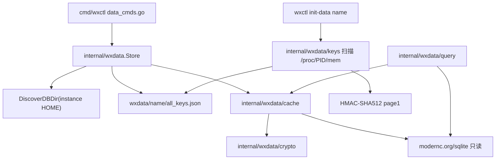
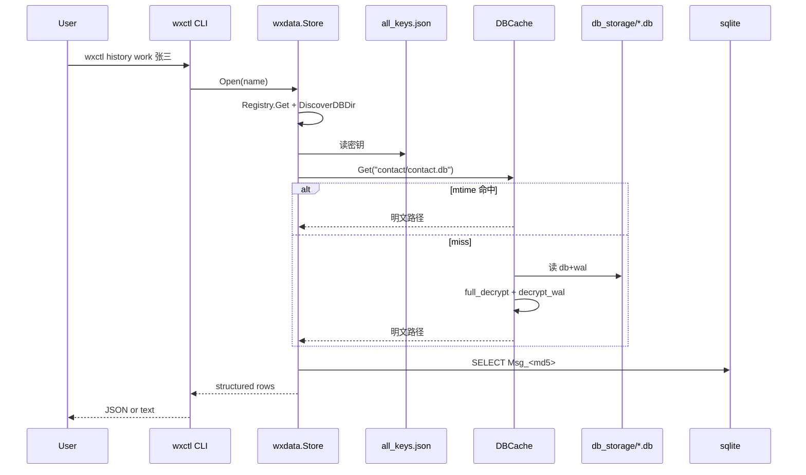
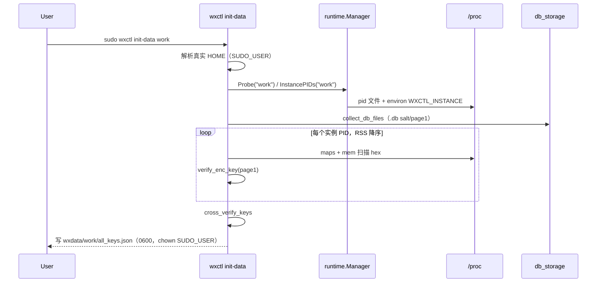

# wxctl Linux 多实例微信数据查询（移植 wechat-cli 核心能力）

| 字段 | 值 |
|------|-----|
| **Title** | wxctl Linux 多实例微信数据查询 |
| **Date** | 2026-09-21 |
| **Status** | Draft |
| **Target repo** | `/home/deali/code/wechatctl`（Go module `github.com/star-plan/wechatctl`，CLI `wxctl`） |
| **Reference repo** | `/home/deali/code/2/wechat-cli`（Python `wechat-cli` v0.2.4） |
| **Audience** | Cursor coding agent；完成后由 Grok 按本文验收 |

---

## Overview

wxctl 已经能用伪造 `HOME` 在同一 Linux 用户下隔离多个微信实例（`~/.local/share/wxctl/instances/<name>/`）。wechat-cli 能解密并查询 **单个** 微信账号的会话/消息/联系人，但它的 Linux 自动探测只看 `~/Documents/xwechat_files/*/db_storage`，且全局状态写在 `~/.wechat-cli/`，因此永远找不到 wxctl 实例数据。

本设计把 wechat-cli 的 **密钥提取 → 自定义 SQLCipher-4 页解密 → 解密缓存 → sqlite 查询** 管线用纯 Go 移植进 wxctl，**每个实例一份密钥/缓存/游标**。不 exec Python，不包装 wechat-cli，不移植 Windows/macOS。v1 命令：`init-data`、`sessions`、`history`、`search`、`contacts`、`members`、`chat-export`、`unread`、`new-messages`。

---

## Background & Motivation

### 当前状态

wxctl（Linux-only，cobra）只做实例生命周期：

- 注册表：`~/.config/wxctl/instances.toml`（`internal/config/instances.go` `Registry`）
- 伪造 HOME：`internal/backend/linux.go` `linuxHome.HomeDir` → `{ProfilesRoot}/{name}`，默认 `~/.local/share/wxctl/instances/<name>/`
- 启动时 `HOME=<instance home>`、`WXCTL_INSTANCE=<name>`（`buildEnv`）
- pid 文件：`~/.local/share/wxctl/run/<name>.pid`（`paths.Layout.PidFile`）
- 归属校验：`belongsToInstance` 读 `/proc/<pid>/environ` 是否含 `WXCTL_INSTANCE=<name>`

本机已注册实例：`work`、`tk`、`caitouguo`、`mirai`、`windy`。实测数据根是 **`$HOME/xwechat_files/<wxid_*>/db_storage`**，**不是** `$HOME/Documents/xwechat_files`：

| 实例 | db_storage |
|------|------------|
| work | `~/.local/share/wxctl/instances/work/xwechat_files/wxid_ga0fx5jh7h4x22_7249/db_storage` |
| tk | `~/.local/share/wxctl/instances/tk/xwechat_files/wxid_002eaj28at0322_250c/db_storage` |
| caitouguo | `~/.local/share/wxctl/instances/caitouguo/xwechat_files/wxid_yrr3nek1i72222_5e6f/db_storage` |
| windy | `~/.local/share/wxctl/instances/windy/xwechat_files/wxid_lqpo2g0o1myk22_7b01/db_storage` |
| mirai | 仅有 `Shared` 软链，从未登录，无 `xwechat_files` |

work 上关键库体积（用于性能预算，`ls -lah`）：`message/message_0.db` ~40MB，`contact/contact.db` 7.8MB，`session/session.db` 3.2MB。tk 已出现分库 `message_0.db` + `message_1.db`，查询层必须按 wechat-cli 做多库表发现。

wechat-cli 当前用户配置（`~/.wechat-cli/config.json`）指向 **另一个** 账号：

```text
/home/deali/Documents/xwechat_files/wxid_71v40t1uqudu41_4291/db_storage
```

这正是痛点：单账号工具 + 错误的 Linux 探测路径，无法服务 wxctl 多实例。

### wechat-cli 管线（源码事实，必须按此移植）

1. **密钥** — `wechat_cli/keys/scanner_linux.py` `extract_keys` + `keys/common.py`：扫进程内存 ASCII hex `x'<64+ hex>'`，用 SQLCipher-4 page1 HMAC 验证。
2. **解密** — `wechat_cli/core/crypto.py`： **不是** SQLCipher 库。4096 字节页、AES-256-CBC、页尾 reserve 80（IV 16 + HMAC-SHA512 64）。然后把 WAL frame 解密写回对应页。
3. **缓存** — `wechat_cli/core/db_cache.py` `DBCache`：按 db+wal mtime 复用临时明文库。Python 写在 `/tmp/wechat_cli_cache`（wxctl **禁止**沿用）。
4. **查询** — stdlib sqlite3。

### 痛点

- 多实例数据互串风险（wechat-cli 全局一份 `all_keys.json` / `last_check.json`）。
- Linux 微信在伪造 HOME 下把数据放在 `$HOME/xwechat_files`，wechat-cli 探测不到。
- **仅 `init-data` 需要** root/`CAP_SYS_PTRACE` 与正在运行的微信。查询命令在微信已停止、密钥与 `db_storage` 仍在时必须能工作。
- 密钥扫描必须只针对该实例 PID（及同 `WXCTL_INSTANCE` 的微信子进程），避免扫到别的实例或其它用户的微信进程。

---

## Goals & Non-Goals

### Goals（v1）

- 在 **wechatctl** 内用 Go 实现查询管线；Linux only。
- 实例名作为数据命令的 **第一个必选参数**，风格对齐 `wxctl start/stop/show <name>`。
- 命令：`init-data`、`sessions`、`history`、`search`、`contacts`、`members`、`chat-export`、`unread`、`new-messages`。
- 每实例隔离：密钥、解密缓存、`new-messages` 游标。
- 密钥扫描只针对该实例 PID（及同 `WXCTL_INSTANCE` 的微信子进程），不扫全机。
- `go test ./...` 全绿；无 CGO；不依赖 Python。
- 现有生命周期命令（`create/list/show/start/stop/restart/status/edit/remove/desktop/config/migrate/export/import`）行为不变。

### Non-Goals（v1 明确不做）

- `stats`、`favorites`、MCP server（`wechat_cli/mcp_server.py`）。
- `--media` 真实文件路径解析（`_resolve_media_path` / `_format_app_message_text(..., resolve_media=True)`）。
- 像素级复刻全部 appmsg XML 富文本；v1 用占位字符串（见「消息格式化策略」）。
- Windows/macOS key scanner、codesign、npm packaging。
- exec / 包装 `wechat-cli`。
- 修改 wechat-cli 源码（除非加一行指向本设计的注释；默认不加）。
- 解密 `message_fts.db` / `biz_message_*.db` / `favorite.db` 用于查询。
- 写回微信数据库；只读副本。

---

## Key Decisions

1. **纯 Go 移植，不包装 Python。** 产品已拍板。依赖映射：pycryptodome AES → 标准库 `crypto/aes` + `crypto/cipher`；PBKDF2 → 标准库 `crypto/pbkdf2`（Go 1.26 可用）；HMAC-SHA512 → `crypto/hmac` + `crypto/sha512`；zstd → `github.com/klauspost/compress/zstd`；sqlite → `modernc.org/sqlite`（纯 Go，无 CGO）。**禁止** `mattn/go-sqlite3`。
2. **数据命令顶层 cobra，实例名第一参数。** 例：`wxctl sessions work`。不引入 `wxctl data ...` 父命令（避免 Cursor 猜产品结构）。若后续要分组，再 re-parent，v1 不预留空壳。
3. **聊天导出命名为 `chat-export`。** 现有 `wxctl export <file>`（`cmd/wxctl/config_cmds.go` `exportCmd`）导出的是配置/实例 **元数据**，不含聊天。不能覆盖。wechat-cli 的 `export` 在 wxctl 中叫 `chat-export`。
4. **状态目录：`~/.local/share/wxctl/wxdata/<name>/`，不进伪造 HOME。** 微信进程以该目录为 `$HOME`；把密钥/缓存放进去有被微信扫描或 `remove --purge` 语义纠缠的风险。wxdata 与 `instances/<name>` 并列。`remove --purge` 必须同时删 wxdata。
5. **禁止** 使用 `~/.wechat-cli` 和 `/tmp/wechat_cli_cache`。
6. **只扫本实例进程。** wechat-cli `scanner_linux.py` `_get_pids()` 会扫全机 `wechat`/`wechatappex`/`weixin`。wxctl 必须用 pid 文件 + **fail-closed** 的 `WXCTL_INSTANCE` environ 精确匹配过滤。**禁止**把 `backend.belongsToInstance`（environ 读失败返回 `true`）用于 `/proc` 扫描。
7. **history/search 的 JSON 用结构化对象，不用 wechat-cli 的格式化字符串数组。** 内部类型 `query.Message` / `query.SearchHit`；JSON 走字段表；text / `chat-export` 走 `toTextLine()`。**禁止**把 `_build_history_line` 的字符串当作 JSON `messages`。
8. **`--media` 在 v1 不实现、不暴露 flag。** history 不要抄 wechat-cli 的 `--media`。
9. **查询类 `--format` 默认 `json`。** 两个例外：`init-data` 默认 `text`；`chat-export` 的 `--format` 是 `markdown|txt`（默认 `markdown`），不是 json/text。生命周期命令仍是纯文本，不改。
10. **schema 探测失败则硬失败。** 第一次打开真实解密库时检查 `sqlite_master` 与必填列；不匹配就报「Linux schema 与 wechat-cli 假设不一致」，列出 expected vs found，exit 6。禁止静默 SELECT 失败后当空结果。exit 6 靠 **单元测试** 验收，不靠 live 微信缺列。
11. **sudo 下解析真实用户 HOME。** 扩展 `paths.realHome()`：`WXCTL_REAL_HOME` >（**仅** `geteuid()==0` 时 `SUDO_USER` 的 passwd home）> `os.UserHomeDir()`。`euid` 与 `Lookup` 必须可注入以便单测。euid==0 时 **忽略** `XDG_CONFIG_HOME` / `XDG_DATA_HOME`（避免 sudoers `env_keep` 指向 `/root`）。`init-data` 成功后 `chown` **整个** `WxdataDir(name)` 树（目录+文件）到 `SUDO_UID`/`SUDO_GID`；chown 失败则命令失败，禁止留下 root 拥有的 0600 密钥并报成功。
12. **members 文本模式按「意图」实现，不复制 Python bug。** `wechat_cli/commands/members.py` 文本分支用未定义循环变量 `m`，会 `NameError`。Go 必须按 JSON 同源的成员列表循环输出。
13. **数据命令使用独立 `wxdata.Error`（Code + 英文 Error 文本），禁止复用 `runtime.ExitError`。** `ExitError` 是「微信子进程退出码」包装，`main.go` 对其 **不打印** stderr。数据错误必须先 `Fprintln(os.Stderr, err)`（**外层** `error`，保留 wrap 的 `--force` 等提示）再 `os.Exit(code)`。**禁止**只打印 `we.Error()`（会丢掉 wrap）。`start` 路径保持今天的静默 `ExitError`。
14. **查询不要求实例在跑。** 仅 `init-data` 要求微信进程 + ptrace。`sessions`/`history`/… 只要 `all_keys.json` 与 `db_storage` 仍在即可。
15. **`init-data` 不得留下「看起来成功」的残缺或 root 拥有、用户读不了的 `all_keys.json`。** 缺必需库 key 时不覆盖正式文件（可写 `all_keys.json.partial`）。chown 失败必须删掉刚写的正式文件（或根本不 rename 到最终路径）。无 `--force` 且文件已存在时必须先校验必需 key + salt/`_db_dir`（**缺 `_db_dir` 视为失败**）；euid==0 时 skip 前还要把树 chown 给 SUDO_UID。校验失败则重新扫描，不得 skip 后 exit 0。

---

## Proposed Design

### 架构



数据流（查询）：



密钥提取：



### 包布局

在 wechatctl 仓库新增（不要改 wechat-cli）：

```text
cmd/wxctl/
  main.go                 # 注册新命令；errors.As(*wxdata.Error) 打印后 Exit
  data_cmds.go            # 全部数据 cobra 命令
  data_output.go          # JSON/text 输出
  data_output_test.go     # wrap ErrNoKeys → 外层含 --force，code 3

internal/wxdata/
  wxdata.go               # Store, Open, Close, 路径, 错误类型
  discover.go             # 从 instance HOME 找 db_storage
  discover_test.go
  schema.go               # sqlite_master 探测
  schema_test.go
  errors.go

  crypto/
    crypto.go             # 常量、DecryptPage、FullDecrypt、DecryptWAL
    crypto_test.go

  keys/
    keys.go               # KeyInfo JSON、GetKeyInfo、路径变体
    verify.go             # VerifyEncKey
    scan_linux.go         # //go:build linux  内存扫描
    collect.go            # collect_db_files
    keys_test.go
    verify_test.go

  cache/
    cache.go              # mtime 缓存 + flock
    cache_test.go

  query/
    contacts.go           # get_contact_names/full/detail/members/resolve
    sessions.go           # SessionTable 查询（调用 format.go）
    format.go             # decompress_content, format_msg_type（PR5 即落地）
    messages.go           # 表发现、SQL、history/search builders（PR6）
    time.go               # parse_time_range, validate_pagination
    *_test.go
    live_test.go          # 无 live env 则 Skip
```

对齐现有风格：

- `cmd/wxctl/*.go` 全部 `//go:build linux`（与 `main.go`/`instance_cmds.go` 一致）。
- cobra：`Use` + `Args: cobra.ExactArgs/MinimumNArgs` + `RunE`；先 `loadApp()`，再 `instance.Manager{Layout, Config}`。
- 注释中文、短、只解释非显而易见约束；错误信息英文（现有 `fmt.Errorf("instance %q not found", name)`）。
- 用户可见 **text 模式** 用中文（对齐 wechat-cli 的 `文本`/`图片`/`最近 N 个会话`），因为那是查询 UX，不是生命周期 UX。
- 原子写文件：`*.tmp` + `os.Rename`（已用于 `config.Save`、`writePid`、desktop）。

**不要**新建 `internal/wxdata/output` 除非 `data_output.go` 超过 ~400 行；先放 cmd。

### 对现有包的最小改动

| 文件 | 改动 |
|------|------|
| `cmd/wxctl/main.go` | `AddCommand` 追加 9 个数据命令；对 `*wxdata.Error`（`errors.As`）先打印 **外层 `err`** 再 `os.Exit(we.Code)`。对 `*runtime.ExitError` **仍只 Exit、不打印**（保持 `wxctl start` 微信子进程退出语义） |
| `internal/paths/paths.go` | 新增 `WxdataDir(name)`；扩展 `realHome()`（可注入 `geteuid` / user lookup）；euid==0 忽略 `XDG_*` |
| `internal/instance/instance.go` | `Remove` 在 `purge==true` 时 **始终** `RemoveAll(WxdataDir)`（即使 HOME 已不存在）；确认文案同时列出 HOME 与 wxdata |
| `internal/runtime/runtime.go` | 新增 `InstancePIDs(name) []int`（见密钥提取）。**不要**导出或复用 fail-open 的 `belongsToInstance` 做 /proc 扫描 |
| `internal/backend/linux.go` | **不改** `belongsToInstance` / `Status()`。扫描器用独立 fail-closed 解析函数（可放 `internal/wxdata/keys`） |
| `README.md` | 最后一 PR 追加数据命令、离线查询、cache 删除方法 |
| `go.mod` | 增加 `modernc.org/sqlite`、`github.com/klauspost/compress` |

`exportCmd`（元数据）**禁止改 Use**。

### 每实例状态路径

```text
~/.local/share/wxctl/wxdata/<name>/          # MkdirAll 0700
  all_keys.json          # 权限 0600
  all_keys.json.partial  # 仅扫描失败时可能存在，正式成功路径必须删掉
  lock                   # flock，覆盖解密与 last_check 写入
  last_check.json        # new-messages 游标，0600
  cache/                 # MkdirAll 0700
    _mtimes.json
    <md5-12>.db          # 明文 sqlite，0600
```

`wxdata/<name>` 与 `cache/` 一律 `os.MkdirAll(..., 0o700)`，禁止默认 0755（明文库目录否则可被其它本地用户 list）。

对应 API（加到 `paths.Layout`）：

```go
func (l Layout) WxdataDir(name string) string {
    return filepath.Join(l.DataDir, "wxdata", name)
}
```

`DataDir` 已是 `filepath.Join(xdgDataHome(home), "wxctl")`（`internal/paths/paths_unix.go`）。

`all_keys.json` schema（db 条目与 wechat-cli `save_results` 相同；另加 `_` 元数据，加载时按 `strip_key_metadata` 忽略）：

```json
{
  "_db_dir": "/home/deali/.local/share/wxctl/instances/work/xwechat_files/wxid_ga0fx5jh7h4x22_7249/db_storage",
  "session/session.db": {
    "enc_key": "<64 hex>",
    "salt": "<32 hex>",
    "size_mb": 3.2
  },
  "contact/contact.db": {},
  "message/message_0.db": {}
}
```

键是相对 `db_storage` 的 POSIX 路径（正斜杠）。`_db_dir` 为 Discover 当时的绝对路径（`EvalSymlinks` 后）。CLI 文本/JSON 的 `"keys"` 计的是 **不含 `_` 前缀的 db 条目数**（不是 unique salt 数）；text 与 JSON 必须用同一个数字。

`last_check.json`（抄 `new_messages.py`）：

```json
{
  "wxid_xxx": 1711944000,
  "123@chatroom": 1711944100
}
```

值为该 username 上次见到的 `last_timestamp`（整数 Unix 秒）。

### db_storage 发现算法

函数：`wxdata.DiscoverDBDir(instanceHome string) (string, error)`

Linux 微信在伪造 HOME 下使用 **`$HOME/xwechat_files/<wxid_...>/db_storage`**。wechat-cli 的 `_auto_detect_db_dir_linux`（`wechat_cli/core/config.py`）搜 `~/Documents/xwechat_files`，**不可复用**。

算法（确定性，无交互）：

1. `root := filepath.Join(instanceHome, "xwechat_files")`。若不存在或不是目录 → 错误：`no WeChat data under %s (instance never logged in?)`。
2. 读 `root` 下一层子目录。跳过名字为 `all_users`、`WMPF` 的项（本机真实存在）。
3. 候选：该子目录下存在目录 `db_storage`，且 `db_storage/session` 或 `db_storage/message` 或 `db_storage/contact` 至少其一存在。典型名字：`wxid_*_*`（如 `wxid_ga0fx5jh7h4x22_7249`），但 **不要** 把正则当硬过滤——只要含 `db_storage` 即可，避免微信改目录名后误杀。
4. 0 个候选 → 同上错误。
5. 多个候选：选 `db_storage/message` 的 mtime 最新者（目录不存在则退回 `db_storage` mtime）。**不要** prompt。日志可写到 stderr：`using db_storage %s (newest of %d)`。
6. 返回绝对路径，`EvalSymlinks` 后的 `db_storage`。

本机每个已登录实例恰好 1 个 `wxid_*` 目录；`mirai` 走步骤 1 失败。

单测：用 `t.TempDir()` 搭 `xwechat_files/all_users` + `xwechat_files/wxid_a_1/db_storage/message` + 较旧的 `wxid_b_2/...`，断言选中较新者。

### Store 打开流程

```go
type Store struct {
    Name     string
    Home     string
    DBDir    string
    StateDir string
    Keys     map[string]KeyInfo
    Cache    *cache.Cache
}

func Open(layout paths.Layout, cfg config.Config, name string) (*Store, error)
```

`Open`（除 `init-data` 外所有数据命令；**不** `Probe` 微信是否在跑）：

1. `config.ValidateName` + `instance.Manager.Get`；找不到 → `ErrInstanceNotFound`（exit 1）。
2. `home := mgr.HomeDir(name)`；`DiscoverDBDir(home)`。
3. `stateDir := layout.WxdataDir(name)`；`all_keys.json` 不存在 → `ErrNoKeys`（exit 3），stderr 提示 `run: wxctl init-data %s`。
4. 读 keys。`_db_dir` **缺失**，或与当前 Discover 结果（都 `EvalSymlinks`）不同 → `ErrNoKeys`（exit 3）。返回/wrap 的英文必须含：`db_storage changed (wxid rotated?); run: wxctl init-data --force %s`（缺 metadata 用同一句，不要另发明）。
5. `cache.New(keys, dbDir, filepath.Join(stateDir, "cache"))`。
6. 调用方 `defer store.Close()`（释放 flock/文件句柄；**不要**删除缓存文件）。

`Cache.Get(relKey)` 在解密前读源 db page1[0:16]，与 `keys[rel].salt` 比较；不一致 → `ErrNoKeys`（exit 3），同样提示 `--force`。查询用到某个 rel_key 时若 keys 里没有 → `ErrDecrypt`（exit 3）。

---

## 密钥提取

### 谁在跑、扫谁

不要复制 `_get_pids()` 的全机扫描。

新增 `runtime.Manager.InstancePIDs(name string) []int`：

1. `Probe(name)`：若 `Status.Running`（沿用现有 pid 文件 + **现有** fail-open `belongsToInstance`，**不改 Status 语义**），把该 PID 收入列表。pid 文件是 wxctl 自己写的，可信任。
2. 再扫 `/proc/[0-9]+`：`comm` 或 exe basename 匹配 wechat-cli 的集合（大小写不敏感）`wechat`、`wechatappex`、`weixin`。跳过解释器前缀：`python`/`bash`/`sh`/`zsh`/`node`/`perl`/`ruby`。跳过 `os.Getpid()`。
3. **扫到的候选必须 fail-closed：** 成功读完 `/proc/<pid>/environ`（读失败 → **跳过，不得当作属于本实例**），且 NUL 分隔 token **精确等于** `WXCTL_INSTANCE=<name>`。禁止调用或导出 `belongsToInstance` 做这一步（它在 environ 读失败时返回 `true`，setcap 下会 ptrace 其它用户的微信）。
4. 去重。按 `/proc/<pid>/statm` 第二字段 RSS pages 降序。
5. 空列表 → `ErrNotRunning`（exit 4）：`instance %q is not running (start it, then retry init-data)`。

辅助函数（单测用假 environ 字节，不要碰真 `/proc`）：

```go
func environHasInstance(environ []byte, name string) bool
```

测试：NUL 分隔匹配；同前缀但 name 不同（`work` vs `work2`）不匹配；空/缺文件等价于调用方 skip。

`init-data` **只**扫这个列表。即使机器上有 `Documents/xwechat_files` 的另一份微信，也不碰。

验证 comm 的逻辑抄 `scanner_linux.py` `_is_wechat_process`。

### 权限与 sudo UX

抄 `_check_permissions`：

- `os.Geteuid()==0` 通过。
- 否则读 `/proc/self/status` 的 `CapEff:`，`CAP_SYS_PTRACE = 1<<19` 置位则通过。
- 否则 `ErrPermission`（exit 5），stderr **原文可用中英混合**，必须包含可执行命令：

```text
need root or CAP_SYS_PTRACE to read WeChat process memory
  sudo wxctl init-data work
  or: sudo setcap cap_sys_ptrace=ep $(command -v wxctl)
```

说明（写入 README，命令本身也要能用）：

- Ubuntu 默认 `kernel.yama.ptrace_scope=1`，wxctl 用 `Setsid` 拉起微信（`linux.go` Start），**不是**父进程，同用户 ptrace 通常失败。所以 v1 假定需要 sudo 或 setcap。
- `sudo wxctl ...` 必须靠扩展后的 `realHome()` 找到用户的 `instances.toml`，不要求用户必须带 `-E`。
- `realHome()` 实现约束：
  - 包级可注入：`geteuid func() int`（默认 `os.Geteuid`）、`lookupHome func(string) (string, error)`（默认 `os/user.Lookup` → `HomeDir`）。
  - 优先级：`WXCTL_REAL_HOME`（非空）> `geteuid()==0 && SUDO_USER` 的 passwd home > `os.UserHomeDir()`。
  - **非 root 时忽略 `SUDO_USER`**（避免普通用户环境里误用）。
  - **euid==0 时忽略 `XDG_CONFIG_HOME` / `XDG_DATA_HOME`**，一律 `{home}/.config` 与 `{home}/.local/share`。root 的 XDG 经常指向 `/root`，即使 sudoers `env_keep` 了这些变量也不采用。
- 单测（不要真 sudo）：(a) euid≠0 + 设置 `SUDO_USER` → 结果与无 `SUDO_USER` 相同；(b) fake euid 0 + `SUDO_USER=deali` → lookup 返回的 home；(c) `WXCTL_REAL_HOME` 始终赢。
- `CGO_ENABLED=0` 下 `user.Lookup` 只读 `/etc/passwd`（无 nss/LDAP）。文档一句即可；测试走 fake `lookupHome`，不依赖本机 passwd。
- 以 root 跑完 `init-data` 后，对 **整个** `WxdataDir(name)` 做 `filepath.Walk` `os.Chown`（含目录自身、`cache/`、json）。UID/GID 来自 `SUDO_UID`/`SUDO_GID`，缺则用 lookup 的 Uid/Gid。解析不到目标 uid 同样失败。
- **chown 失败不得留下可 skip 的正式文件：** 先写 `all_keys.json.tmp` → chown 整树（含 tmp）→ 成功才 `Rename` 为 `all_keys.json`。若已 rename 后 chown 失败：立即 `os.Remove(all_keys.json)`（可改回 `.partial`），然后 exit 1。禁止「exit 1 但正式文件还在」——下次无 `--force` 会 skip，用户侧 `sessions` 读不了 root 0600。
- **skip 路径（euid==0）：** 即使 JSON 校验通过，若 `all_keys.json` 的 uid ≠ 目标 SUDO_UID，必须先 chown 整树；chown 失败则 **不要** skip（删正式文件或改 `.partial` 后走重新扫描；扫描仍失败则 exit 1）。非 root skip 不 chown。
- **不要**在文档里推荐 `setcap` 到世界可写路径。

### 算法常量（必须与 Python 一致）

来源：`wechat_cli/keys/common.py`、`scanner_linux.py`、`core/crypto.py`。

```go
const (
    PageSize     = 4096
    KeySize      = 32
    SaltSize     = 16
    ReserveSize  = 80 // IV 16 + HMAC-SHA512 64
    WALHeaderSize = 32
    WALFrameHeaderSize = 24
    HMACXOR      = 0x3A
    PBKDF2Iter   = 2
    MaxRegionSize = 500 * 1024 * 1024
)
var SQLiteHdr = []byte("SQLite format 3\x00") // 16 bytes
```

Hex 正则（Go）：

```go
hexRe := regexp.MustCompile(`x'([0-9a-fA-F]{64,192})'`)
```

对应 Python：`re.compile(rb"x'([0-9a-fA-F]{64,192})'")`。扫描的是 **原始内存字节**，按 ASCII 匹配。

`VerifyEncKey(encKey []byte, page1 []byte) bool` 必须逐字节对齐 `common.py` `verify_enc_key`：

```text
salt     = page1[0:16]
mac_salt = salt XOR 0x3A   (每个字节)
mac_key  = PBKDF2-HMAC-SHA512(password=enc_key, salt=mac_salt, iter=2, dkLen=32)
hmac_data = page1[16 : 4096-80+16]   # page1[16:4032]  （密文 + IV）
stored    = page1[4096-64 : 4096]    # page1[4032:4096]
compute   = HMAC-SHA512(mac_key, hmac_data || uint32le(1))
ok        = hmac.Equal(compute, stored)
```

**注意：** AES 加密密钥就是内存里的 32 字节 `enc_key`，**不再**用 salt 做 PBKDF2 派生 AES key。salt 只用于 HMAC。

### 内存区域过滤（抄 `_get_readable_regions`）

导出 `ParseMaps(r io.Reader) []Region`，用 **文件 fixture** 单测（PR4），不要只在真 /proc 上测。

读 `/proc/<pid>/maps`：

- 权限列不含 `r` → skip
- mapping name ∈ `{[vdso],[vsyscall],[vvar]}` → skip
- name 前缀 `/usr/lib/`、`/lib/`、`/usr/share/` **且** 小写 name 不含 `wcdb`/`wechat`/`weixin` → skip
- `0 < size < 500MB` 才加入

读 `/proc/<pid>/mem`：`Seek(base)` + `Read(size)`；`OSError` 则 skip 该 region。每 200 个 region 向 stderr 打进度（可静默，但不要打到 stdout，以免破坏 JSON——`init-data` 默认 text）。

### hex 命中规则（抄 `scan_memory_for_keys`）

对每个 match 的 hex 字符串：

| hex 长度 | 行为 |
|----------|------|
| 96 | `enc_key=hex[:64]`，`salt=hex[64:]`；若 salt 仍在 remaining 且 `VerifyEncKey` 对应该 salt 的 page1 通过 → 记录 |
| 64 | 当作 enc_key，对 **每个 remaining salt** 的 page1 试 HMAC |
| \>96 且偶数 | `enc_key=hex[:64]`，`salt=hex[-32:]`，同上 |

扫完后 `cross_verify_keys`：对未匹配 salt，用已有任意 enc_key 再试 HMAC。

`collect_db_files`：walk `db_dir`，文件名 `*.db` 且 **不是** `*-wal`/`*-shm`，size ≥ 4096，读 page1，`rel` 用 `filepath.Rel` 后转正斜杠。

### `init-data` 成功/失败标准

必需库：

- `session/session.db`
- `contact/contact.db`
- 至少一个 `message/message_<N>.db`（正则 `message/message_\d+\.db$`）

规则：

- 一个 key 都没有 → 失败，exit 3，`no keys extracted`。**不写** `all_keys.json`。
- 有部分 key 但缺任一必需库 → 失败，exit 3，stderr 列出缺的 rel 路径。**不覆盖**已有 `all_keys.json`；允许写 `all_keys.json.partial` 供调试。成功路径必须删除 `.partial`。
- 其它库（fts、biz、favorite、sns…）缺 key：stderr `MISSING: ...`，**仍成功**。
- 成功写入的 `all_keys.json` 必须含 `_db_dir` 与全部已找到的 db 条目。缺少 `_db_dir` 的文件视为无效，与 salt 不匹配同等处理。
- 无 `--force` 且 `all_keys.json` 已存在：**先校验**（必需 key 都在、**`_db_dir` 存在且** 匹配当前 Discover、抽查必需库 page1 salt 与 JSON `salt` 一致；euid==0 时文件 uid 必须已是 SUDO_UID，否则先 chown，见上）。校验通过 → 打印路径 exit 0，不扫描。校验失败 → **自动重新扫描**（不要假装已初始化）。`--force`：跳过校验，总是扫描并覆盖。

`"keys"` / 文本 `keys:` = 不含 `_` 前缀的 JSON 对象条目数，与 `missing` 数组一起出现在 text 与 JSON 中。

进度与结果走 **stderr**；stdout 只在 `--format json` 时输出结果对象（默认 text）。

---

## 解密与缓存

### 页解密（`crypto.DecryptPage`）

抄 `wechat_cli/core/crypto.py` `decrypt_page`：

```text
iv = page[4016:4032]           # PAGE_SZ-80 : PAGE_SZ-80+16
if pgno == 1:
    encrypted = page[16:4016]  # 4000 bytes，16 的倍数
    plain = AES-256-CBC-Decrypt(enc_key, iv, encrypted)
    return SQLITE_HDR + plain + 80*0x00
else:
    encrypted = page[0:4016]   # 4016 bytes
    plain = AES-256-CBC-Decrypt(enc_key, iv, encrypted)
    return plain + 80*0x00
```

CBC **不**验证 HMAC（Python 也不在 decrypt 路径验 HMAC；HMAC 只用于选 key）。使用 `crypto/aes` + `cipher.NewCBCDecrypter`。不要 PKCS7 unpad：SQLCipher 页是整块。

`FullDecrypt(encPath, outPath, encKey)`（对齐 Python `total_pages = file_size // PAGE_SZ`）：

- 只循环 **完整页**：`n = size / 4096`（整数除法）。**不要**把尾部不足 4096 的残渣当成第 n+1 页去填零解密。
- 单次 `Read` 若返回短于 4096（被截断的文件）：0 填充到 4096 再解密该页（防御，不是多出来的一页）。
- 写 `outPath` 前 `MkdirAll(..., 0o700)`
- 先写 `outPath+".tmp"` 再 `Rename`（Python 直接写目标；Go 必须原子，为并发）

### WAL（`crypto.DecryptWAL`）

抄 `decrypt_wal`：

```text
读 32 字节 WAL header
wal_salt1 = BE uint32 at [16:20]
wal_salt2 = BE uint32 at [20:24]
frame_size = 24 + 4096
while tell+frame_size <= wal_size:
    fh 24 bytes
    pgno        = BE uint32 [0:4]
    frame_salt1 = BE uint32 [8:12]
    frame_salt2 = BE uint32 [12:16]
    ep = 4096 bytes
    skip if pgno==0 or pgno>1_000_000
    skip if salts != header salts
    dec = DecryptPage(enc_key, ep, pgno)
    写入 outDB offset (pgno-1)*4096
```

WAL 与主库 **endian 不同**：WAL header/frame 是 **big-endian**；HMAC page number 是 **little-endian**。不要搞反。

### 缓存（`cache.Cache`）

对齐 `DBCache.get`，但目录是实例 wxdata：

- `Get(relKey string) (plainPath string, err error)`
- relKey 用 `key_utils.get_key_info` 语义：拒绝 `..`；尝试 `/` 与 `\` 变体。
- 源路径：`filepath.Join(dbDir, filepath.FromSlash(relKey))`
- wal：`dbPath+"-wal"`（微信把 wal 放在同目录，本机已确认 `session.db-wal` 等）
- 命中条件：`_mtimes.json` 中该 relKey 的 `db_mt`/`wal_mt`/`db_size`/`wal_size` 与当前 `Stat` **全部相等**，且 `path` 指向的文件存在。Go 存 `mtime.UnixNano()`（比 Python 浮点秒更严）。任一字段变则失效。
- 缓存文件名：`md5(relKey)[:12] + ".db"`（抄 `_cache_path`）。relKey 统一成正斜杠再哈希。
- **解密输入用快照：** 未命中时先把 db（及存在的 wal）`io.Copy`/`sendfile` 到 `cache/.snap-<hash>.db` 与 `.wal`，再对快照跑 `FullDecrypt` / `DecryptWAL`，然后删快照。缩小与微信并发写的撕裂窗口（见 Alternative E）。
- **崩溃残留：** 拿到 LOCK_EX 之后、解密之前，删除该 cache 目录下所有 `/.snap-*`（以及本 hash 的 `.snap-<hash>.db` / `.wal`）。`defer` 再删一次。禁止把 `.snap-*` 写进 `_mtimes.json` 或当明文缓存。
- 未命中：flock 排他 → 清 `.snap-*` → 再检查一次（double-check）→ 校验 page1 salt → 快照 → 解密到 `hash.db.tmp` → `DecryptWAL` → rename → 更新 `_mtimes.json`（原子写）。
- v1：**整个 Get 用 LOCK_EX**。同一实例两个 `wxctl history` 串行解密，可接受（~40MB AES 通常 <1s）。
- flock：`syscall.Flock` on `wxdata/<name>/lock`（Linux stdlib，不加 `gofrs/flock`）。
- 并发：两个命令、同一实例 → 排队；不同实例 → 不同 lock 文件，并行。
- **不要**在查询时解密 fts/biz/media。`Get` 按需。

`_mtimes.json` schema（PR3 测试按此断言）：

```json
{
  "session/session.db": {
    "db_mt": 1711944000123456789,
    "wal_mt": 1711944000999999999,
    "db_size": 3355443,
    "wal_size": 4194304,
    "path": "/home/deali/.local/share/wxctl/wxdata/work/cache/a1b2c3d4e5f6.db"
  }
}
```

`wal_mt`/`wal_size` 在无 wal 时为 `0`。`path` 为明文缓存绝对路径。顶层 key 为正斜杠 relKey。

### 与正在运行的微信的竞争（必须文档化并在错误信息中可理解）

微信持有 SQLCipher 库并持续写 WAL。wxctl 解密的是 **db+wal 的短暂快照**，不是 SQLite 备份锁，仍可能拷贝到撕裂帧。

- 风险（Medium）：快照窗口内 WAL 仍可能撕裂。缓解：frame salt 不匹配则 skip（Python 已做）；sqlite Open 失败则删缓存重试 **一次**，仍失败 → `ErrDecrypt`。
- **绝不** `PRAGMA` 写、绝不碰 `-shm`。
- 打开明文（modernc.org/sqlite **必须** `file:` URI，禁止 `path?mode=ro` 这种会被当成文件名的写法）：

**唯一允许的打开顺序**（不要用 `url.Values.Set("_pragma", …)` 两次——`Set` 会覆盖，DSN 里只剩最后一个）：

```go
u := url.URL{Scheme: "file", Path: filepath.ToSlash(plainPath)}
q := u.Query()
q.Set("mode", "ro")
u.RawQuery = q.Encode()
db, err := sql.Open("sqlite", u.String())
if err != nil { return err }
if _, err := db.Exec("PRAGMA query_only=ON"); err != nil { return err }
if _, err := db.Exec("PRAGMA busy_timeout=3000"); err != nil { return err }
```

`mode=ro` 只放在 URI 里。两个 PRAGMA **Open 之后 Exec**，保证都生效。路径含空格时用 `url.URL` 编码。单测：DSN 含 `mode=ro` 且 **不含** `_pragma=`；打开后 `query_only` 为 ON。禁止 `plainPath+"?mode=ro"`。

延迟目标：冷启动解密 work 的 `message_0.db` ~40MB + `contact` 7.8MB + `session` 3.2MB，普通桌面 CPU **< 3s**；mtime 命中后 sessions 查询 **< 300ms**。search 全库 LIKE 可能数秒（见风险）。

---

## API / Interface Changes

### CLI 总则

- 全部新命令：`Args` 里 **第一个** 位置参数是 instance `name`。
- 全局不加 PersistentPreRun 去 Open Store（`init-data` 不需要已有 keys）。
- `--format`：
  - 查询命令（sessions/history/search/contacts/members/unread/new-messages）：`json|text`，**默认 `json`**。
  - `init-data`：`json|text`，**默认 `text`**。
  - `chat-export`：`markdown|txt`，**默认 `markdown`**（不是 json/text）。
- JSON：`encoding/json` 输出到 stdout，`SetEscapeHTML(false)`，indent 两个空格，末尾 `\n`（对齐 `output/formatter.py`）。
- 错误：一律 stderr；`SilenceUsage: true` 已在 root。
- 不要加 `--config` 去读 wechat-cli 的 config。
- 查询命令 **不要** 调用 `runtime.Probe`；微信停止时仍应成功。

### Exit codes

| Code | 哨兵 / 类型 | 何时 |
|------|------|------|
| 0 | | 成功（含 sessions 空列表、unread 无未读、new-messages 无新消息、init-data 校验通过 skip） |
| 1 | `ErrInstanceNotFound` / `ErrChatNotFound` / `ErrNotGroup` / `ErrNoDBStorage` | 实例不存在；聊天名解析失败；members 目标不是群；未登录无 db_storage；init-data chown 失败 |
| 2 | `ErrInvalidArgs` | **仅** history/search/chat-export 的时间格式、`validate_pagination`、未知 `--type`。sessions/unread/contacts 的 `--limit` **不算** 这里 |
| 3 | `ErrNoKeys` / `ErrDecrypt` | 无 all_keys.json；缺必需 key；salt/`_db_dir` 不匹配；解密/打开失败 |
| 4 | `ErrNotRunning` | `init-data` 时实例微信未运行 |
| 5 | `ErrPermission` | 无 ptrace |
| 6 | `ErrSchema` | sqlite_master 与假设不符 |

**禁止**把这些 code 塞进 `runtime.ExitError`。该类型的 `Error()` 是 `wechat exited with status %d`，且 `main.go` 目前 type-assert 后 **不打印** 就 `os.Exit`。

在 `internal/wxdata/errors.go`：

```go
type Error struct {
    Code int
    Msg  string
    Err  error
}

func (e *Error) Error() string {
    if e.Err != nil {
        return e.Msg + ": " + e.Err.Error()
    }
    return e.Msg
}
func (e *Error) Unwrap() error { return e.Err }
```

哨兵：`var ErrNoKeys = &Error{Code: 3, Msg: "keys not found"}` 等。命令返回 `fmt.Errorf("db_storage changed; run: wxctl init-data --force %s: %w", name, wxdata.ErrNoKeys)` 可以。

`cmd/wxctl/main.go` 改为（**打印 `err`，不要 `we.Error()`**）：

```go
if err := rootCmd().Execute(); err != nil {
    var we *wxdata.Error
    if errors.As(err, &we) {
        fmt.Fprintln(os.Stderr, err) // 外层全文，含 wrap 的 --force 提示
        os.Exit(we.Code)
    }
    if ee, ok := err.(*runtime.ExitError); ok {
        os.Exit(ee.Code) // 保持 start 微信子进程：不打印
    }
    fmt.Fprintln(os.Stderr, err)
    os.Exit(1)
}
```

PR4 `data_output_test.go` 必须断言：

1. `errors.As` 从 `fmt.Errorf("db_storage changed; run: wxctl init-data --force work: %w", wxdata.ErrNoKeys)` 取出 `Code==3`。
2. 打印用的字符串是 **外层 `err.Error()`**，**包含** `--force`，**不含** `wechat exited`。
3. 对照：若误用 `we.Error()` 则只有 `keys not found`——测试应失败那种实现。

### 命令契约

下列 `Use`/`Flags` 必须按此实现，Grok 验收会逐条对。

#### `init-data`

```text
Use:   init-data <name>
Short: Extract SQLCipher keys for an instance from its running WeChat process
Args:  cobra.ExactArgs(1)
Flags:
  --force            bool    重新扫描并覆盖 all_keys.json
  --format           string  json|text，默认 text（扫描进度在 stderr；text 对人类更合适）
```

示例：

```bash
wxctl start work --detach
sudo wxctl init-data work
sudo wxctl init-data work --force
wxctl init-data work --format json
```

text stdout 示例：

```text
initialized instance "work"
  db_dir:     /home/deali/.local/share/wxctl/instances/work/xwechat_files/wxid_ga0fx5jh7h4x22_7249/db_storage
  keys_file:  /home/deali/.local/share/wxctl/wxdata/work/all_keys.json
  keys:       16
  missing:    0
```

JSON：

```json
{
  "instance": "work",
  "db_dir": "...",
  "keys_file": "...",
  "keys": 16,
  "missing": []
}
```

`missing` 为相对路径数组。

#### `sessions`

```text
Use:   sessions <name>
Args:  cobra.ExactArgs(1)
Flags:
  --limit    int     默认 20；只要求 >= 0。limit==0 → 空数组、exit 0（对齐 Python LIMIT 0，不要走 validate_pagination）
  --format   string  json|text 默认 json
```

SQL 源：`wechat_cli/commands/sessions.py`。

```sql
SELECT username, unread_count, summary, last_timestamp,
       last_msg_type, last_msg_sender, last_sender_display_name
FROM SessionTable
WHERE last_timestamp > 0
ORDER BY last_timestamp DESC
LIMIT ?
```

JSON：数组，元素字段 **必须** 为：

| 字段 | 类型 | 规则 |
|------|------|------|
| `chat` | string | 显示名（备注>昵称>username） |
| `username` | string | |
| `is_group` | bool | `strings.Contains(username, "@chatroom")` |
| `unread` | int | NULL → 0 |
| `last_message` | string | summary 按 `decompress_content`；CT=4 失败用 `'(压缩内容)'`（**不是** history 的 `'(无法解压)'`，抄 `sessions.py`）；若含 `:\n` 取后半（群摘要） |
| `msg_type` | string | `format_msg_type(last_msg_type)` |
| `sender` | string | 仅群且 last_msg_sender 非空：names 或 last_sender_display_name |
| `timestamp` | int | Unix 秒 |
| `time` | string | `01-02 15:04`（Go layout，对应 Python `%m-%d %H:%M`） |

text：抄 sessions.py 模板：`[time] chat [群]? (N条未读)?\n  msg_type: sender?: last_message`，头行 `最近 N 个会话:`。

示例：`wxctl sessions work --limit 10`；`wxctl sessions work --format text`。

#### `unread`

```text
Use:   unread <name>
Args:  cobra.ExactArgs(1)
Flags:
  --limit    int     默认 50；与 sessions 相同：>=0，0 → 空列表 exit 0
  --format   string  json|text 默认 json
```

SQL 源：`commands/unread.py`。与 sessions 相同列，WHERE 改为 `unread_count > 0`。JSON 字段与 sessions 相同（含 `'(压缩内容)'`）。text 无数据时：`没有未读消息`。

#### `new-messages`

```text
Use:   new-messages <name>
Args:  cobra.ExactArgs(1)
Flags:
  --format   string  json|text 默认 json
  --reset    bool    删除该实例 last_check.json 后按「首次调用」处理
```

SQL：同 sessions 但 **无 LIMIT**（`new_messages.py`）。

状态文件：**仅** `wxdata/<name>/last_check.json`，禁止 `~/.wechat-cli/last_check.json`。

行为（抄 Python，字段名对齐）：

- 无状态或 `--reset`：写入 `{username: timestamp}`；返回当前 `unread_count>0` 的会话。JSON：`{"first_call": true, "unread_count": N, "messages": [...]}`。messages 字段：`chat, username, is_group, unread, last_message, msg_type, time, timestamp`。`time` 格式 `15:04`（`%H:%M`）。
- 有状态：`timestamp > prev` 的会话视为新消息；然后 **整表覆盖** 写回状态。JSON：`{"first_call": false, "new_count": N, "messages": [...]}`。messages 另含 `sender`；`time` 格式 `15:04:05`（`%H:%M:%S`）。按 timestamp 升序。

`--reset` 是 wxctl 相对 Python 的显式补充（Python 靠手删文件）；必须实现，避免用户记路径。

#### `contacts`

```text
Use:   contacts <name>
Args:  cobra.ExactArgs(1)
Flags:
  --query    string
  --detail   string  仅当 Flags().Changed("detail") 时生效（不要用默认 "" 当「已传」）
  --limit    int     默认 50；>=0，0 → 空列表 exit 0
  --format   string  json|text 默认 json
```

源：`commands/contacts.py` + `core/contacts.py`。

- **`--detail` 优先于 `--query`**（两个都传时走 detail）。未 Changed("detail")：从 `contact` 表 `SELECT username, nick_name, remark`。`--query` 对 nick_name/remark/username **大小写不敏感子串**。截断 `--limit`。JSON 数组：`username, nick_name, remark`。
- `--detail`：`resolve_username` 后 `get_contact_detail`。找不到 **exit 1**（Python `commands/contacts.py` `_show_detail` 是 `return` 且 **不** `ctx.exit(1)`，exit 0——**不要抄这个 bug**，与 members NameError 同等对待）。JSON 对象：

```text
username, nick_name, remark, alias, description, avatar,
verify_flag, local_type, is_group, is_subscription
```

`avatar = small_head_url || big_head_url`；`is_subscription = strings.HasPrefix(username, "gh_")`。

SQL（detail）：

```sql
SELECT username, nick_name, remark, alias, description,
       small_head_url, big_head_url, verify_flag, local_type
FROM contact WHERE username = ?
```

#### `members`

```text
Use:   members <name> <group>
Args:  cobra.ExactArgs(2)
Flags:
  --format   string  json|text 默认 json
```

源：`get_group_members`（`core/contacts.py`）。

1. `resolve_username(group)`，失败 exit 1（`找不到: ...` 可作 stderr，英文或中文均可，但 exit 必须为 1）。
2. username 不含 `@chatroom` → `ErrNotGroup` exit 1。
3. SQL：

```sql
SELECT id FROM contact WHERE username = ?
SELECT owner FROM chat_room WHERE id = ?
SELECT member_id FROM chatroom_member WHERE room_id = ?
SELECT id, username, nick_name, remark FROM contact WHERE id IN (...)
```

4. `display_name = remark || nick_name || username`。排序：群主（`owner` 原 username，不是显示名）第一，其余按 `display_name`。JSON：

```json
{
  "group": "显示名",
  "username": "...@chatroom",
  "member_count": 3,
  "owner": "显示名或空",
  "members": [
    {"username": "...", "nick_name": "...", "remark": "...", "display_name": "..."}
  ]
}
```

注意：Python `owner` 返回的是 **显示名**（`names.get(owner_row[0], owner_row[0])`），排序比较用的是 **原始 username**。照抄。

text（按意图循环 `result.members`，不要用 Python 那个未定义的 `m`）：

```text
{display_name} 的群成员（共 {n} 人），群主: {owner}:     # 无 owner 则省略「，群主: …」

{display_name}  ({username})
{display_name}  ({username})  备注: {remark}            # 仅 remark 非空时追加
```

#### `history`

```text
Use:   history <name> <chat>
Args:  cobra.ExactArgs(2)
Flags:
  --limit       int     默认 50
  --offset      int     默认 0
  --start-time  string  默认 ""
  --end-time    string  默认 ""
  --type        string  枚举见下，默认不过滤
  --format      string  json|text 默认 json
```

**不要** `--media`。

`--type` 枚举（`MSG_TYPE_NAMES`）：`text, image, voice, video, sticker, location, link, file, call, system`。映射抄 `MSG_TYPE_FILTERS`：

```text
text=(1,), image=(3,), voice=(34,), video=(43,), sticker=(47,),
location=(48,), link=(49,), file=(49,6), call=(50,), system=(10000,)
```

`file` 额外 `(local_type >> 32) & 0xFFFFFFFF = 6`。

分页：`limit>0`，`offset>=0`；history **没有** 500 上限（Python `limit_max=None`）。非法 exit 2。

时间：`parse_time_value` 支持 `YYYY-MM-DD`、`YYYY-MM-DD HH:MM`、`YYYY-MM-DD HH:MM:SS`；仅日期的 end 为当天 `23:59:59` **本地时区**。`start>end` exit 2。

聊天解析：`resolve_chat_context`（见下）。找不到对象 exit 1；找到对象但无 `Msg_*` 表 exit 1（`找不到 %s 的消息记录`）。

JSON：

```json
{
  "chat": "显示名",
  "username": "wxid_...",
  "is_group": false,
  "count": 2,
  "offset": 0,
  "limit": 50,
  "start_time": null,
  "end_time": null,
  "type": null,
  "messages": [
    {
      "local_id": 123,
      "timestamp": 1711944000,
      "time": "2026-04-01 12:00",
      "sender": "me",
      "type": "文本",
      "text": "hello"
    }
  ],
  "failures": null
}
```

`time` 用 `2006-01-02 15:04`（Python history `%Y-%m-%d %H:%M`，无秒）。`failures` 无则为 JSON `null`。`sender` 空字符串表示解析不到（私聊己方/对方逻辑见下）。history 解压失败：`text` 为 `'(无法解压)'`。

**禁止 1:1 把 `_build_history_line` 的字符串塞进 JSON `messages`。** 规范类型（tag 必须抄，否则默认导出 `LocalID` 对不上验收字段）：

```go
type Message struct {
    LocalID   int64  `json:"local_id"`
    Timestamp int64  `json:"timestamp"`
    Time      string `json:"time"`   // 2006-01-02 15:04
    Sender    string `json:"sender"`
    Type      string `json:"type"`   // format_msg_type
    Text      string `json:"text"`
}

type HistoryResult struct {
    Chat      string    `json:"chat"`
    Username  string    `json:"username"`
    IsGroup   bool      `json:"is_group"`
    Count     int       `json:"count"`
    Offset    int       `json:"offset"`
    Limit     int       `json:"limit"`
    StartTime *string   `json:"start_time"`
    EndTime   *string   `json:"end_time"`
    Type      *string   `json:"type"`
    Messages  []Message `json:"messages"`
    Failures  *[]string `json:"failures"` // nil → JSON null
}
```

- JSON：直接 `json.Marshal` 上述结构。
- text / `chat-export`：`Message.toTextLine()` → `[time] {sender}: {text}` 或无 sender 时 `[time] {text}`（与 wechat-cli 行格式同构）。
- PR6 黄金测试：marshal 一份 `HistoryResult{Failures: nil}` 的 JSON 必须含 `"local_id"` 且 `"failures": null`，不得含 `"LocalID"`。

text 头行含返回条数、offset、limit、`[群聊]`。

分页语义抄 `_page_ranked_entries`：多表合并后按 timestamp **降序**切 `[offset:offset+limit]`，再 **升序** 输出（时间线从旧到新）。

#### `search`

```text
Use:   search <name> <keyword>
Args:  cobra.ExactArgs(2)
Flags:
  --chat        stringArray  可重复
  --start-time  string
  --end-time    string
  --limit       int     默认 20，最大 500
  --offset      int     默认 0
  --type        string  同 history
  --format      string  json|text 默认 json
```

源：`commands/search.py`。

- 0 个 `--chat`：`search_all_messages` 扫所有 `message/message_\d+\.db`。
- 1 个：`collect_chat_search` 单 chat。找不到 exit 1。
- 多个：`resolve_chat_contexts`；全部失败 exit 1；部分失败记入 `failures` 仍返回其余。

LIKE **必须参数化**（Python `_build_message_filters` 是 `LIKE ?` + `params.append('%'+keyword+'%')`，**不是** SQL 里 `||keyword||`）：

```sql
message_content LIKE ?
```

绑定值：`%` + keyword + `%`。**禁止**把 keyword 拼进 SQL 字符串。keyword 中的 `%`/`_` 按 SQLite LIKE 通配符处理（wechat-cli 同样如此，v1 接受）。zstd 压缩 blob **不会**被 LIKE 命中（已知限制）。

JSON：

```json
{
  "scope": "全部消息" | "<显示名>" | "N 个聊天对象",
  "keyword": "...",
  "count": 1,
  "offset": 0,
  "limit": 20,
  "start_time": null,
  "end_time": null,
  "type": null,
  "results": [
    {
      "timestamp": 1711944000,
      "time": "2026-04-01 12:00",
      "chat": "显示名",
      "sender": "张三",
      "type": "文本",
      "text": "..."
    }
  ],
  "failures": null
}
```

```go
type SearchHit struct {
    Timestamp int64  `json:"timestamp"`
    Time      string `json:"time"`
    Chat      string `json:"chat"`
    Sender    string `json:"sender"`
    Type      string `json:"type"`
    Text      string `json:"text"`
}

type SearchResult struct {
    Scope     string      `json:"scope"`
    Keyword   string      `json:"keyword"`
    Count     int         `json:"count"`
    Offset    int         `json:"offset"`
    Limit     int         `json:"limit"`
    StartTime *string     `json:"start_time"`
    EndTime   *string     `json:"end_time"`
    Type      *string     `json:"type"`
    Results   []SearchHit `json:"results"`
    Failures  *[]string   `json:"failures"` // nil → JSON null
}
```

**不要**把 `_build_search_entry` 拼好的一行当作 JSON `results` 元素。PR6 黄金测试同样断言 snake_case 与 `"failures": null`。

`text` 字段截断 300 字符 + `...`。

search **text 模式**（抄 `search.py` 骨架，行内容用 `toTextLine()`）：

- 无结果：`在 {scope} 中未找到包含 "{keyword}" 的消息`
- 有结果头行：`在 {scope} 中搜索 "{keyword}" 找到 {n} 条结果（offset={offset}, limit={limit}）`
- 若有时间范围再加一行：`时间范围: {start or 最早} ~ {end or 最新}`
- 若有 failures 再加：`查询失败: ` + `；` 连接
- 然后空行 + 每条 `toTextLine()`，条目之间空行：`[{time}] [{chat}] {sender}: {text}`（无 sender 则 `[{time}] [{chat}] {text}`）

#### `chat-export`

```text
Use:   chat-export <name> <chat>
Args:  cobra.ExactArgs(2)
Flags:
  --format      string  markdown|txt  默认 markdown   # 不是 json|text
  --output      string  文件路径；空则 stdout
  --start-time  string
  --end-time    string
  --limit       int     默认 500，无上限（与 history 相同校验，只要求 >0）
```

源：`commands/export.py` `_format_markdown` / `_format_txt`。无消息：stderr 提示，exit 0（抄 Python `ctx.exit(0)`）。

写 `--output` 时用 0644，UTF-8。markdown 标题/字段抄 Python 中文：`聊天记录`、`时间范围`、`导出时间`、`消息数量`、`类型`（`群聊`/`私聊`）。每条消息一行 `- ` + `Message.toTextLine()`（**不是** JSON 对象）。`limit`/`offset`/`时间` 走 `validate_pagination` + `parse_time_range`（exit 2）。

**不要**动现有 `wxctl export <file>`。

---

## Data Model Changes

无 TOML/注册表 schema 变更。不往 `instances.toml` 写 db_dir（每次 Discover；`_db_dir` 只存在 `all_keys.json`）。

`remove --purge`：

- 确认文案必须同时出现 instance HOME **和** `WxdataDir`（密钥/明文缓存）。现有 `instance.go` 只打印 HOME，必须改。
- 用户确认后：`backend.Remove(HOME)`（HOME 已不存在则现有实现 no-op，可接受）**并且无论 HOME 是否存在** 都 `os.RemoveAll(layout.WxdataDir(name))`。
- 不 purge 则保留 wxdata（与「注销但保留聊天数据」一致）。

无迁移脚本：wxdata 目录不存在即未 init。v1 不提供 `wxctl cache-clear`；README 写明删除明文缓存：`rm -rf ~/.local/share/wxctl/wxdata/<name>/cache`。

---

## 查询层细节（SQL 与 Python 函数对照）

### 联系人加载

源：`wechat_cli/core/contacts.py`。

- **不要**实现 `decrypted_dir` 预解密路径（那是 wechat-cli 的 `~/.wechat-cli/decrypted`）。只走 cache.Get(`contact/contact.db`)。
- 进程内可缓存 names（单次 CLI 进程）；不要做跨进程全局。
- `resolve_username(q)`：
  1. `q` 已在 names 的 key 中，或 `strings.HasPrefix(q, "wxid_")`，或含 `@chatroom` → 原样返回（即使不在通讯录，history 仍可能有表）。
  2. 与 display **全等**（大小写不敏感）。
  3. display **子串** 命中第一条。
  4. 否则空 → 调用方 exit 1。
- `get_self_username`：`accountDir = filepath.Base(filepath.Dir(dbDir))`（即 `wxid_ga0fx5jh7h4x22_7249`）；candidates = `[无 _hex 后缀, 全名]`；第一个出现在 names 里的。`display_name_fn`：self → `"me"`。

### 消息表发现

源：`find_msg_db_keys`、`_find_msg_tables_for_user`。

- `msg_db_keys` = keys 中相对路径匹配 **`message/message_\d+\.db$`** 的项（正斜杠）。Python `find_msg_db_keys` 用 `startswith("message/")` + `message_\d+\.db$`，会把 `message/biz_message_0.db` 误收进来（`biz_message_0.db` 也匹配 `message_0.db$`）。work 上该文件约 25–30MB。Go **必须**用 `message/message_\d+\.db$`，不要「对齐 Python」改回 `search()`。再显式排除 `message_fts.db`、`media_0.db`、`message_resource.db` 作为皮带。
- `table = "Msg_" + hex.EncodeToString(md5(username))`，username 原始字节 UTF-8。安全检查：`^Msg_[0-9a-f]{32}$`。
- 对每个 msg db：`SELECT 1 FROM sqlite_master WHERE type='table' AND name=?`；存在则 `SELECT MAX(create_time) FROM [Msg_xxx]`。按 max_create_time 降序。一个 username 可能出现在 `message_0` 与 `message_1`（tk 实例已是如此）。

全局 search 的表发现（`_load_search_contexts_from_db`）：

```sql
SELECT name FROM sqlite_master WHERE type='table' AND name LIKE 'Msg_%'
SELECT user_name FROM Name2Id
```

`Name2Id`：`SELECT rowid, user_name FROM Name2Id` 做 sender 映射（`_load_name2id_maps`）。`rowid` 对应 `real_sender_id`。

### 消息 SQL

```sql
SELECT local_id, local_type, create_time, real_sender_id, message_content,
       WCDB_CT_message_content
FROM [Msg_<32hex>]
WHERE ...
ORDER BY create_time DESC
LIMIT ? OFFSET ?
```

Filter 拼接抄 `_build_message_filters`：`create_time >= ?`、`create_time <= ?`、`message_content LIKE ?`（绑定 `%keyword%`）、`(local_type & 0xFFFFFFFF) = ?`、可选高 32 位。全部参数化。

**表名只允许** `Msg_[0-9a-f]{32}`，用方括号引用。禁止把用户输入拼进表名。

batch：`_HISTORY_QUERY_BATCH_SIZE = 500`。history 先取 `limit+offset` 条候选再分页。

### 内容解压

`decompress_content(content, ct)`（`messages.py`）：

- `ct==4` 且 content 是 blob → `zstd.Decompress` → UTF-8 replace。
- 其它 blob → UTF-8 replace。
- 已是 string → 原样。
- 失败占位 **按调用方区分**（抄 Python，不要统一成一个字符串）：
  - sessions / unread / new-messages 的 summary：`'(压缩内容)'`
  - history / chat-export：`'(无法解压)'`
  - search：该行跳过（`_build_search_entry` 返回 None）

依赖：`github.com/klauspost/compress/zstd`。

### schema 探测（首次打开对应明文库）

`schema.Probe(db, kind)`，kind ∈ `session|contact|message`。

**session.db** 必须有表 `SessionTable`，列包含：

`username, unread_count, summary, last_timestamp, last_msg_type, last_msg_sender, last_sender_display_name`

**contact.db** 必须有表 `contact`, `chat_room`, `chatroom_member`，列包含：

- contact: `id, username, nick_name, remark, alias, description, small_head_url, big_head_url, verify_flag, local_type`
- chat_room: `id, owner`
- chatroom_member: `room_id, member_id`

**message_N.db** 必须有表 `Name2Id` 列 `user_name`；至少 0 个 `Msg_*` 可接受（空账号），但一旦有 `Msg_*`，列必须包含：

`local_id, local_type, create_time, real_sender_id, message_content, WCDB_CT_message_content`

失败信息必须同时列出 missing tables/columns 与 `sqlite_master` 里实际表名（最多 30 个），exit 6。探测按 Store 生命周期每个 kind **一次**。

---

## v1 消息格式化策略

源：`_format_message_text` / `_format_app_message_text` / `_format_voip_message_text`，`resolve_media=false`。

`local_type` 拆分：`base = t & 0xFFFFFFFF`，`sub = t >> 32`（若 t 能当 int64；Python 对 `t > 0xFFFFFFFF` 才右移，Go 用 uint64 更干净：始终 `uint32(t)` + `uint32(t>>32)`）。

`format_msg_type` 标签（JSON `type`/`msg_type` 用这些中文，对齐 wechat-cli）：

| base | 标签 |
|------|------|
| 1 | 文本 |
| 3 | 图片 |
| 34 | 语音 |
| 42 | 名片 |
| 43 | 视频 |
| 47 | 表情 |
| 48 | 位置 |
| 49 | 链接/文件 |
| 50 | 通话 |
| 10000 | 系统 |
| 10002 | 撤回 |
| 其它 | `type=<raw>` |

群消息 content 常为 `wxid:\nbody`（`_parse_message_content`）：拆出 sender wxid 与 body。

**text 字段生成（v1）：**

| base | 输出 |
|------|------|
| 1 | 正文（群已去掉 `wxid:\n` 前缀） |
| 3 | `[图片] (local_id={id})` |
| 47 | `[表情]` |
| 50 | voip XML 简化，否则 `[通话]` |
| 49 | 见 appmsg 下表；解析失败 `[链接/文件]` |
| 其它非 1 | `[{format_msg_type}] {text}`，text 空则只有标签 |

**appmsg `appmsg/type`（XML，不是 local_type）：**

| app_type | 输出 |
|----------|------|
| 57 | 引用：`{title或[引用消息]}` + 可选 `\n  ↳ 回复 {displayname}: {ref_content}`；ref_content 超 160 加 `...` |
| 6 | `[文件] {title}`（**无路径**） |
| 5 | `[链接] {title}` |
| 33, 36, 44 | `[小程序] {title}` |
| 其它且有 title | `[链接/文件] {title}` |
| 其它 | `[链接/文件]` |

XML：长度 > 20000 或匹配 `(?i)<!DOCTYPE|<!ENTITY` 则不解析。用 `encoding/xml` 或等价；失败当无 appmsg。

voip：`<voip>` 中 `.//msg` 文本；`Duration:` 前缀 → `[通话] 通话时长 {rest}`；map `Canceled→已取消`，`Line busy→对方忙线`，`Call not answered` / `Call wasn't answered` → `未接听`。

**明确不做的 appmsg：** 地图卡片细节、红包、转账、视频号、带 path 的文件、图片 .dat 解码。未知类型走「链接/文件」占位。

`format.go`（PR5 必须落地，sessions JSON 才能有正确 `msg_type` / 解压后的 `last_message`）：导出 `DecompressContent`、`FormatMsgType`、群摘要 `:\n` 切割。appmsg/voip/`Message.toTextLine` 可在 PR5 只放 sessions 需要的部分，完整 history 格式化在 PR6 补齐，但 **PR5 不得用占位 `"type=?"` 交差。**

Sender 标签（`_resolve_sender_label`）：

- 群：Name2Id[real_sender_id] 若存在且 ≠ chat_username → `display_name_fn`；否则 content 里拆出的 wxid；否则 `""`。
- 私聊：若 sender_username == chat_username → chat 显示名；若有 sender_username → `display_name_fn`（己方变 `me`）；否则 `""`。

---

## Tests

### 单元测试（`go test ./...` 默认跑，不需要微信）

| 包 | 内容 |
|----|------|
| `crypto` | 构造一页 SQLCipher-like page：已知 key/salt/iv/plaintext；`VerifyEncKey` true；错 key false；`DecryptPage` 得到 `SQLite format 3\x00`+plain+80 零。第二页 round-trip。WAL：32B header + 一帧，断言写入第 pgno 页。`FullDecrypt` 对 `size=4096+100` 的文件只处理 1 页。 |
| `keys` | `GetKeyInfo` 的 `..` 拒绝、斜杠变体；hex 正则长度 64/96/100。`environHasInstance` 假 blob。`ParseMaps`：fixture 含 `[vdso]`、`/usr/lib/...`、含 `wcdb` 的 lib、超 500MB 区域；断言 skip/keep。 |
| `query` | `Msg_` + md5(`"wxid_abc"`) 固定哈希；`parse_time_range` 三种格式、end-of-day、start>end；`validate_pagination` 只用于 history/search/chat-export（history 无 max、search 501 失败、limit 0、offset -1）；`format_msg_type`；群 `wxid:\nbody` 拆分；appmsg type 5/6/57 占位；sessions 解压失败 → `'(压缩内容)'`。PR6：`Message`/`HistoryResult` marshal 含 `local_id`、`"failures": null`，不含 `LocalID`。 |
| `discover` | TempDir 布局，跳过 `all_users`/`WMPF`，多候选选新 mtime。 |
| `schema` | 最小 sqlite（测试里用 modernc 建表）缺列 → 错误信息含列名。**这是 exit 6 的验收手段**，不依赖 live 微信缺列。 |
| `cache` | 两次 Get 同 mtime+size 不重解密；mtime 或 size 变则重解密。`_mtimes.json` 字段齐全。salt 不匹配返回 `ErrNoKeys`。 |
| `paths` | 现有测试保留；`WxdataDir`；可注入 euid/lookup 的 sudo 三分支（见 Key Decision 11）。 |
| `cmd` | `data_output_test.go`：包装后的 `ErrNoKeys` → Code 3；打印外层字符串含 `--force`，不含 `wechat exited`。 |

HMAC 测试向量：测试自己 `encrypt` 对称构造 page1（实现一个 `encryptPage` **仅测试可见**，或测试文件内私有函数）。不要把用户 `all_keys.json` 里的真实 key 写进仓库。

### 集成测试（默认 Skip）

文件：`internal/wxdata/query/live_test.go`。

```go
if os.Getenv("WXCTL_LIVE_INSTANCE") == "" {
    t.Skip("set WXCTL_LIVE_INSTANCE=work to run live tests")
}
```

步骤（文档进 README 与本段）：

```bash
# 1. 抽 key 时微信必须在跑
wxctl start work --detach
sudo wxctl init-data work
wxctl stop work          # 查询应在停止后仍成功（离线）
# 2. 跑 live 测试
WXCTL_LIVE_INSTANCE=work go test ./internal/wxdata/... -count=1 -timeout 120s
```

live 测试必须：

1. `Open` 成功。
2. Probe session/contact/message schema；失败则 `t.Fatal` 完整 schema 错误（这就是 Cursor 第一次碰到 Linux 差异时的信号）。
3. `sessions` limit 1 返回 0 或 1 条，且 JSON 字段齐全。
4. 任选一个 username 做 history limit 1（若 sessions 非空）。

**不要** 在 CI 默认跑 live。**不要** 断言具体聊天内容（隐私）。

### 手工对照（给实现者，非强制自动化）

对 **同一** work 实例，在抽 key 后可对比字段名（内容因 wechat-cli 指向另一 db_dir 不能直接 diff）：

```bash
wxctl sessions work --limit 3 --format json
wxctl unread work --format json
wxctl contacts work --limit 5 --format json
```

---

## Observability

本地 CLI，无 metrics/alerting。最低要求：

- 错误走 stderr，JSON 成功走 stdout（便于管道）。数据错误打印 **外层 `err`**（含 wrap）；`runtime.ExitError` 仍静默。
- `init-data` 扫描进度 stderr。
- 可选：环境变量 `WXCTL_DEBUG=1` 时 stderr 打印解密了哪些 relKey、耗时、WAL frames patched。默认关闭。不要 Info 刷屏。
- 不写 syslog。
- README 必须写清：查询无需 sudo、无需微信在跑；清缓存：`rm -rf ~/.local/share/wxctl/wxdata/<name>/cache`。

---

## Security & Privacy Considerations

| 威胁 | 缓解 |
|------|------|
| 密钥文件泄露 | `all_keys.json` 与明文缓存 `0600`；目录 `0700`；README 写明这是账号数据等价物 |
| 扫错进程 / setcap 扫到其它用户 | /proc 扫描 fail-closed 精确匹配 `WXCTL_INSTANCE`；HMAC 对 **该实例** page1 再验证 |
| XXE | 抄 Python：禁 DOCTYPE/ENTITY，长度帽 20k |
| SQL 注入 | 表名白名单 `Msg_[0-9a-f]{32}`；`LIKE ?` 绑定 `%keyword%`，禁止拼接 keyword |
| sudo 后 root 拥有密钥 | chown **整树**；失败则 init-data 失败 |
| 明文缓存残留 | README 写 cache 路径与 `rm -rf`；`remove --purge` 删除 wxdata |
| wxid 换号仍用旧 key | `_db_dir` + page1 salt 校验 → exit 3 + `--force` 提示 |
| setcap wxctl | 等于允许该二进制 ptrace 任意进程；只建议安装到 `/usr/local/bin` |
| 把数据发网上 | 工具纯本地，无网络调用 |

威胁模型：攻击者已是本机同一用户则可读伪造 HOME 里的加密库；无 key 不能读内容。wxctl 把 key 从内存抽到磁盘，扩大了「磁盘被复制」的风险——可接受，与 wechat-cli 相同，但路径隔离到实例。

---

## Rollout Plan

这是本地 CLI，没有服务端 feature flag。

1. 只 **新增** 子命令；`wxctl start/stop/list/...` 代码路径除 `remove --purge` 与 `realHome()` 外不改。
2. `realHome()` sudo 修复对所有命令生效（属于 bugfix：sudo 下本就应看用户 XDG）。回归：无 sudo 时行为与现在完全一致。
3. 分 PR 合并（见文末 PR Plan），每 PR `go test ./...` 与 `go vet ./...`。
4. **Rollback：** `git revert` 该 PR。未调用的 `internal/wxdata` 对现有用户零影响。用户可删 `~/.local/share/wxctl/wxdata/`。
5. 不要改默认 `go build ./cmd/wxctl` 的 OS；保持 linux tag。

---

## Alternatives Considered

### A. `wxctl` exec `wechat-cli` 并注入 `--db-dir`

- 优点：最快。
- 缺点：产品已否决；wechat-cli 仍是全局一份 keys/last_check；每次多一个 Python 运行时；无法保证实例 PID 扫描隔离。
- **否决。**

### B. 用 SQLCipher C 库 / `mattn/go-sqlite3` 打开加密库

- 优点：少自己实现页解密。
- 缺点：CGO、系统 libsqlcipher 版本、SQLCipher 4 的 HMAC/KDF 参数仍要配对；WAL 处理不一定覆盖 wechat 的自定义。Python 已证明「手写页解密 + 标准 sqlite 读明文」稳定。
- **否决 CGO。** 保留手写解密。

### C. 数据命令挂在 `wxctl data ...` 下

- 优点：root `--help` 更干净；`data export` 不与元数据 `export` 重名。
- 缺点：与「实例名作为第一参数、对齐 start/stop」的指定略冲突；Cursor 还要猜父命令。
- **v1 否决。** 用顶层命令 + `chat-export` 解决重名。

### D. 解密缓存放进实例伪造 HOME（`instances/name/.wxctl/`）

- 优点：purge HOME 自然清掉。
- 缺点：微信进程能看见；未知是否扫描点文件。
- **否决。** 并列 `wxdata/<name>` + purge 时显式删除。

### E. 先把 db+wal 拷到临时快照再解密

- 优点：把与微信并发写的撕裂窗口缩到 `copy` 期间；本机 live WAL 约 4MB/库，窗口真实存在。无需 CGO。代价是短暂多占一份 ~40MB 磁盘。
- 缺点：拷贝不是 crash-consistent snapshot（无 fs freeze）；仍可能拷到半帧。
- **v1 采用。** `Cache.Get` 未命中时 copy 再解密（见缓存节）。salt mismatch + sqlite 打开失败重试一次仍然保留。

---

## Risks

| ID | 风险 | 严重度 | 缓解 |
|----|------|--------|------|
| R1 | Yama ptrace_scope / 无 sudo 导致 init-data 失败 | High | 明确 exit 5 与 sudo/setcap 文案；不假装同用户一定能扫 |
| R2 | 密钥在 wechatappex 子进程不在主 PID | Medium | `InstancePIDs` 含同实例所有 wechat* 进程，RSS 降序（对齐 Python 多进程，但加实例过滤） |
| R3 | Linux 微信改表结构 | High | schema probe 硬失败 exit 6，禁止空结果掩盖 |
| R4 | 微信升级改内存 hex 格式 | High | init-data 失败；无自动 fallback。文档：升级后 `--force` 重抽 |
| R5 | 运行中写 WAL 导致撕裂 | Medium | 先 copy 快照再解密；frame salt skip；sqlite open 失败重试一次 |
| R6 | search 对 zstd 内容 LIKE 命不中 | Medium | 文档化为已知限制；v1 不解密 FTS |
| R7 | 全局 search 扫所有 Msg_* LIKE，会话多时数秒~数十秒 | Medium | `--chat` 收窄；limit 500；不在 v1 做并发扫库（正确性优先） |
| R8 | 明文缓存与密钥 0600 仍对本用户可读 | Low | 接受（本地工具）；目录改为 0700 防其它用户 list |
| R9 | `members.py` 文本 bug 若被「逐行翻译」会编译失败 | Low | 本文明确按意图重写 |
| R10 | sudo 写到 /root 或 root 拥有密钥 | High | 可注入 `realHome()`；euid==0 忽略 XDG；chown 整树失败则命令失败 |
| R11 | 现有 `wxctl export` 被误改 | High | 命令名 `chat-export`；验收检查元数据 export 仍可用 |
| R12 | 换 wxid / 盐变了仍用旧 `all_keys.json` | High | `_db_dir` + page1 salt；失败提示 `--force` |
| R13 | 复用 `runtime.ExitError` 导致失败静默或打印 `wechat exited` | High | 独立 `wxdata.Error`；main 分支打印后再 Exit |

---

## Open Questions

下列 **不要** 在 v1 自行发挥；卡住就按括号内默认。

1. 是否在 `wxctl show <name>` 里打印 `db_dir` / `keys_file`？（**v1 默认：不改 show**。init-data 已打印。）
2. v2 是否用 `message_fts.db` 解决压缩消息搜不到？（**v1 不做。**）
3. MCP 是否直接 import `internal/wxdata`？（**v1 不做。**）
4. 多 wxid 目录是否交互选择？（**v1：静默选 message mtime 最新。**）

没有未决的命令名、exit code 或 JSON 字段问题——已在 Key Decisions 拍板。

---

## Cursor Implementation Guide

按顺序做。每步结束跑 `go test ./...`。实现时打开 wechat-cli 对应文件对照，**不要修改 wechat-cli**。

工作目录：`/home/deali/code/wechatctl`。参考只读：`/home/deali/code/2/wechat-cli`。

### 规则（违反即验收失败）

1. 只改 wechatctl。
2. 不 exec `wechat-cli` / `python`。
3. 不添加 Windows/macOS scanner、codesign、npm。
4. 不破坏现有 `start/stop/restart/list/show/export/import/...`。`main.go` 对 `runtime.ExitError` 仍不打印。
5. 不把状态写入 `~/.wechat-cli` 或 `/tmp/wechat_cli_cache`。
6. 不实现 `stats`/`favorites`/MCP/`--media`。
7. 匹配现有 Go 风格：见 `cmd/wxctl/instance_cmds.go`（loadApp、Manager、英文 error）。
8. 注释不要叙事（「接下来我们…」）；只写非显而易见约束。
9. `gofmt`；`go vet ./...`。
10. 不要提交真实密钥、不要把 `all_keys.json` 拷进仓库。

### Task 0 — 依赖与路径

- `go get modernc.org/sqlite github.com/klauspost/compress`
- `Layout.WxdataDir`；`realHome()` 可注入 euid/lookup（测试三分支，不要真 sudo）；euid==0 忽略 XDG。
- `instance.Remove` purge：确认文案含 wxdata；HOME 缺失仍 `RemoveAll(WxdataDir)`。

### Task 1 — crypto

创建 `internal/wxdata/crypto`。把 `crypto.py` 的三个函数译成 Go。单测 round-trip + HMAC 在 keys 包。

命令：`go test ./internal/wxdata/crypto ./internal/wxdata/keys -count=1`

### Task 2 — discover + keys 文件 + cache

`DiscoverDBDir` + 测试。`keys.Load/Save`（含 `_db_dir`）。`cache.Cache` + flock + `_mtimes.json` schema + 快照 copy + salt 校验。DSN 用 `file:` URI。cache 测试可用 crypto 生成的假加密文件。

### Task 3 — 扫描器 + `init-data`

`InstancePIDs`（pid 文件用 Status；/proc 扫描 fail-closed）。`ParseMaps` fixture 测试。`scan_linux.go` 移植 scan/cross_verify。cobra `init-data`：残缺 key 不写正式文件；skip 前校验。`wxdata.Error` + `main.go` 打印外层 `err`。`data_output_test.go` 断言 stderr 含 `--force`。chown 整树；失败则删除正式 `all_keys.json`。

本地验证（需用户环境）：

```bash
go build -o wxctl ./cmd/wxctl
./wxctl start work --detach   # 若未运行
sudo ./wxctl init-data work
ls -l ~/.local/share/wxctl/wxdata/work/all_keys.json
```

### Task 4 — schema probe + contacts/sessions/unread/new-messages/members + format helpers

必须同时落地 `query/format.go`：`DecompressContent`、`FormatMsgType`（sessions JSON 合同，不是 stub）。`schema_test.go` 覆盖 exit 6。contacts `--detail` 用 `Flags().Changed`；找不到 exit 1（不抄 Python exit 0）。**members 放本步**（只依赖 contact.db）。new-messages 读写 `last_check.json`（flock）。zstd 依赖在本步加入。

### Task 5 — history/search/chat-export

移植 `messages.py` 的表发现与 SQL（不要抄 `collect_chat_stats`、`_resolve_media_path`、`find_msg_db_keys` 的宽松正则）。内部 `Message`/`SearchHit`；JSON 走结构体；text/`chat-export` 走 `toTextLine()`。**不要**把 `_build_history_line` / `_build_search_entry` 的字符串当 JSON payload。

### Task 6 — live 测试 + README

`live_test.go`；README：sudo init-data、离线查询、状态路径、清 cache、zstd LIKE、WAL 快照。

### 文件创建清单（预期）

```text
cmd/wxctl/data_cmds.go
cmd/wxctl/data_output.go
internal/wxdata/wxdata.go
internal/wxdata/discover.go
internal/wxdata/discover_test.go
internal/wxdata/schema.go
internal/wxdata/schema_test.go
internal/wxdata/errors.go
internal/wxdata/crypto/crypto.go
internal/wxdata/crypto/crypto_test.go
internal/wxdata/keys/keys.go
internal/wxdata/keys/verify.go
internal/wxdata/keys/collect.go
internal/wxdata/keys/scan_linux.go
internal/wxdata/keys/keys_test.go
internal/wxdata/keys/verify_test.go
internal/wxdata/cache/cache.go
internal/wxdata/cache/cache_test.go
internal/wxdata/query/contacts.go
internal/wxdata/query/sessions.go
internal/wxdata/query/format.go
internal/wxdata/query/messages.go
internal/wxdata/query/time.go
internal/wxdata/query/contacts_test.go
internal/wxdata/query/format_test.go
internal/wxdata/query/messages_test.go
internal/wxdata/query/time_test.go
internal/wxdata/query/live_test.go
cmd/wxctl/data_output_test.go
internal/wxdata/keys/maps_test.go
```

可在同一包内拆文件，但 **不要** 另起 `internal/wechat` 之类第二套名字。

### 常用命令

```bash
go test ./...
go vet ./...
go build -o wxctl ./cmd/wxctl
./wxctl --help
./wxctl sessions work --limit 5
./wxctl history work '文件传输助手' --limit 3 --format text
```

---

## Acceptance Checklist（Grok 验收用）

实现完成后，下列全部必须为真。

### 命令存在且参数正确

- [ ] `wxctl --help` 含：`init-data sessions history search contacts members chat-export unread new-messages`
- [ ] **仍含** 原 `export`（元数据）和 `import`、`start`、`stop`、`restart`
- [ ] `wxctl export --help` 仍是「Export config and instance metadata」
- [ ] `wxctl chat-export --help` 是聊天记录导出
- [ ] 每个数据命令（除 help）要求 instance name；`wxctl sessions` 无参非 0
- [ ] 无 `--media` flag
- [ ] 无 `stats` / `favorites` 命令

### 隔离

- [ ] 密钥在 `~/.local/share/wxctl/wxdata/<name>/all_keys.json`，**不是** `~/.wechat-cli/`
- [ ] 缓存不在 `/tmp/wechat_cli_cache`
- [ ] `new-messages` 对 `work` 与 `tk` 使用不同 `last_check.json`
- [ ] `wxctl init-data work` 在 `tk` 也在跑时，不会把 tk 的 db 写进 work 的 keys（keys 的 rel 路径对应 work 的 db_storage）
- [ ] `remove --purge` 删除该实例 wxdata

### 无 Python 依赖 / Linux-only

- [ ] `go.mod` 无 Python；二进制 `ldd` 不需要 libpython
- [ ] 无 CGO 对象（`CGO_ENABLED=0 go build ./cmd/wxctl` 必须成功）
- [ ] 无 `scanner_windows` / `scanner_macos` / codesign 移植

### JSON 字段

- [ ] `sessions` 元素含：`chat, username, is_group, unread, last_message, msg_type, sender, timestamp, time`
- [ ] `history` 含 envelope：`chat, username, is_group, count, offset, limit, messages[]`
- [ ] `messages[]` 元素含：`time, timestamp, sender, type, text`（可用 `local_id`）
- [ ] `contacts --detail` 含：`username, nick_name, remark, alias, description, avatar, is_group, is_subscription`
- [ ] `members` 含：`group, username, member_count, owner, members[]`
- [ ] `new-messages` 含 `first_call` 以及 `unread_count` 或 `new_count`

### 错误用例

| 操作 | 期望 exit |
|------|-----------|
| `wxctl sessions nosuch` | 1 |
| 未 `init-data` 时 `wxctl sessions work` | 3 |
| `wxctl init-data work` 且实例未启动 | 4 |
| 无 ptrace 权限时 `init-data` | 5 |
| `wxctl history work '___no_such_chat___'` | 1 |
| `wxctl members work '文件传输助手'`（非群） | 1 |
| `wxctl history work x --start-time 'not-a-date'` | 2 |
| `wxctl search work k --limit 501` | 2 |
| schema 缺列（**单元测试** `schema_test.go`，不是 live） | 6 |
| `mirai` 从未登录：`init-data mirai` 或 sessions | 1（无 db_storage）或 4（未运行）——有数据目录但无 db 用 1 |
| `wxctl sessions work` 在 `wxctl stop work` 之后（已 init-data） | 0 |
| 失败的 `sessions nosuch` stderr 含 `not found`，**不含** `wechat exited` | 1 |

### 行为对照

- [ ] `Msg_` 表名 = `Msg_` + md5(utf8 username) hex
- [ ] 群文本去掉 `wxid:\n` 前缀
- [ ] 图片 v1 为 `[图片] (local_id=...)` 不含磁盘路径
- [ ] 文件 appmsg 为 `[文件] title` 不含路径
- [ ] 己方 sender 显示 `me`
- [ ] `go test ./...` 在无 live env 时全绿
- [ ] `CGO_ENABLED=0 go test ./internal/paths ./internal/wxdata/keys` 覆盖 sudo 注入与 maps fixture
- [ ] 查询无需 sudo（文档 + 离线 sessions）

---

## References

- wxctl CLI：`/home/deali/code/wechatctl/cmd/wxctl/main.go`、`instance_cmds.go`、`runtime_cmds.go`、`config_cmds.go`
- 实例与路径：`internal/config/instances.go`、`internal/paths/paths.go`、`internal/paths/paths_unix.go`、`internal/backend/linux.go`、`internal/runtime/runtime.go`
- wechat-cli 入口：`wechat_cli/main.py`
- 密钥：`wechat_cli/keys/scanner_linux.py`、`wechat_cli/keys/common.py`
- 解密/缓存：`wechat_cli/core/crypto.py`、`wechat_cli/core/db_cache.py`、`wechat_cli/core/key_utils.py`
- 查询：`wechat_cli/core/contacts.py`、`wechat_cli/core/messages.py`
- 命令：`wechat_cli/commands/{init,sessions,unread,new_messages,contacts,members,history,search,export}.py`
- 输出：`wechat_cli/output/formatter.py`
- 现状配置：`~/.config/wxctl/instances.toml`、`~/.wechat-cli/config.json`（单账号，勿复用）

---

## Cursor Working Rules

（验收同样看这些）

1. 只在 `/home/deali/code/wechatctl` 实现。
2. 把 `/home/deali/code/2/wechat-cli` 当只读参考；不要改它（除非你加了一行链接到 wxctl 的注释——默认不要加）。
3. 不要 Windows/macOS。
4. 保持现有实例生命周期命令可用；`wxctl export <file>` 语义不变。
5. `go test ./...`、`gofmt`、`go vet ./...`。
6. 风格对齐 `cmd/wxctl/instance_cmds.go`：`loadApp()`、`instance.Manager`、`runtime.Manager`、英文 `error`、中文短注释。
7. 产品问题已在本文拍板；不要在 PR 里重新讨论「要不要包装 wechat-cli」。
8. 实现时若发现 Linux schema 与本文列名不符：**失败并报告**，不要改 SQL 去猜列名后静默继续。把实际 `sqlite_master` 贴进错误。这是给后续设计修订用的信号，不是让 Cursor 发明新 schema。

---

## PR Plan

每 PR 可独立 review、合并后 `go test ./...` 通过。后面的 PR 依赖前面的包，但不依赖未合并的命令。

### PR 1 — 路径、sudo HOME、wxdata 目录、purge

- **Title:** `feat(wxdata): add per-instance wxdata paths and sudo-aware home`
- **Files:** `internal/paths/paths.go`、`paths_unix.go`、`paths_test.go`；`internal/instance/instance.go`（purge）
- **Deps:** 无
- **Description:** `WxdataDir`；可注入 `geteuid`/`lookupHome`；euid==0 忽略 XDG；测试三分支。`remove --purge` 确认文案含 wxdata；HOME 缺失仍删 wxdata。无新命令。非 root 行为与现在一致。

### PR 2 — SQLCipher 页解密与 HMAC 验证

- **Title:** `feat(wxdata): port SQLCipher-4 page decrypt and HMAC verify`
- **Files:** `internal/wxdata/crypto/*`、`internal/wxdata/keys/verify.go`、`keys_test.go`/`verify_test.go`/`crypto_test.go`；`go.mod` 可暂不加 sqlite
- **Deps:** 无（可不依赖 PR1）
- **Description:** 移植 `crypto.py` + `verify_enc_key`。合成页 round-trip 测试。无 CLI。

### PR 3 — db 发现、key JSON、解密缓存

- **Title:** `feat(wxdata): discover db_storage and cache decrypted sqlite copies`
- **Files:** `internal/wxdata/discover.go`、`wxdata.go`（部分）、`errors.go`、`keys/keys.go`、`keys/collect.go`、`cache/*`；`go.mod` 加 `modernc.org/sqlite`
- **Deps:** PR1、PR2
- **Description:** `DiscoverDBDir` 单测。Cache：0700、`_mtimes.json` schema、快照 copy、page1 salt、`file:` DSN。仍无 CLI。

### PR 4 — Linux 内存扫描与 `init-data`

- **Title:** `feat(wxctl): init-data key extraction for a single instance`
- **Files:** `internal/runtime/runtime.go`（`InstancePIDs`）；`internal/wxdata/keys/scan_linux.go`、`maps_test.go`、environ 单测；**不改** `belongsToInstance`；`cmd/wxctl/data_cmds.go`（仅 init-data）；`cmd/wxctl/main.go`（`wxdata.Error` 打印+Exit）；`data_output.go`、`data_output_test.go`
- **Deps:** PR3
- **Description:** /proc 扫描 fail-closed。残缺 keys 不写正式文件；skip 前校验。chown 失败删除正式文件；euid==0 skip 再 chown。`main.go` 打印外层 err。exit 4/5。maps fixture。

### PR 5 — schema probe 与 sessions/unread/contacts/members/new-messages

- **Title:** `feat(wxctl): query sessions, unread, contacts, members, and new-messages`
- **Files:** `internal/wxdata/schema.go`、`schema_test.go`、`query/contacts.go`、`query/sessions.go`、`query/format.go`、`query/format_test.go`；`cmd/wxctl/data_cmds.go`；zstd
- **Deps:** PR4
- **Description:** PR5 JSON 必须已是验收字段表（`msg_type` 真值、summary 解压/`'(压缩内容)'`），不是 stub。members 在本 PR。schema 缺列单元测试 → exit 6。查询不 Probe 进程。

### PR 6 — history/search/chat-export

- **Title:** `feat(wxctl): history, search, and chat-export`
- **Files:** `internal/wxdata/query/messages.go`、测试；`cmd/wxctl/data_cmds.go`
- **Deps:** PR5（复用 `format.go` / `Message.toTextLine`）
- **Description:** 表名 md5、严格 `message/message_\\d+\\.db$`、参数化 LIKE、分页、appmsg 占位、无 `--media`。JSON 结构体带 `json` tag；黄金测试 `local_id` + `"failures": null`。`chat-export` 用 text line。不碰元数据 `export`。

### PR 7 — live 测试、README、help 文案

- **Title:** `docs+test(wxctl): live query tests and README for data commands`
- **Files:** `internal/wxdata/query/live_test.go`；`README.md`
- **Deps:** PR6
- **Description:** 默认 Skip。文档：sudo init-data、离线查询、cache `rm -rf`、zstd LIKE、WAL 快照。`go test ./...` 无 env 仍绿。

---

*End of design document.*
