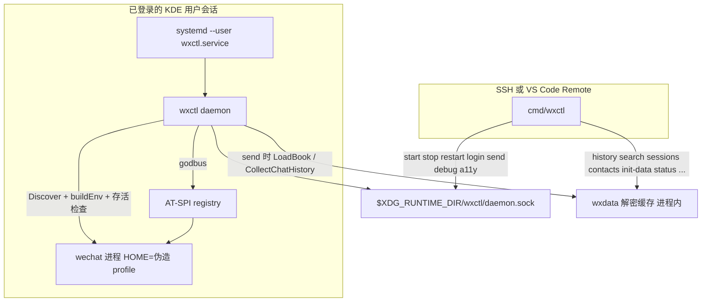
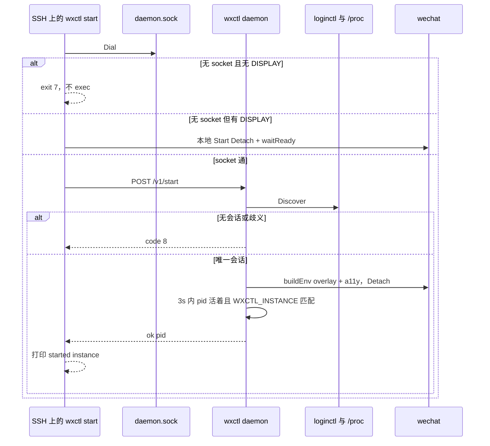
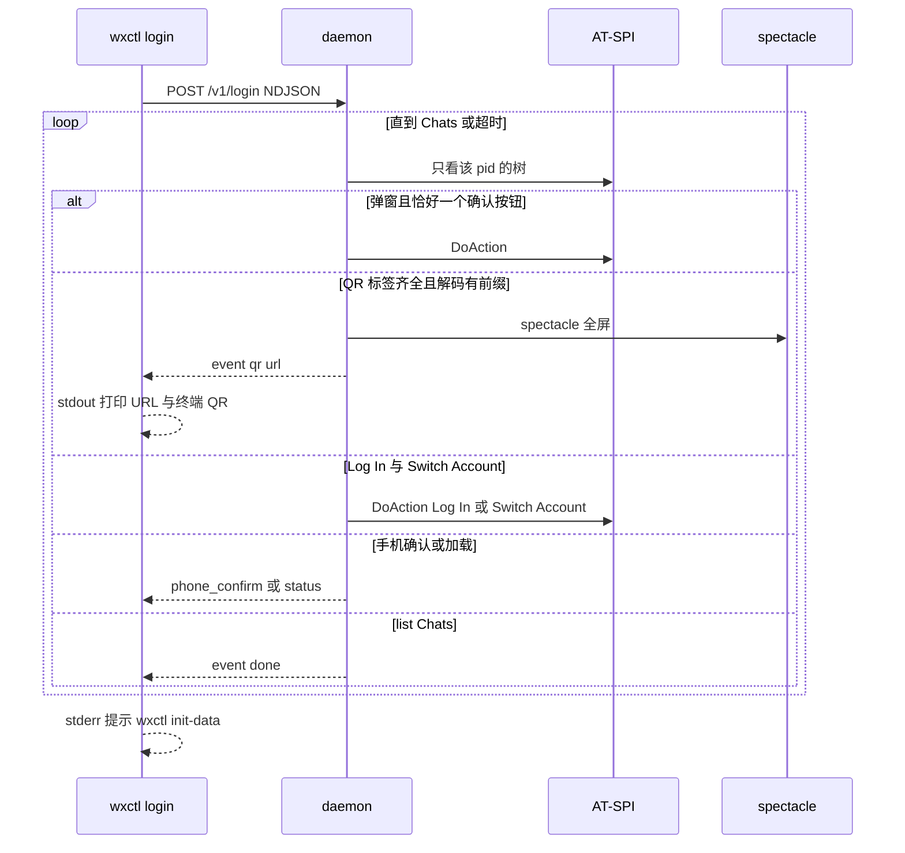

# wxctl Linux 图形会话守护进程与界面控制（登录 / 发文本）

| 字段 | 值 |
|------|-----|
| **Title** | wxctl Linux 图形会话守护进程与界面控制 |
| **Date** | 2026-09-22 |
| **Status** | Draft |
| **Target path** | `/home/deali/code/wechatctl/docs/wxctl-linux-session-control.md` |
| **Target repo** | `/home/deali/code/wechatctl`（Go module `github.com/star-plan/wechatctl`，CLI `wxctl`，`go 1.26.5`，CGO 关闭） |
| **Reference repo** | `/home/deali/code/2/agent-wechat`（只读；无 LICENSE。禁止拷贝、禁止修改、禁止 vendor） |
| **Audience** | Cursor coding agent；完成后由人工按验收清单检查 |
| **Supersedes** | `docs/wxctl-linux-data-query.md` 里「现有生命周期命令行为不变」以及 Key Decision 13 的「start 路径保持静默 ExitError」，**仅**对下面这些 start/stop/restart 变化。数据查询命令、exit 3–6、`desktop sync` 写出的文件内容不改。取代范围：① 子进程环境（加上无障碍变量、删掉三个 scale 键、相对 `XAUTHORITY` 改成绝对路径、空 `DISPLAY` 删掉）；② `--detach` 存活检查；③ socket 已接通时 start/stop/restart 变成 RPC，省略 `--detach` 也不再 `Wait()`，成功仍打印 `started instance` / `restarted instance`。本地且无 socket 的前台 `Wait()` 与静默 `*runtime.ExitError` 保持不变。菜单项 `Exec=wxctl start <name>`（`internal/desktop/desktop_unix.go` `formatDesktop`，没有 `--detach`）文件内容不动，但点击后走新的 start 路由 |

---

## Overview

wxctl 今天用伪造 `HOME` 在同一 Linux 用户下隔离多个微信，并用纯 Go 读每个实例的 SQLCipher 库。控制路径仍是「谁调用 `wxctl start`，谁 `exec` 微信」。主用法是 VS Code Remote SSH：SSH 会话没有 `DISPLAY` / `WAYLAND_DISPLAY`，`buildEnv` 又原样继承调用方环境，微信立刻退出。`--detach` 却在写完 pid 后返回 nil，CLI 打印 `started instance`。前台失败走 `*runtime.ExitError`，`main.go` 不打印。

本设计加一个**每用户一个**的 `wxctl daemon`，跑在已经登录的 KDE 图形会话里。SSH 上的 `start` / `stop` / `restart` / `login` / `send` 在 socket 通的时候只转发给它。`history`、`search` 以及其余读库/元数据命令继续在 CLI 进程里直接读，**不**经过守护进程。登录和发文本用 AT-SPI（D-Bus）重写，不移植 agent-wechat 的 Frida、坐标点击或 Python。

---

## Background & Motivation

### 当前状态（已在仓库里核对）

- 单一二进制：`cmd/wxctl/main.go`。`SilenceUsage` / `SilenceErrors` 都是 true。`classifyRunError`：`*wxdata.Error`（别名 `errkind.Error`）打印**外层** `err` 再退出；`*runtime.ExitError` 只 `os.Exit`、不打印；其它错误打印后 exit 1。
- `cmd/wxctl/runtime_cmds.go`：`start` 在 `StartWith` 成功且 `--detach` 时打印 `started instance %q`。`stop` 成功打印 `stopped instance %q`。`restart` 先 `Stop` 再 `StartWith`，`--detach` 时打印 `restarted instance %q`。没有图形会话判断。
- `internal/backend/linux.go` `buildEnv`：从 `os.Environ()` 复制，只改 `HOME`、`WXCTL_INSTANCE`（`paths.InstanceEnvKey`）、以及可选的 `GTK_IM_MODULE` / `QT_IM_MODULE` / `XMODIFIERS`。不设置无障碍变量，不补显示变量。
- `linuxHome.Start`：`Detach==true` 时 `Setsid`，stdin/stdout/stderr 全部设为 nil，`writePid` 后立刻 `return nil`。子进程马上死也不会被看见。`Detach==false` 时 `cmd.Wait()`，退出码包成 `*ExitError`。
- `belongsToInstance`：`/proc/<pid>/environ` **读失败返回 true**（fail-open）。`Status()` 用它。`runtime.Manager.InstancePIDs` 的注释写明扫描路径不得调用它；扫描用 `keys.EnvironHasInstance`（精确 token，读失败由调用方跳过）。
- pid 文件：`paths.Layout.PidFile` → `{DataDir}/run/<name>.pid`，默认 `~/.local/share/wxctl/run/<name>.pid`。原子写在 `internal/backend/pid.go` `writePid`（`*.tmp` + `Rename`）。
- 数据面已经落地：`wxdata.Open`、`query.LoadBook`、`Book.DisplayName` / `ResolveUsername`、`query.ResolveChatContext`、`query.CollectChatHistory`。密钥缺失时 `Open` 返回带 `run: wxctl init-data %s` 的 `ErrNoKeys`（exit 3）。`init-data` 仍是 ptrace 扫内存，与本设计无关。
- `go.mod` 已有 `modernc.org/sqlite`（纯 Go）与 `golang.org/x/sys`（间接）。没有 D-Bus、没有二维码库。
- 全仓库没有 `cmd/wxctld`，没有 systemd unit。`scripts/` 下只有 `wechat-profile.sh`。

### 本机图形会话（2026-09-22 实测，禁止写死进代码）

KDE Wayland，`loginctl` session id `3`，`Type=wayland`，`Remote=no`，`State=active`，`Desktop=KDE`。plasmashell 的 environ 含 `DISPLAY=:1`、`WAYLAND_DISPLAY=wayland-0`、`DBUS_SESSION_BUS_ADDRESS=unix:path=/run/user/1000/bus`、`XDG_SESSION_TYPE=wayland`。SSH / VS Code Remote 是 `XDG_SESSION_TYPE=tty`，没有 `DISPLAY` 也没有 `WAYLAND_DISPLAY`，但 `XDG_RUNTIME_DIR` 与用户总线和桌面相同。`/tmp/.X11-unix` 有 root 的 `X0` 和用户的 `X1`。`DISPLAY` 为空的进程**不得**落到 `:0`。

`XAUTHORITY` 是 `/run/user/1000/` 下的随机文件（实测名 `xauth_XHwSGu`）。实例启动会把 `HOME` 换成伪造 profile，之后不能再靠 `~/.Xauthority`。session leader `/proc/3344/environ` 与 `kwin_wayland` 的 environ 当时 `EACCES`；plasmashell 可读。发现逻辑必须扫同 uid、environ 可读、且含 `WAYLAND_DISPLAY` 或 `DISPLAY` 的进程，禁止按 comm 写死 `plasmashell`，禁止写死 `:1` 或 `wayland-0`。

### agent-wechat 里要重做的行为（只读，不移植源码）

对照过这些文件。实现时按本文重写，不要把 Rust/Python 拷进 wechatctl。

- `packages/agent-server-rust/src/ia/states/login.rs` 用无障碍**名字**认屏，顺序是代理设置、QR、已保存账号、手机确认、加载。QR 要同时有 label `Scan to log in`、按钮名包含 `Transfer files only`，并且截图解出的载荷以 `http://weixin.qq.com/x/` 开头；解不出就**不是** QR 屏。已保存账号是按钮 `Log In` 或 `Open WeChat`，外加 `Switch Account`。label 含 `Current User` 时去掉该前缀得到账号名。手机确认的源码正则是 `Comfirm on phone|Confirm.*phone|手机确认`。拼写 `Comfirm` 不当契约。v1 认的是：label 同时包含 `confirm` 与 `phone`（大小写不敏感），或包含 `手机确认`。因此 `Confirm on phone` 与 `Confirm login on your phone` 都算，后者只是我们发给客户端的事件句子，不是另一套标签。加载是 label `Entering`、名字含 `Loading`，或已有 Weixin/WeChat + Contacts 但还没有 list `Chats`。
- `ia/actions.rs` `click_login` 点 `Log In|Open WeChat`；`click_switch_account` 点 `Switch Account`；`dismiss_popup` 点 `OK|Confirm|确定|确认`。
- `plans/login.rs` 阶段名：`Initializing`、`Authenticating`、`Maximizing`、`DetectingUser`、`ExtractingKeys`、`Done`。成功条件是主界面进入 Chat / ChatOpen。它还会最大化窗口、探测账号目录、抽密钥。**wxctl 不做这三件事。** 成功只认 list `Chats`。密钥仍走现有 `wxctl init-data`。
- `ia/states/chat.rs`：`is_chat_view` 要有 Weixin 或 WeChat、Contacts、以及 list `Chats`。选中项是该 list 下 `SELECTED` 的 `list-item`。标题是 Chats 列表右侧、靠上、名字不含 `Send` 的 label；群名用结尾 `(数字)` 判断。
- `plans/send_message.rs` 阶段：`Opening`、`Focusing`、`Inputting`、`Confirming`、`Done`。输入框是「同一父节点下既有 `push-button` 名 `Send(S)`，又有 role `text` 且 `EDITABLE`」。发送确认是该按钮状态含 `DISABLED`。它用 `open_chat`（Frida）打开会话，并用坐标点输入框。**这两处都不移植。**
- `tools/qr.rs` 用 rqrr 解码、qrcode crate 再编码。wxctl 改用下面指定的纯 Go 模块。截图脚本 `docker/tools/screenshot` 调 `scrot`，仅 X11，**不移植**。
- `docker/tools/launch-wechat` 在启动前导出 `QT_ACCESSIBILITY=1`、`QT_LINUX_ACCESSIBILITY_ALWAYS_ON=1`、`GTK_MODULES=gail:atk-bridge`。它还强制 `QT_SCALE_FACTOR=1` 等 HiDPI 开关，那是给 xdotool 坐标用的。**wxctl 不设置、并从子进程环境删掉这些 scale 变量。**
- `docker/tools/input`：`xclip -selection clipboard` 必须放后台，因为它会阻塞到选区被取走；然后 `xdotool key ctrl+v`。Wayland 上对应物是 `wl-copy --foreground` 后台 + `wtype`。

### 反模式：`docker/tools/chat-select.py`（禁止移植）

该脚本用微信 ELF BuildID 前缀选择一套堆偏移：`5233a112`、`f8713825`、`3eda8254`、`eba86b80`。它 `readelf` 读 BuildID，用 Frida 在堆上扫 manager 的 vtable，再改 `selectSession` 的下标参数，按 wxid 直接选中会话。这依赖某一个微信构建的内部布局，更新即坏，并且是进程注入。

**不在本设计范围内。** 搜索框不在无障碍树里、搜索结果没有 AT-SPI action、或头栏对不上时，返回错误（exit 9）。禁止调用 Frida，禁止按 BuildID 分支，禁止把该脚本改写成 Go/cgo，禁止在搜索失败后滚动虚拟列表碰运气。

### 痛点

- SSH 上 `wxctl start --detach` 报成功，微信已经死了。
- 无障碍树只在**启动时**带上 Qt/GTK 变量的进程里出现。已经在跑的微信不会长出树，必须重启该实例。
- 登录和发消息要独占键鼠/剪贴板。查询命令如果也进同一把锁，会把 `history` 拖死。所以读路径留在 CLI。
- 剪贴板和按键必须由**在图形会话里**的进程执行。SSH 进程即使用户总线相同，也没有 Wayland 座位。

---

## Goals & Non-Goals

### Goals（v1）

- 仍然只有一个 main 包。子命令 `wxctl daemon`。实现落在 `internal/daemon` 与 `internal/control`。systemd `ExecStart` 是 `wxctl daemon`。
- 用户级 systemd unit，安装到 `~/.config/systemd/user/wxctl.service`（尊重 `XDG_CONFIG_HOME`，与 systemd 一致）。不安装系统级 unit，不 `enable-linger`。
- 守护进程监听 `$XDG_RUNTIME_DIR/wxctl/daemon.sock`。目录 `0700`，socket `0600`。只校验对端 uid。
- `start` / `stop` / `restart` 在「有 socket」或「无显示又无 socket」时不再由 SSH 进程拉起微信。有显示且无 socket 时，本机终端仍走今天的进程内启停，但 `--detach` 必须做存活检查。
- `login`、`send`、`debug a11y` 始终要求守护进程。
- 登录状态机与发文本按上面的选择器重写。`CGO_ENABLED=0`。
- 发文本的对象是微信 id（wxid、`xxx@chatroom`，或表里确实存在的 `filehelper`）。显示名用现有 `query.LoadBook`。缺密钥文件沿用 exit 3 与 `init-data` 提示。`filehelper` 不单独开绿灯。
- `go test ./...` 在没有显示器时全绿。

### Non-Goals（v1 明确不做）

- 自动回复机器人。
- 图片或文件发送。agent-wechat 的 paste-image / paste-file 只作对照，不实现。
- Frida、hook、vtable、BuildID 偏移、`chat-select.py` 的任何部分。
- 为每个实例起新的 Xvfb / Weston。
- 没有图形登录的无头机器。
- TCP API、gRPC、新的 web 框架、认证 token。
- 把 `history` / `search` / `sessions` / `contacts` / `members` / `chat-export` / `unread` / `new-messages` / `init-data` / `list` / `show` / `create` / `edit` / `remove` / `export` / `import` / `config` / `migrate` / `desktop` / `status` 挪进守护进程。
- 修改 `/home/deali/code/2/agent-wechat` 或 wechat-cli，或把它们的源码拷进本仓库。
- Windows / macOS。
- 把 `QT_SCALE_FACTOR`、`QT_ENABLE_HIGHDPI_SCALING`、`QT_AUTO_SCREEN_SCALE_FACTOR` 设成 1。`buildEnv` 必须从子进程环境**删掉**这三个键，避免调用方自己设过。
- 登录过程中抽数据库密钥、最大化窗口、处理「网络代理」页。卡住就等到超时。
- 守护进程退出时杀掉微信。

---

## Key Decisions

1. **一个二进制，`wxctl daemon`。** 禁止 `cmd/wxctld` 与第二个 `main`。`cmd/wxctl` 只解析 flag 并调用 `internal/daemon`。与「cmd 只做解析」的现有结构一致。
2. **只装 user unit。** 仓库文件 `scripts/systemd/wxctl.service` 与嵌入副本 `internal/daemon/wxctl.service` 必须逐字节相同（测试锁死）。`install` 把 `@WXCTL_BIN@` 换成 `os.Executable()` 的绝对路径（`EvalSymlinks`），原子写入 unit，再 `systemctl --user daemon-reload` 与 `enable --now`。`uninstall` 为 `disable --now`、删文件、再 `daemon-reload`。不 linger。unit 含 `KillMode=process`：子进程虽然 `Setsid`，仍留在服务 cgroup 里；默认 `control-group` 会在 `systemctl stop` 时把微信一起杀掉。另含 `RestartPreventExitStatus=1`：`XDG_RUNTIME_DIR` 为空时进程 exit 1，不能让 `Restart=on-failure` 每 2 秒拉起一次。路径用 `paths.SystemdUserUnit`，也就是现有 `xdgConfigHome(layout.Home)` 再加 `systemd/user/wxctl.service`。`realHome()` 不导出。不用 `Layout.ConfigDir`（那是 `~/.config/wxctl`）。euid 为 0 时沿用 `xdgConfigHome`：忽略 `XDG_CONFIG_HOME`。`systemctl` 经可注入的 `Run` 调用，单测禁止真的 exec。
3. **socket 只放 `$XDG_RUNTIME_DIR/wxctl/daemon.sock`。** `XDG_RUNTIME_DIR` 空则守护进程拒绝启动（exit 1，英文 `XDG_RUNTIME_DIR is empty; refusing to start`）。禁止放进伪造 HOME、`~/.wechat-cli`、`/tmp`。无 TCP。不发明 token。权限 `0600` 加上 `SO_PEERCRED` 的 uid 必须等于 `os.Geteuid()`（拥有 socket 的凭证，不是 `Getuid`）。不等则 HTTP 403。`GetsockoptUcred` 失败则拒绝，不 fail-open。今天的二进制没有 setuid，两种 uid 在生产上相同；写进代码的只有 euid，避免以后 sudo/setuid 时两处分叉。
4. **协议是绑在该 unix socket 上的 `net/http`。** 不用 gRPC，不引入 web 框架。JSON 请求/响应。登录用同一条 HTTP 响应上的 chunked NDJSON（`application/x-ndjson`），每条事件 `Flush`。schema 见 API 一节，不要加版本协商。
5. **读命令永不进守护进程。** `init-data` 仍是现有的 ptrace。`status` 仍本地读 pid 文件（SSH 上可以看状态，不必有 socket）。转发集合只有：`start`、`stop`、`restart`、`login`、`send`、`debug a11y`。
6. **路由按拨号结果分三态，不要压成一个 bool。** 只有 `ENOENT` 与 `ECONNREFUSED` 是「没有守护进程」。超时、`EACCES`、`EPERM`、`ENOTDIR` 以及其它错误都是 exit 7，英文 `daemon socket not accessible`，并且**不得**调用 `Start` 或 `Stop`。有显示的 KDE 终端遇到 root 拥有或拨号超时的 socket 时，也不许退回本地 `exec`。
   - 拨号成功：转发。客户端不 `exec` 微信，也不本地 `Stop`。
   - 确认没有守护进程，且进程已有非空 `WAYLAND_DISPLAY` 或 `DISPLAY`：`start`/`stop`/`restart` 走进程内路径。`login`/`send`/`debug a11y` 仍失败，exit 7，英文要求 `wxctl daemon install`。
   - 确认没有守护进程，且两个显示变量都空：`start`/`stop`/`restart` **不得**创建微信进程，也不得发信号。exit 7，英文说明 SSH 没有图形会话。禁止打印 `started instance`、`stopped instance`、`restarted instance`。
   - 这三句成功文案都只在对应操作返回 nil 之后打印。转发成功时，即使用户没写 `--detach`，也打印 `started instance` / `restarted instance`（不要把今天 `if detach` 的打印留在 HTTP 分支上）。本地无 socket 的前台路径仍只在 `--detach` 时打印 start/restart 的成功句；`stop` 成功则始终打印。
7. **会话发现是守护进程拿显示的方法，不是第二种产品模式。** 算法见 Proposed Design。直接本地路径（调用方自己已有显示）**不**跑 `loginctl`，用调用方环境。发现结果禁止带上桌面进程的 `HOME`。禁止写死 plasmashell / `:1` / `wayland-0`。零个会话或多于一个会话都是 exit 8，不启动微信。
8. **无障碍变量在 `exec` 微信之前写入子进程环境。** 已在跑的进程不会获得树。本地路径与守护进程路径都走 `buildEnv`。三个 scale 变量删除，不设置。本地路径：`DISPLAY` 缺失或为空就删掉这个键，避免空字符串落到 Qt。守护进程路径：发现结果里没有非空 `DISPLAY` 或没有非空 `WAYLAND_DISPLAY` 时，必须从子进程环境删掉对应键，即使守护进程自己的 environ 里已经有 `DISPLAY=:0`。子进程不得继承发现逻辑没有显式复制的显示变量。
9. **`--detach` 与守护进程的 start 必须存活检查。** 最长等 3 秒。成功条件：pid 仍活着，且 `keys.EnvironHasInstance` 对 `/proc/<pid>/environ` 为真。environ 读失败视为失败（fail-closed），禁止用 `belongsToInstance`。失败时若进程还在就 `SIGKILL`、删 pid 文件，错误字符串带日志尾部。该错误**不是** `*runtime.ExitError`，CLI 必须打印。无 `--detach` 的前台 `Wait()` 与静默 `ExitError` **保持不变**。守护进程的 start 始终等价于 detach+存活检查，不等待微信生命周期。前台等待只存在于「有显示且没走守护进程」的直接路径。
10. **实例锁在守护进程内，每名字一把 `sync.Mutex`。** `start`/`stop`/`restart`/`login`/`send`/`debug a11y` 对同一 `name` 串行。不同名字并行。读命令不拿这把锁。锁不落盘，不写进伪造 HOME。PR2 起 start/stop/restart 就拿锁；PR3 起 `debug a11y` 拿锁；登录 PR 起 login 拿锁。不要等到发文本才加锁，否则三分钟的点击循环期间可以 stop 掉同一个实例。
11. **界面控制用 `github.com/godbus/dbus/v5` 直连 AT-SPI，纯 Go。** 不 import Python `gi`，不 shell out 到 `a11y-dump.py`，不用 Frida。点按钮只用名字是 `click` 或 `press`（大小写不敏感）的 `DoAction` 下标，不用坐标，也不要因为 `NActions>0` 就调用下标 0。选择器常量只放 `internal/control/selectors.go`。
12. **发文本的显示名解析复用 `query.LoadBook`，不写第二套解析器。** 签名是 `(*Book, *sql.DB, error)`。`--to` 必须是 `contact.username` 的精确键（`filehelper` 没有特例；表里没有就 exit 1）。禁止把模糊显示名塞进 `--to`。有消息键时，在任何 AT-SPI 写入或点击之前做一次 `ResolveChatContext` + `CollectChatHistory` 快照；这次 `err != nil`、`failures` 非空或 `ctx == nil` 就返回，不去点界面。界面接受之后的轮询每次重新 `ResolveChatContext`。`failures` 非空不是空快照。sender 为 `me` 的判定沿用 `Book.DisplayNameFor` / `ResolveSenderLabel`，不另写 SQL。`defer store.Close()`。没有 `message/message_\d+\.db` 密钥时不走 exit 3：`Open` 不重查 `MissingRequired`，`keys.RequiredRels` 只有 session 与 contact。
13. **新退出码放在 `internal/clierr`，不复用 `wxdata` 的 3–6，也不复用 `runtime.ExitError`。** `backend` 不能 import `control`（`control` 将来由 `daemon` 调用，`daemon` 调用 `backend`，再回去就成环）。这与数据面把哨兵放在 `internal/wxdata/errkind` 是同一原因。`main.go` 对 `*clierr.Error` `errors.As` 后**打印外层 err** 再退出。
14. **二维码：守护进程只负责截屏与解码；终端重绘在客户端。** 截屏命令固定为 `spectacle -b -n -f -o <file>`。解码库 `github.com/makiuchi-d/gozxing`（含 `GenericMultipleBarcodeReader`，纯 Go）。终端绘制 `github.com/mdp/qrterminal/v3`（纯 Go）。不用 `scrot`，不用 CGO。载荷必须带前缀 `http://weixin.qq.com/x/`，否则不当成 QR。
15. **默认日志不记消息正文与 QR URL。** URL 是登录秘密。日志字段只有实例名、pid、阶段、错误。控制状态不写伪造 HOME：日志在 `{RunDir}/<name>.log`，QR PNG 在 `$XDG_RUNTIME_DIR/wxctl/`。
16. **输入优先走 AT-SPI，座位按键只是退路。** 节点带 `org.a11y.atspi.EditableText` 时用 `SetTextContents`（`s` → `b`）。提交优先对 `Send(S)` 做 click/press，而不是 `Return`。没有该接口、调用返回 false，或搜索框写入后 2 秒仍无结果时，才用剪贴板 + `wtype`/`xdotool`。退路进程的环境只含会话白名单和守护进程的真实 `HOME`（`layout.Home`），不是微信子进程那份伪造 `HOME`。剪贴板只在这次退路粘贴期间放正文。

---

## Proposed Design

### 架构



SSH 与桌面共享 `XDG_RUNTIME_DIR` 和用户总线，所以 `systemctl --user` 与 unix socket 从 SSH 就能用。SSH **没有** Wayland 座位，所以客户端不 `exec` 微信、不跑 `wtype`。

### 包布局

```text
cmd/wxctl/
  main.go                      # 增加 clierr 分支；注册 daemon / login / send / debug
  runtime_cmds.go              # start/stop/restart 改走 Router
  daemon_cmds.go               # //go:build linux
  control_cmds.go              # login、send、debug a11y
  exit_test.go                 # clierr 打印；ExitError 仍静默

internal/clierr/
  clierr.go                    # Code 7–10；无 build tag

internal/daemon/
  session.go                   # loginctl + environ 发现
  session_test.go
  route.go                     # 三分支
  route_test.go
  client.go                    # HTTP over unix
  server.go                    # 监听、peercred、路由、实例锁
  server_test.go
  unit.go                      # install / uninstall
  wxctl.service                # 与 scripts/systemd/wxctl.service 相同

internal/backend/
  linux.go                     # buildEnv、detach 存活检查、EnvOverlay
  start_linux_test.go

internal/control/
  selectors.go
  tree.go                      # AT-SPI 节点、状态位、JSON
  atspi_linux.go
  login.go
  send.go
  qr.go
  input_linux.go               # wl-copy/wtype 或 xclip/xdotool
  testdata/chat_view.json
  selectors_test.go
  login_test.go
  send_test.go
  live_test.go                 # WXCTL_LIVE_CONTROL=1 才跑

scripts/systemd/wxctl.service
```

`cmd/wxctl` 新文件、`internal/daemon`、`internal/control`、`internal/backend` 的 Linux 文件都加 `//go:build linux`，与 `cmd/wxctl/main.go` 一致。

对齐现有风格：cobra `Use` + `Args` + `RunE`；先 `loadApp()`；错误英文；注释中文、短、只写非显而易见约束；写文件用 `*.tmp` + `Rename`（见 `config.Save`、`writePid`）。

### 对现有包的改动

| 文件 | 改动 |
|------|------|
| `cmd/wxctl/main.go` | `AddCommand(daemonCmd(), loginCmd(), sendCmd(), debugCmd())`。`classifyRunError` 在 `wxdata.Error` 之后、`runtime.ExitError` 之前识别 `*clierr.Error` 并打印 |
| `cmd/wxctl/runtime_cmds.go` | `start`/`stop`/`restart` 经 `daemon.Route`。成功文案不变。失败不得打印 `started instance` |
| `internal/backend/linux.go` | `buildEnv` 增加无障碍变量、删除 scale 变量。本地路径 `dropEmptyDisplay`。overlay 未给出的 `DISPLAY` / `WAYLAND_DISPLAY` 从子进程删除。`Detach` 写 `{RunDir}/{name}.log` 并 `waitReady`。**不改** `belongsToInstance` 与 `Status()` |
| `internal/paths/paths_unix.go` | 新增 `SystemdUserUnit`，复用 `xdgConfigHome`。不改 `realHome` 的导出性 |
| `internal/backend/backend.go` | `StartOptions` 增加 `EnvOverlay map[string]string` |
| `README.md` | PR2 写 SSH 与 unit；PR4 补 login/send。不改数据命令契约 |
| `go.mod` | `github.com/godbus/dbus/v5`、`github.com/makiuchi-d/gozxing`、`github.com/mdp/qrterminal/v3` |

`export` 的 `Use` 不改。`wxdata` 的 SQL、exit 3–6、`init-data` 扫描范围不改。

### 路由

```go
type Kind int

const (
	KindStart Kind = iota
	KindStop
	KindRestart
	KindLogin
	KindSend
	KindA11y
)

type Decision struct {
	Local bool // true = 进程内 backend；false = HTTP
}

type DialResult int

const (
	DialUp DialResult = iota
	DialAbsent        // 仅 ENOENT、ECONNREFUSED
	DialError         // 超时、EACCES、EPERM、ENOTDIR 以及其它
)

// Route 不拨号、不 exec。hasDisplay 为 WAYLAND_DISPLAY 或 DISPLAY 非空。
// DialError 时一律返回 code 7，Local 必须为 false。
func Route(dial DialResult, hasDisplay bool, kind Kind) (Decision, error)
```

| dial | hasDisplay | start/stop/restart | login/send/a11y |
|------|------------|--------------------|-----------------|
| `DialUp` | 任意 | HTTP | HTTP |
| `DialAbsent` | true | 本地 | `*clierr.Error` 7 |
| `DialAbsent` | false | `*clierr.Error` 7，且调用方不得 `Start`/`Stop` | `*clierr.Error` 7 |
| `DialError` | 任意 | `*clierr.Error` 7，`daemon socket not accessible`，不得 `Start`/`Stop` | 同左 |

exit 7 的三句英文（测试按子串匹配，不要改写）：

```text
ssh has no graphical session; run the daemon inside the logged-in desktop (wxctl daemon install && systemctl --user start wxctl.service)
```

```text
login and send require the wxctl daemon; run: wxctl daemon install
```

```text
daemon socket not accessible
```

`debug a11y` 在确认没有守护进程时用：`debug a11y requires the wxctl daemon; run: wxctl daemon install`。`DialError` 时它也用 `daemon socket not accessible`，不要假装没装 unit。

`Dial` 超时 200ms。把 `errors.Is(err, os.ErrNotExist)` 与 `syscall.ECONNREFUSED` 收成 `DialAbsent`。`context.DeadlineExceeded`、`EACCES`、`EPERM`、`ENOTDIR` 都是 `DialError`。`route_test.go` 必须有一条：`DialError` 且 `DISPLAY=:1` 时 fake starter 与 fake stop 的调用次数都是 0。

本地 `start` 仍先 `Probe`，已在跑则 `instance %q is already running (pid %d)`（exit 1），与今天相同。

### 会话发现

```go
// Session.Env 只有白名单键，且不含 HOME。
type Session struct {
	ID  string
	Env map[string]string
}

type DiscoverOpts struct {
	SessionID string // --session 或 WXCTL_SESSION；空则必须唯一
	UID       int
	// 测试注入。nil 时用 exec.CommandContext（不经 shell）。
	Run            func(ctx context.Context, name string, args ...string) ([]byte, error)
	ReadEnviron    func(pid int) ([]byte, error) // 非 nil 错误 = 不可读
	ListCgroupPIDs func(controlGroup string) ([]int, error)
}

func Discover(ctx context.Context, opts DiscoverOpts) (Session, error)
```

白名单，顺序固定，缺则省略，禁止发明：

```text
DISPLAY
WAYLAND_DISPLAY
XAUTHORITY
XDG_RUNTIME_DIR
DBUS_SESSION_BUS_ADDRESS
XDG_SESSION_TYPE
XDG_CURRENT_DESKTOP
```

算法：

1. `loginctl list-sessions --no-legend`。只取第一列 session id（`^[A-Za-z0-9-]+$`，不匹配就跳过该行）。不要用 shell。
2. 对每个 id 跑 `loginctl show-session <id> -p Remote -p Type -p State -p Desktop -p Leader -p User -p ControlGroup`。解析 `Key=Value`。保留 `User` 等于十进制 uid、`Remote=no`、`Type` 为 `wayland` 或 `x11`、`State=active`。
3. `opts.SessionID` 非空：只留这个 id。它不在保留集里 → exit 8，`session %s is not an active local graphical session`。
4. 保留集为空 → exit 8，`no active local graphical session`。多于一个且没有 id → exit 8，`ambiguous graphical sessions: <id 列表>; restart the daemon with --session or WXCTL_SESSION`。id 列表用逗号加空格连接。每个 id 都能 `strconv.ParseUint(..., 10, 64)` 时按数值升序（`3` 在 `10` 前）；否则整组按字符串升序（`3` 在 `c1` 前）。不要对非十进制 id 做整数转换。单测要有一条非十进制 id，避免只写 `3` 和 `4`。
5. 选进程。先读 `Leader`。environ 可读且含非空 `WAYLAND_DISPLAY` 或非空 `DISPLAY` 就用它。否则取 `ControlGroup` 的 `cgroup.procs`（含子 cgroup）。pid 升序。优先第一个「可读且 `WAYLAND_DISPLAY` 非空」的，否则第一个「可读且 `DISPLAY` 非空」的。禁止按 comm 挑 `plasmashell`。Leader 不可读就继续，这是实测过的情况，不是硬错误。
6. `ControlGroup` 为空或目录不存在：扫 `/proc/[0-9]+/cgroup`，内容包含 `session-<id>.scope` 的 pid，同样规则。单测注入 `ListCgroupPIDs`，不要依赖真 cgroup。
7. 一个可读进程都没有 → exit 8，`graphical session %s has no process with a readable DISPLAY or WAYLAND_DISPLAY`。
8. 复制白名单。`XAUTHORITY` 若存在但不是绝对路径 → exit 8，`XAUTHORITY %q is not absolute`。禁止 `filepath.Join` 桌面进程的 `HOME`。两个显示变量都空则该进程不算命中。
9. 结果里没有 `HOME`。不要因为没发现 `DISPLAY` 就填 `:0`。overlay 没给出的 `DISPLAY` / `WAYLAND_DISPLAY` 必须从子进程删掉，不能沿用守护进程自己的值。本地路径只额外删空的 `DISPLAY`。

守护进程**启动**时不调用 `Discover`（此时 Plasma 可能还没导入环境）。每次 `start`/`restart`/`login`/`send`/`debug a11y` 前现查。失败返回 exit 8，不 `exec`。守护进程进程本身保持监听。

本机对照（不许写进常量）：session `3` 的 plasmashell 能提供 `DISPLAY=:1` 与 `WAYLAND_DISPLAY=wayland-0`；leader `3344` 当时不可读，算法必须落到 cgroup 里别的进程。

### 子进程环境

`StartOptions.EnvOverlay == nil`（直接本地路径）：从 `os.Environ()` 复制。`XAUTHORITY` 若是相对路径，用**替换 HOME 之前** environ 里的 `HOME` 拼成绝对路径；用户 HOME 也空则 exit 1，`XAUTHORITY %q is not absolute`。然后把 `HOME` 设为实例伪造目录（现有行为）。

`EnvOverlay != nil`（守护进程）：先复制守护进程自己的 environ，再写白名单里**非空**的键。overlay 里出现非白名单键则忽略。然后对 `DISPLAY` 和 `WAYLAND_DISPLAY` 各做一次：overlay 没有这个键，或值是空字符串，就 `unsetEnv`。守护进程自己带着的 `DISPLAY=:0` 不得留下。发现逻辑没复制的显示变量，子进程一份也不能有。`dropEmptyDisplay` 只删空字符串，盖不住「父环境是 `:0`、overlay 根本没这个键」。

```go
func applyOverlay(env []string, overlay map[string]string) []string {
	for _, key := range sessionEnvKeys { // 白名单，见上
		if v, ok := overlay[key]; ok && v != "" {
			env = setEnv(env, key, v)
		}
	}
	for _, key := range []string{"DISPLAY", "WAYLAND_DISPLAY"} {
		if v, ok := overlay[key]; !ok || v == "" {
			env = unsetEnv(env, key)
		}
	}
	return env
}
```

本地路径不走 `applyOverlay`。两条路径在 `applyA11y` 之后、`exec` 之前都调用 `dropEmptyDisplay`，专门删掉仍然为空的 `DISPLAY`。单测两条：

- 本地：父环境 `WAYLAND_DISPLAY=wayland-1` 且 `DISPLAY=`（空字符串）时，子进程没有 `DISPLAY` 键。
- 守护进程：父环境 `DISPLAY=:0`，overlay 只有 `WAYLAND_DISPLAY=wayland-1`。子进程有 `WAYLAND_DISPLAY`，没有 `DISPLAY` 键。

```go
func dropEmptyDisplay(env []string) []string {
	if getEnv(env, "DISPLAY") == "" {
		return unsetEnv(env, "DISPLAY")
	}
	return env
}
```

```go
func applyA11y(env []string) []string {
	env = setEnv(env, "QT_ACCESSIBILITY", "1")
	env = setEnv(env, "QT_LINUX_ACCESSIBILITY_ALWAYS_ON", "1")
	env = setEnv(env, "GTK_MODULES", appendGTKModules(getEnv(env, "GTK_MODULES")))
	env = unsetEnv(env, "QT_SCALE_FACTOR")
	env = unsetEnv(env, "QT_ENABLE_HIGHDPI_SCALING")
	env = unsetEnv(env, "QT_AUTO_SCREEN_SCALE_FACTOR")
	return env
}
```

`appendGTKModules`：按 `:` 拆，缺 `gail` 或 `atk-bridge` 就按这个顺序追加到末尾，已有的用户值一个都不删，不重复。空字符串结果是 `gail:atk-bridge`。

`WXCTL_INSTANCE` 与 IM 模块逻辑保持 `buildEnv` 现状。

### 存活检查

`--detach` 或守护进程 start：

1. `cmd.Dir` 仍是伪造 HOME。stdout 与 stderr 追加到 `{RunDir}/{name}.log`，打开标志 `O_CREATE|O_TRUNC|O_WRONLY`，模式 `0600`。每次启动截断，避免旧日志混进尾部。stdin 为 nil。`Setsid: true`。
2. `Start` + `writePid` 与今天相同。pid 写失败则杀掉子进程。
3. 最长 3 秒，每 100ms：`alive` 为假则马上失败。为真则读 environ；`keys.EnvironHasInstance` 为真则成功返回。读失败或 token 不对就继续等到截止，以便应付启动瞬间 environ 还不可读。
4. 截止仍活着但不匹配 → `SIGKILL`，删 pid，错误 `wechat pid %d has no WXCTL_INSTANCE=%s`。
5. 进程已死 → 删 pid，错误 `wechat exited during start; log %s:` 后接日志最后 20 行（不足 20 行则全部）。日志空则 `wechat exited during start; log %s: empty`。错误里要能看到尾部，单测搜 `boom` 这类标记。
6. 返回的是普通 `error` 或 `*clierr.Error` 以外的 `fmt.Errorf`，**不要** `&ExitError{}`。`runtime_cmds.go` 只有 `err == nil` 才打印 `started instance`。`stopped instance` 与 `restarted instance` 同样只有 nil 才打印。

无 `--detach` 且走本地路径：仍把 stdio 接到终端，`Wait()`，退出码仍然是 `*runtime.ExitError`，`main` 仍不打印。数据查询文档里「静默 ExitError」只在这条路径上仍然有效。

`restart` 两条路径同一语义，对齐今天的 `restartCmd`：`Probe` 认为在跑才 `Stop`，否则跳过 `Stop` 直接 `Start`。禁止对已停止实例调用 `linuxHome.Stop`（它会返回 `instance %q is not running`，重启就起不来了）。守护进程在同一把实例锁里做这件事。`server_test.go`：未运行 ⇒ fake stop 次数为 0、fake starter 次数为 1、HTTP `ok:true`。

守护进程的 start/restart handler 始终 `Detach: true` 并传入 `EnvOverlay`。HTTP 在存活检查结束后才返回 JSON。不等待微信生命周期。客户端在 nil 之后打印 `started instance` 或 `restarted instance`，**即使请求没有 detach 标志**。直接本地路径上省略 `--detach` 仍是前台 `Wait()`，并且不打印这两句。

### 实例锁与守护进程生命周期

```go
func (d *Daemon) withInstance(name string, fn func() error) error {
	d.mu.Lock()
	m := d.locks[name]
	if m == nil {
		m = &sync.Mutex{}
		d.locks[name] = m
	}
	d.mu.Unlock()
	m.Lock()
	defer m.Unlock()
	return fn()
}
```

`map` 的锁不覆盖 `fn`。不要用全局一把锁。

进程：

- `wxctl daemon [--session id]`。id 也可用环境变量 `WXCTL_SESSION`（flag 优先）。
- `XDG_RUNTIME_DIR` 空 → 启动失败，不监听。
- `MkdirAll($XDG_RUNTIME_DIR/wxctl, 0700)` 后再 `chmod 0700`。
- socket 已存在：能 `Dial` 则 exit 1 `daemon already running`。不能则删除陈旧文件再监听。
- `syscall.Umask(0077)` 包住 `Listen("unix", path)`，随后 `chmod 0600`。然后再 `Serve`。
- `SIGTERM`/`SIGINT`：关闭 listener，删 socket，exit 0。不向微信发信号。
- 不在启动时 `exec` 微信，不在启动时要求 `Discover` 成功。

`Accept` 包装：`unix.GetsockoptUcred(fd, SOL_SOCKET, SO_PEERCRED)`。`self` 用 `uint32(os.Geteuid())`。`peerAllowed(self, cred.Uid)` 为假，或取 cred 失败 → 连接直接关，不读 body。HTTP 层再挡一层 403。单测：`peerAllowed(1000, 1000)` 为真，`peerAllowed(1000, 0)` 为假；再测一条同 euid 的真连接。

### systemd unit

`scripts/systemd/wxctl.service`（嵌入副本相同）：

```ini
[Unit]
Description=wxctl per-user session daemon
PartOf=graphical-session.target
After=graphical-session.target

[Service]
Type=simple
ExecStart=@WXCTL_BIN@ daemon
Restart=on-failure
RestartSec=2s
RestartPreventExitStatus=1
KillMode=process
PassEnvironment=DISPLAY WAYLAND_DISPLAY XAUTHORITY XDG_RUNTIME_DIR DBUS_SESSION_BUS_ADDRESS XDG_SESSION_TYPE XDG_CURRENT_DESKTOP

[Install]
WantedBy=graphical-session.target
```

没有 `WantedBy=default.target`，没有 `User=`，没有 `ExecStartPre` 启动微信。

安装目标由新函数给出，不要在 `daemon` 里再写一套 HOME 规则，也不要 `filepath.Join(layout.ConfigDir, ...)`：

```go
// SystemdUserUnit 使用与 DefaultLayout 相同的 xdgConfigHome。
// euid==0 时忽略 XDG_CONFIG_HOME，避免 sudo env_keep 写到 /root。
func SystemdUserUnit(layout Layout) string {
	return filepath.Join(xdgConfigHome(layout.Home), "systemd", "user", "wxctl.service")
}
```

放在 `internal/paths/paths_unix.go`（已有 `//go:build linux`）。单测放在 `paths_test.go`，沿用 `withHomeHooks`：euid 0、`XDG_CONFIG_HOME=/root/.config`、`layout.Home=/home/deali` 时期望 `/home/deali/.config/systemd/user/wxctl.service`。euid 非 0 且 `XDG_CONFIG_HOME` 指向别的目录时，unit 落在该目录下的 `systemd/user/wxctl.service`，而不是 `Layout.ConfigDir`（那个路径以 `wxctl` 结尾）。

写入：同目录 `wxctl.service.tmp`，`0644`，`Rename`。`systemctl` 不直接 `exec.Command`，走与 `DiscoverOpts.Run` 相同形状的注入：

```go
type Systemctl func(ctx context.Context, args ...string) ([]byte, error)
```

生产实现才调用 `systemctl`。`go test ./...` 里的 install/uninstall 必须传入假的 `Systemctl`，断言参数含 `--user` 与 `daemon-reload`，并且不 exec 真的 `systemctl`。假 runner 返回错误时，install 不得打印成功。生产参数是：

```text
systemctl --user daemon-reload
systemctl --user enable --now wxctl.service
```

卸载：`disable --now`，删 unit 文件，再 `daemon-reload`。`systemctl` 失败则命令失败，不要打印成功。不要调用 `loginctl enable-linger`。

多会话时不由 install 写 drop-in。错误 8 的正文已经告诉用户用 `--session` 或 `WXCTL_SESSION` 重启守护进程。手工 drop-in 路径是 `~/.config/systemd/user/wxctl.service.d/session.conf`，本文不自动生成。

从 SSH 执行 `systemctl --user` 是支持的：用户总线与桌面相同。用户管理器没起来时，把 `systemctl` 的 stderr 原样返回，并加一句 `user manager is not running; log in to the desktop first`。不要建议 linger。

### 启动时序



### AT-SPI

`internal/control` 提供纯数据结构，D-Bus 只在 `atspi_linux.go`。选择器测试喂 JSON，不连总线。

连接步骤（地址用发现到的 `DBUS_SESSION_BUS_ADDRESS`，禁止用进程启动时缓存的 `dbus.SessionBus()`，那时变量可能还是空的）：

1. `dbus.Connect(sessionBus)`。
2. 调用 `org.a11y.Bus` / `/org/a11y/bus` 的 `org.a11y.Bus.GetAddress`，得到 AT-SPI 总线地址。
3. `dbus.Connect` 那条地址。
4. 根对象：总线名 `org.a11y.atspi.Registry`，路径 `/org/a11y/atspi/accessible/root`。
5. 下面每个成员都标明是属性还是方法。属性一律 `org.freedesktop.DBus.Properties.Get`，接口名是该 AT-SPI 接口，不是 `Properties` 自己。线格式对不上时按 Working Rule 9 失败，不要改成坐标。

| 成员 | 种类 | 接口 | 签名 |
|------|------|------|------|
| `Name` | 属性 | `org.a11y.atspi.Accessible` | `s` |
| `ChildCount` | 属性 | `org.a11y.atspi.Accessible` | `i` |
| `GetRoleName` | 方法 | `org.a11y.atspi.Accessible` | `()` → `s` |
| `GetChildAtIndex` | 方法 | `org.a11y.atspi.Accessible` | `i` → `(so)` |
| `GetState` | 方法 | `org.a11y.atspi.Accessible` | `()` → `au` |
| `GetApplication` | 方法 | `org.a11y.atspi.Accessible` | `()` → `(so)` |
| `GetInterfaces` | 方法 | `org.a11y.atspi.Accessible` | `()` → `as` |
| `Id` | 属性 | `org.a11y.atspi.Application` | `i`（int32，在 `GetApplication` 返回的对象上） |
| `GetExtents` | 方法 | `org.a11y.atspi.Component` | `u` → `(iiii)`，参数 `0` 表示屏幕坐标 |
| `NActions` | 属性 | `org.a11y.atspi.Action` | `i`。读不到再调方法 `GetNActions` `()` → `i` |
| `GetName` | 方法 | `org.a11y.atspi.Action` | `i` → `s` |
| `DoAction` | 方法 | `org.a11y.atspi.Action` | `i` → `b` |
| `SetTextContents` | 方法 | `org.a11y.atspi.EditableText` | `s` → `b` |

6. `GetState` 的 D-Bus 类型是 `au`（`[]uint32`），**不是**结构体 `(uu)`。位 `i` 在 `words[i/32]` 的 `1<<(i%32)`。数组通常两项，低 32 位在下标 0；长度不是 2 时按实际长度解，不要当结构体去解。位序号对应 at-spi2 的 `AtspiStateType`，名字用去掉前缀的大写：

```text
0 INVALID, 1 ACTIVE, 2 ARMED, 3 BUSY, 4 CHECKED, 5 DEFUNCT,
6 EDITABLE, 7 EXPANDABLE, 8 EXPANDED, 9 FOCUSABLE, 10 FOCUSED,
11 HAS_TOOLTIP, 12 HORIZONTAL, 13 ICONIFIED, 14 MODAL, 15 MULTI_LINE,
16 MULTISELECTABLE, 17 OPAQUE, 18 PRESSED, 19 RESIZABLE, 20 SELECTABLE,
21 SELECTED, 22 SENSITIVE, 23 SHOWING, 24 SINGLE_LINE, 25 STALE,
26 TRANSIENT, 27 VERTICAL, 28 VISIBLE, 29 MANAGES_DESCENDANTS,
30 INDETERMINATE, 31 REQUIRED, 32 TRUNCATED, 33 ANIMATED,
34 INVALID_ENTRY, 35 SUPPORTS_AUTOCOMPLETION, 36 SELECTABLE_TEXT,
37 IS_DEFAULT, 38 VISITED, 39 CHECKABLE, 40 HAS_POPUP, 41 READ_ONLY
```

AT-SPI **没有** `DISABLED` 位。若位集里没有 `SENSITIVE`，额外合成状态名 `DISABLED`。发送确认认的就是这个名字。注释要写明这是合成的，避免以后有人再对一位。

`DoAction` 只允许打在 `GetName` 为 `click` 或 `press`（大小写不敏感）的下标上。有多个时用最小下标。一个都没有（包括 `NActions==0`，或有动作但名字是 `show` 之类）→ exit 9，`no AT-SPI action on %s %q`。禁止调用下标 0 碰运气，禁止改用坐标。登录按钮、弹窗按钮、搜索结果、`Send(S)` 都走这个规则。

只保留 `Id == 该实例 pid` 的 application 子树。没有 → exit 9，`accessibility tree has no wechat application for pid %d; restart the instance so QT_ACCESSIBILITY=1 is applied`。树遍历深度上限 30，单节点子节点上限 500。

`wxctl debug a11y <name>` 把该子树 JSON 打到 stdout（`SetEscapeHTML(false)`，两空格缩进）。节点：

```json
{
  "role": "push-button",
  "name": "Log In",
  "states": ["SHOWING", "SENSITIVE", "FOCUSABLE"],
  "bounds": {"x": 0, "y": 0, "width": 10, "height": 10},
  "children": []
}
```

这条命令走守护进程（SSH 上看见的是桌面会话里的树）。它是改 `selectors.go` 之前的入口。第一次在本机实跑必须能用。

### 登录

`wxctl login <name> [--switch-account] [--timeout 3m]`

只在该 pid 的应用子树里认屏。每 500ms 一轮。默认超时 3 分钟。客户端断开或超时：停止点击，不杀微信。

每一轮顺序：

1. **弹窗。** 按钮名整串匹配 `(?i)^(OK|Confirm)$` 或 `^(确定|确认)$`，且该按钮位于 role 为 `dialog`/`alert` 的节点内，或任一祖先带 `MODAL`。恰好一个这样的按钮才按上节规则 `DoAction`。零个或多个：什么都不点（拿不准）。不点 `Cancel`/`取消`。不处理含 `Discard` 或标题 `Network proxy settings` 的界面。同一次登录最多关 3 次，超过则 exit 9 `popup not dismissed`。
2. **成功。** 存在 role `list` 且 name 精确等于 `Chats`。发 `done`。若有 label 名包含 `Current User`，`account` 为去掉该子串并 `TrimSpace` 后的余下部分（可空）。**不要**把「点了 Log In」当成成功。不抽密钥。
3. **QR。** label 名包含 `Scan to log in`，且存在按钮名包含 `Transfer files only`。然后截屏解码。有前缀才发 `qr`（URL 变化才再发）。解码失败或前缀不对：这一轮**不**认作 QR，不点击。每 5 秒最多一条 `status`：`QR label visible but payload did not decode`（正文不得含 URL）。
4. **已保存账号。** 存在按钮名精确等于 `Log In` 或 `Open WeChat`，且存在按钮名精确等于 `Switch Account`。默认 `DoAction` 在 Log In / Open WeChat 上。`--switch-account` 则点 `Switch Account`，用来回到 QR。点一次后至少等 2 秒再允许再点；同一屏幕最多点 3 次，之后只等，直到超时或屏变了。
5. **手机确认。** label 名包含 `手机确认`，或同时包含 `confirm` 与 `phone`（大小写不敏感）。`Confirm on phone` 与 `Confirm login on your phone` 都命中。只等。`phone_confirm` 只发一次，`message` 固定为 `Confirm login on your phone`（这是事件文案，不是第二套标签）。不点击。不把 `Comfirm` 写进匹配。
6. **加载。** label 名精确 `Entering`，或 label 名包含 `Loading`，或同时有按钮 `Weixin`/`WeChat` 与 `Contacts` 且没有 list `Chats`。只等。阶段变化时发一条 `status`。
7. 其它：每 5 秒最多一条 `status` `unrecognized screen`，继续直到超时。超时 exit 10，`login timed out`。

不实现 agent-wechat 的 `Maximizing` / `DetectingUser` / `ExtractingKeys`。不点 `Maximize`。

`done` 之后 CLI 在 stderr 印：`run: wxctl init-data <name>`。查询仍要用户自己跑现有命令。

截屏：守护进程在会话环境里执行

```text
spectacle -b -n -f -o <path>
```

`<path>` 为 `$XDG_RUNTIME_DIR/wxctl/qr-<pid>.png`，模式 `0600`，解码后删除。`LookPath` 失败：exit 1，`spectacle not found; install the spectacle package`。不要 `scrot`。全屏图里可能有别的码；用 `GenericMultipleBarcodeReader` 把图里所有 QR 都试一遍，取第一条具有前缀的。一条都没有就当解码失败。

客户端收到 `qr`：若 URL 没有该前缀，exit 9 `refusing QR url without weixin prefix`，不绘制。否则 stdout 先打 URL 一行，再用 `qrterminal.GenerateHalfBlock` 打到 stdout。守护进程日志不写 URL。

### 发文本

`wxctl send <name> --to <username> --text <text>`

`--to`、`--text` 必填。`text` 空字符串 exit 1 `text is empty`。v1 没有图片/文件 flag。

下面是**唯一**顺序。持有该实例锁，从打开库到轮询结束都不放。不要先点界面再做快照：快照若含本次发送产生的 `local_id`，后面的轮询会把它当成旧行，成功的发送会变成 exit 1 `send not observed in database`。`CollectChatHistory` 只读本地库，不读无障碍树，所以快照不必先打开会话。

1. `store, err := wxdata.Open(layout, cfg, name)`。`Open` 失败时原样返回。`errors.As` 得到 `*wxdata.Error`（含 `ErrNoKeys` / `ErrDecrypt` / `ErrSchema`）则 HTTP `code` 保持该码，`error` 为外层字符串。缺 `all_keys.json` 时字符串里已有 `run: wxctl init-data %s`，exit 3。schema 不符是 exit 6。禁止改成 exit 9，禁止改用 wxid 去搜界面。成功则 `defer store.Close()`。`Close` 会关掉 `Store.dbs` 里每一次 `OpenDB`。不要再对联系人库单独 `Close`。
2. `book, contactDB, err := query.LoadBook(store)`。三返回值：`(*Book, *sql.DB, error)`。`err != nil` 原样返回（解密失败是 3，schema 失败是 6）。禁止写成 `book, _ :=`。`contactDB` 已在 `store.dbs` 里。`book.Names()` 没有这个 username → exit 1 `contact %q not found`。不要 `ResolveUsername` 的模糊分支。没有 `filehelper` 特例。`display := book.DisplayName(username)`（备注 > 昵称 > username）。
3. 用 `keys.MessageDBRelRE`（`^message/message_\d+\.db$`）扫 `store.Keys`。一个都不匹配：跳过本步，history 替身调用次数为 0。不要在这里退出，也不要发 DB 警告；警告在界面接受之后。有匹配时，**现在**读快照，在任何 AT-SPI 写入或点击之前（包括搜索框 `setText` 和 `Send(S)` 的 `DoAction`）：

```go
filter := query.MsgTypeFilters["text"] // {1}，不要手写另一份切片
ctx, err := query.ResolveChatContext(store, book, username)
if err != nil {
    return err // wxdata 码原样
}
if ctx == nil {
    return fmt.Errorf("contact %q not found", username) // exit 1
}
msgs, failures, err := query.CollectChatHistory(store, book, ctx, nil, nil, 30, 0, filter)
```

`startTS` 与 `endTS` 传 `nil, nil`。`err != nil` 原样返回。`len(failures) > 0` → exit 1，错误带上这些字符串。这两种失败，以及 `ctx == nil`，都在点界面之前返回：搜索框、composer、`DoAction` 的调用次数为 0。`MessageTables` 为空且 `err == nil` 且 `failures` 为空，是合法的空快照（`local_id` 集合为空），不是失败。禁止把带 `failures` 的空 `msgs` 当成空快照再继续发。

4. 快照成功，或第 3 步因没有消息键而跳过之后，才动无障碍树。没有 list `Chats` → exit 9 `Chats list not found; run wxctl login <name>`。`Chats` 没有 bounds → exit 9 `Chats list has no bounds`。已 `SELECTED` 且 `chatNamesMatch` 则跳过搜索。否则找搜索框，找不到的字符串精确为 `search box not in accessibility tree`。用 `setText` 写入**显示名**。200ms 一轮，最多 2 秒。`SetTextContents` 返回 true 但没有结果时，再退路一次剪贴板。仍没有 → exit 9 `search result not found`。多个相等命中 → `search result ambiguous`。对命中节点做 click/press；没有这种动作 → `search result has no AT-SPI action`。不滚动，不坐标点击。再等最多 2 秒看头栏，对不上 → `chat header mismatch`。
5. 找 composer。没有 → exit 9 `composer not in accessibility tree`。`setText(payload)`。剪贴板退路才要求焦点：对 text 节点 click/press，500ms 后再试一次，仍没有 `FOCUSED` → exit 9 `composer not focused`。`EditableText` 成功时不要求 `FOCUSED`。然后对 `Send(S)` 做 click/press，不要先按 `Return`。每 200ms 看状态，最多 3 秒。含 `DISABLED` 才算界面接受。没变成禁用，才退路一次剪贴板 + `Return`，然后再等 3 秒。仍未禁用 → exit 10 `send timed out waiting for empty composer`。按钮没禁用就不要进入第 6 步，也不要发「跳过数据库确认」的警告。
6. 没有消息键：`verified: false`，exit 0。stderr：`DB verification skipped: message keys not found; run: wxctl init-data <name>`。这不是 exit 3。`Open` 成功只说明密钥文件能打开；`RequiredRels` 只有 session 与 contact。
7. 有消息键：界面已经 `DISABLED` 之后才轮询。每 250ms、最多 5 秒，**每次**重新 `ResolveChatContext` 再 `CollectChatHistory`（参数与快照相同，含 `nil, nil`）。不要沿用快照时的 `ctx`：第一次发消息时 `MessageTables` 可能还是空的。这一轮 `err != nil` 原样返回；`len(failures) > 0` → exit 1，带上 failures 文本；`ctx == nil` → exit 1 `contact %q not found`。这三种都不得标 `verified`。出现不在快照集合里的 `local_id`，且 `Text == payload`、`Sender == "me"` → `verified: true` 并结束。5 秒内读都成功但没有这样的新行 → exit 1 `send not observed in database`。只有这一句表示「界面已接受、查询也成功、但没看到新的己方行」。按钮已经禁用也要失败。不要放宽成任意 sender。`Sender == "me"` 只来自 `DisplayNameFor` → `SelfUsername`。

`setText` 与退路按键：

```go
func setText(node *Node, text string) (usedEditable bool, err error)
```

1. `GetInterfaces` 含 `org.a11y.atspi.EditableText` 时调用 `SetTextContents`。返回 `true` 且无 D-Bus 错误 → 结束。返回 `false` 或错误 → 落入退路，只自动降级这一次。
2. 退路进程**不要**继承微信子进程的环境（那里 `HOME` 是伪造 profile）。`cmd.Env` 只放发现到的白名单键（值为空的键不要放）以及 `HOME=` + 守护进程的 `layout.Home`。不要把正文放进环境变量；正文只走 stdin。
3. `WAYLAND_DISPLAY` 在这份环境里非空：`wl-copy --foreground` 后台，然后 `wtype -M ctrl -k a -m ctrl`、`wtype -M ctrl -k v -m ctrl`。composer 的 `Return` 退路才加 `wtype -k Return`。否则：`xclip -selection clipboard` 后台，`xdotool key ctrl+a`、`xdotool key ctrl+v`，`Return` 退路才加 `xdotool key Return`。
4. 后台进程在 Ctrl+V 之后再留 300ms，然后若还在就 `SIGTERM`。它们会阻塞到选区被读走，不放后台则死锁。
5. `LookPath` 失败 exit 1：`wl-copy not found; install the wl-clipboard package`、`wtype not found; install the wtype package`、`xclip not found; install the xclip package`、`xdotool not found; install the xdotool package`。不设置 scale 变量。

名字匹配（`selectors.go`）。列表项和头栏用同一条规则。禁止 `strings.HasPrefix`：`HasPrefix("Group 2", "Group")` 为真，会点错会话。群名后缀由正则吃掉，`Group (3)` 与 `Group` 在规范化之后相等。

```go
var groupSuffix = regexp.MustCompile(`\s*\(\d+\)$`)

func normalizeChatLabel(s string) string {
	return strings.TrimSpace(groupSuffix.ReplaceAllString(s, ""))
}

func chatNamesMatch(accessible, display string) bool {
	a := normalizeChatLabel(accessible)
	d := normalizeChatLabel(display)
	return a != "" && a == d
}
```

头栏：role `label`；name 非空且不包含 `Send`；有 bounds。水平中心在 `Chats` 右边缘以右（`cx > chats.x+chats.width`）。这些 label 里取 `y` 最小，再取 `x` 最小。这就是「列表右侧最靠上的一条」，不用 `chats.y+80` 这种像素带（2x 缩放下 80 设备像素盖不住标题）。窗口原点不在 (0,0) 也不影响，因为比的是相对 `Chats` 的中心，不是屏幕绝对 `y<70`。`normalizeChatLabel` 之后必须与显示名相等。

搜索框（名字现在还不知道，所以规则是结构，不是 name）：

1. 输入框 = 某一节点的直接子节点里，同时有 name 精确等于 `Send(S)` 的 `push-button`，以及 role `text` 且含 `EDITABLE` 的节点。多个这样的父节点时，取该 text 的 `y` 最大者（底部输入框）。这个 text 节点排除出候选。
2. 候选：role 是 `entry`，或 role 是 `text` 且含 `EDITABLE`；不是上一步的输入框；必须有 bounds。
3. 水平中心落在列表列内：`chats.x <= cx && cx <= chats.x+chats.width`。
4. 多个则 `y` 最小，再 `x` 最小（列内最靠上的可编辑框）。不要加 `+80`。
5. 零个：`search box not in accessibility tree`。

`debug a11y` 的用途就是以后把真实 name 写进 `selectors.go` 的常量（可以加可选 name 约束）。在那之前，结构规则是规范，不要空着等人工。

上面的七步是发送的唯一顺序。不要另写「界面 DISABLED 之后才做快照」的小节。`send not observed in database` 只用于第 7 步：界面已接受，轮询的 `err` 与 `failures` 都空，`ctx` 非 nil，但 5 秒内没有新的己方行。

### 登录时序



---

## API / Interface Changes

### CLI

```text
wxctl daemon [--session id]
wxctl daemon install
wxctl daemon uninstall
wxctl daemon status

wxctl login <name>
  --switch-account   bool
  --timeout          duration   默认 3m

wxctl send <name>
  --to     string   必填，微信 username
  --text   string   必填

wxctl debug a11y <name>

wxctl start <name> [--detach] [-- wechat-args...]
wxctl stop <name> [--timeout 5s]
wxctl restart <name> [--detach] [--timeout 5s] [-- wechat-args...]
```

`daemon status` 只打印 socket 路径、`Dial` 是否成功、`GET /v1/health` 是否 `ok`。不启动微信。无 socket时 exit 7。

`start` 的 `--` 之后参数放进 JSON `extra_args`，原样传给微信，与今天 `StartOptions.ExtraArgs` 相同。

成功 stdout。本地无 socket 且无 `--detach` 时，start/restart 不打印下面两句（进程在前台等到微信退出）。socket 转发成功时，无论有没有 `--detach`，都打印。`stop` 只要返回 nil 就打印。拨号失败或业务错误时三句都不打印：

```text
started instance "work"
stopped instance "work"
restarted instance "work"
logged in instance "work"
sent to "wxid_xxx" on instance "work"
```

`logged in` 若 `account` 非空，下一行 `account: ...`。`init-data` 提示在 stderr，不进 stdout。QR 的 URL 与半块字符在 stdout。`send` 的 DB 跳过警告在 stderr。

### Exit codes

| Code | 类型 | 何时 |
|------|------|------|
| 0 | | 成功。含 send 的 `verified:false`（已警告） |
| 1 | 普通 `error` | 未知实例、已在运行、联系人不存在、`text is empty`、工具缺失、存活检查失败、`send not observed in database`、守护进程已在运行、`XDG_RUNTIME_DIR` 空 |
| 3–6 | `*wxdata.Error` | **仅**现有数据错误。send 缺 `all_keys.json` 或 salt 不对仍是 3。禁止拿来表示会话/无障碍 |
| 7 | `*clierr.Error` | 需要守护进程但 socket 不可用；或 SSH 上 start/stop/restart 被拒绝 |
| 8 | `*clierr.Error` | 无图形会话、会话歧义、`XAUTHORITY` 不是绝对路径、会话里没有可读显示变量 |
| 9 | `*clierr.Error` | 树上没有该 pid 的微信；搜索框/输入框/头栏/动作缺失；弹窗关不掉；QR URL 无前缀 |
| 10 | `*clierr.Error` | 登录超时，或发送等待空输入框超时 |

```go
package clierr

type Error struct {
	Code int
	Msg  string
	Err  error
}

func (e *Error) Error() string {
	if e.Err != nil {
		return e.Msg + ": " + e.Err.Error()
	}
	return e.Msg
}

func (e *Error) Unwrap() error { return e.Err }

const (
	CodeNeedDaemon = 7
	CodeNoSession  = 8
	CodeA11y       = 9
	CodeTimeout    = 10
)
```

`main.go`：

```go
func classifyRunError(err error) (code int, printErr bool) {
	var we *wxdata.Error
	if errors.As(err, &we) {
		return we.Code, true
	}
	var ce *clierr.Error
	if errors.As(err, &ce) {
		return ce.Code, true
	}
	if ee, ok := err.(*runtime.ExitError); ok {
		return ee.Code, false
	}
	return 1, true
}
```

打印的是外层 `err`，与 `wxdata` 相同。禁止把 7–10 塞进 `runtime.ExitError`（那句话是 `wechat exited with status %d`，而且不打印）。

### HTTP

基址是 unix socket，没有 Host 路由。`POST` 的 body 上限 1 MiB。服务器不设 `WriteTimeout`（登录是长响应）。单请求用 body 里的超时取消 context。

| 方法 | 路径 | 说明 |
|------|------|------|
| GET | `/v1/health` | `{"ok":true}` |
| POST | `/v1/start` | 存活检查后返回 |
| POST | `/v1/stop` | |
| POST | `/v1/restart` | 锁内 stop 再 start |
| POST | `/v1/login` | `200` + NDJSON |
| POST | `/v1/send` | 一次 JSON |
| POST | `/v1/a11y` | 一次 JSON，树在 `tree` |

操作失败仍返回 `200`，靠 body 的 `ok:false` 与 `code`。这样客户端只有一种解析。例外：对端 uid 不对是 **403** 且不保证 JSON；JSON 坏了是 **400** `{"ok":false,"code":1,"error":"bad json"}`。

`/v1/start` 请求：

```json
{"name": "work", "extra_args": ["--foo"]}
```

成功：

```json
{"ok": true, "name": "work", "pid": 12345}
```

失败：

```json
{"ok": false, "code": 8, "error": "no active local graphical session"}
```

没有 `detach` 字段。守护进程永远在存活检查后返回。

`/v1/stop`：`{"name":"work","timeout_ms":5000}`。成功 `{"ok":true,"name":"work"}`。

`/v1/restart`：start 与 stop 的字段合并。成功 `{"ok":true,"name":"work","pid":12345}`。

`/v1/login` 请求：`{"name":"work","switch_account":false,"timeout_ms":180000}`。

响应头 `Content-Type: application/x-ndjson`。每行一个对象，行尾 `\n`，写完就 `Flush`。事件只有这五种 `event`：

```json
{"event":"status","message":"clicking Log In"}
{"event":"qr","url":"http://weixin.qq.com/x/EXAMPLE","message":"scan the QR code"}
{"event":"phone_confirm","message":"Confirm login on your phone"}
{"event":"done","message":"logged in","account":"Ada"}
{"event":"error","code":10,"error":"login timed out"}
```

`qr.message` 固定为 `scan the QR code`，**不得**把 URL 再写进 `message`。`phone_confirm.message` 固定为 `Confirm login on your phone`。这句同时满足登录认屏（含 `confirm` 与 `phone`），所以树上若出现同一句也不会掉进 `unrecognized screen`。`done.account` 可省略。流的最后一条必须是 `done` 或 `error`。客户端超时比 `timeout_ms` 多 10 秒，以免抢先断开。未知 `event` 当 `status` 打到 stderr，但 v1 测试只发上面五种。

`/v1/send` 请求：`{"name":"work","to":"wxid_xxx","text":"hello"}`。

```json
{"ok": true, "name": "work", "to": "wxid_xxx", "verified": true}
```

跳过确认：

```json
{"ok": true, "name": "work", "to": "wxid_xxx", "verified": false, "warning": "DB verification skipped: message keys not found; run: wxctl init-data work"}
```

`/v1/a11y` 请求 `{"name":"work"}`。成功 `{"ok":true,"pid":123,"tree":{...}}`。

客户端：`http.Transport.DialContext` 拨 `unix`。`Timeout` 为 0，超时放在 `request` 的 context 上。解析到 `ok:false` 就按 `code` 造 `*clierr.Error`；若 `code` 是 3–6，造 `*wxdata.Error`（`errkind`），让现有分支打印。

### 数据查询

不改数据命令的 flag、JSON 字段、exit 3–6。`docs/wxctl-linux-data-query.md` 的「生命周期命令行为不变」从本文起只保留：`create`/`list`/`show`/`edit`/`remove`/`config`/`migrate`/`export`/`import`/`status` 以及全部数据命令。`desktop sync` 生成的 `Exec=` 字符串不变（仍是 `wxctl start <name>`，无 `--detach`），但菜单点击服从新的 start 路由：装了 unit 之后它是一次短 RPC，成功时若有终端就打印 `started instance`。`start`/`stop`/`restart` 的环境、空 `DISPLAY`、detach 存活检查、以及「有 socket 则不等待微信生命周期」以本文为准。

---

## Data Model Changes

无新的 toml、无新的密钥文件、无新的 sqlite。不往伪造 `HOME` 写控制状态。

新增路径：

```text
$XDG_RUNTIME_DIR/wxctl/                 # 0700
  daemon.sock                           # 0600
  qr-<pid>.png                          # 0600，用完即删

~/.local/share/wxctl/run/<name>.log     # 0600，微信 stdout/stderr，启动时截断
~/.config/systemd/user/wxctl.service    # 0644，由 install 生成
```

pid 文件路径不变。`all_keys.json` 与解密缓存不变。

内存里的登录/发送状态随请求结束释放。实例锁是 `map[string]*sync.Mutex`，不序列化。

---

## 界面规则（选择器与阶段）

选择器集中在 `internal/control/selectors.go`。v1 英文常量：

```text
Scan to log in          label 子串
Transfer files only     push-button 子串
Log In                  push-button 精确
Open WeChat             push-button 精确
Switch Account          push-button 精确
confirm 与 phone       label 同时包含（大小写不敏感）；或 手机确认
Entering                label 精确
Loading                 label 子串
Current User            label 子串，仅展示
Weixin / WeChat         push-button 精确，加载态与聊天态
Contacts                push-button 精确
Chats                   list 精确
Send(S)                 push-button 精确
```

唯一预先写上的中文是 `手机确认`（label 子串）。其它中文名等 `wxctl debug a11y <name>` 的实树再改这一文件，不要散落到 `login.go`。

弹窗按钮：`OK`、`Confirm`（英文大小写不敏感，整串）、`确定`、`确认`。

阶段名（日志 `phase` 字段，用这些英文，方便和 agent-wechat 对照，但不要做它的抽密钥阶段）：

```text
popup, qr, account, phone_confirm, loading, chat, search, compose, confirm, done, error
```

`wxctl` 不记录 `Initializing` / `Maximizing` / `ExtractingKeys`。

---

## Tests

全部 `CGO_ENABLED=0`。默认 `go test ./...` 不得连真会话、不得要求 spectacle。

### 会话发现（`session_test.go`）

注入 `Run` / `ReadEnviron` / `ListCgroupPIDs`，不调用真 `loginctl`。

夹具要覆盖：

- 过滤后零个会话 → code 8。
- 两个 `Remote=no`、`Type=wayland`、`State=active` → code 8，错误里两个 id 都在。id 为 `10` 与 `3` 时顺序是 `3, 10`。另有一条 `c1` 与 `3`：按字符串排序，错误里是 `3, c1`，且不 panic。`Type=tty` 或 `Remote=yes` 不计入。
- Leader 的 `ReadEnviron` 返回错误，子 pid 的 environ 含 `WAYLAND_DISPLAY=wayland-0`、`DISPLAY=:1`、`XAUTHORITY=/run/user/1000/xauth_test`、`HOME=/home/deali` → 成功。`Session.Env` 含上述显示变量，**不含** `HOME`。
- `XAUTHORITY=xauth_relative` → code 8，且错误含 `not absolute`。
- environ 只有 `DISPLAY=:0` 且这是进程里真实读到的：可以返回 `:0`（那是数据，不是我们填的）。测试另有一条：没有任何进程提供显示变量时，结果不是合成的 `DISPLAY=:0`，而是 code 8。

### 路由（`route_test.go`）

- `DialAbsent`、无显示：`KindStart` 得到 code 7；fake starter 与 fake stop 的调用次数为 0。
- `DialAbsent`、`DISPLAY=:1`：`Local==true`，fake starter 被调用。
- `DialUp`：HTTP `POST /v1/start` 打到 `httptest` 替身，fake starter 次数为 0。
- `DialAbsent`、有显示、`KindLogin`：code 7，starter 次数为 0。
- `DialError`（用 `EACCES` 或超时，不要只用 `ENOENT`）、`DISPLAY=:1`：code 7，错误含 `daemon socket not accessible`，starter 与 stop 次数都是 0。

### 存活检查（`start_linux_test.go`）

子进程 `/bin/sh -c 'echo boom >&2; exit 1'`，`Detach` 路径。错误含 `boom`，且不含成功返回。pid 文件不留下。再测一条：`sleep 30` 且 environ 含 `WXCTL_INSTANCE=work`（测试可以把 `ReadEnviron` 注入 `waitReady`，不要为了单测去改全局 `/proc`）。3 秒内返回 nil。

不要用 `belongsToInstance` 写这个测试的断言对象。另测 `buildEnv`：`WAYLAND_DISPLAY=wayland-1` 且 `DISPLAY` 为空字符串时，结果里没有 `DISPLAY` 键。

### 选择器（`testdata/chat_view.json`）

自己写夹具，形状接近聊天界面即可，**不要** import agent-wechat，也不要把它的 `chat_view.json` 拷进仓库。窗口不要放在原点，否则 `y+80` 这种错误实现也能过。`Chats` 的 bounds 用 `x=400,y=200,width=212,height=600`。右侧标题 label 放在 `x=700,y=320`（比列表顶低 120，2x 下会掉出 80 像素带，但必须被选中）。再放一条更低的右侧 label（`y=500`）和一条左侧 label（`x=100`），都不得当头栏。列表上方 `entry` 在 `x=420,y=180`；列内再放一个更低的 editable（不是 composer），搜索框必须是 `y=180` 那条。底部是同时拥有 `Send(S)` 与 `EDITABLE` text 的父节点。

断言：

- 选中项名 `Group (3)` 与显示名 `Group` 匹配；`Group 2` 不匹配（锁死相等，不是前缀）。
- 头栏是 `y=320` 的右侧 label，不是含 `Send` 的节点，也不是 `y=500`。
- 搜索框是 `y=180` 的 `entry`，不是 composer，也不是列内更低的 editable。
- 删掉 `entry` 与那个更低的 editable 之后，错误字符串等于 `search box not in accessibility tree`。
- 去掉 `Chats` 的 bounds 之后，头栏和搜索都是 `Chats list has no bounds`，而不是「只剩一个 editable 所以当成搜索框」。
- `Send(S)` 无 `SENSITIVE` 时状态含 `DISABLED`。

登录认屏用另一份小夹具（QR 标签、已保存账号、加载）。手机确认两份都要认：label `手机确认`，以及 label `Confirm login on your phone`。纯树，不解码图片。解码单测用一张程序生成的、载荷为 `http://weixin.qq.com/x/test` 的 PNG，以及一张载荷是 `https://example.com` 的 PNG（必须拒绝）。

### 协议（`server_test.go`）

临时目录当 `XDG_RUNTIME_DIR`。断言目录 `0700`、socket `0600`。`GET /v1/health`。`POST /v1/start` 走注入的 fake starter，不真的 exec 微信。同 euid 的连接成功。`peerAllowed` 的第一个参数是 `uint32(os.Geteuid())` 那种 self：`peerAllowed(1000, 1000)` 为真，`peerAllowed(1000, 0)` 为假。NDJSON 测试：handler 写两条事件，客户端读到两行，中间能看到第一条而不必等 handler 结束（`Flush`）。未运行的 restart：fake stop 次数 0，fake starter 次数 1，`ok:true`。

install/uninstall 单测注入 `Systemctl`，不 exec `systemctl`。

### 发送确认

测试替身的签名与真函数一致：`func(store *wxdata.Store, book *query.Book, ctx *query.ChatContext, startTS, endTS *int64, limit, offset int, typeFilter []int64) ([]query.Message, []string, error)`。生产代码把 `query.CollectChatHistory` 塞进去。单测不要开真 sqlite。断言：

- 快照那一次 `failures` 非空：`setText` 与 `DoAction` 次数为 0（搜索框写入也算写入），错误含 failures 文本，不得标 verified。
- 快照 `ctx == nil`：同样不写界面，exit 1，错误含 `contact`。
- 快照 `err == nil`、`failures` 为空、`MessageTables` 为空：允许继续写界面；这是空快照，不是失败。
- 快照成功且界面已 `DISABLED`，5 秒内查询成功但没有新的 `me` 行 → 错误含 `not observed`。快照若已经含本次发送的 `local_id`，这条测试必须失败（说明快照做晚了）。
- 新 `local_id` 且 `Sender=="me"`、正文相等 → verified。轮询要能看到第二次 `ResolveChatContext`。轮询时 `ctx == nil` 或 `failures` 非空 → 失败且不得标 verified。
- `store.Keys` 里没有匹配 `keys.MessageDBRelRE` 的项：history 替身次数为 0；只有界面已 `DISABLED` 之后才 `verified: false` 且 warning 含 `init-data`。按钮未禁用时不得走这条成功。
- `LoadBook` 返回 error 时不点界面。

### Live

`internal/control/live_test.go`：`os.Getenv("WXCTL_LIVE_CONTROL") != "1"` 则 `t.Skip()`。只做烟测（`daemon status` 或 `debug a11y`），失败信息给人类，不作为默认门禁。

---

## Alternatives Considered

### A. 第二个二进制 `wxctld`

systemd 的 `ExecStart` 可以直接指到另一个 main。否决：仓库约定 cmd 只解析 flag；用户和文档都只有 `wxctl`。两个 main 会分叉版本与 `go install` 路径。

### B. 每次 SSH 命令用 `systemd-run --user` 临时起进程，不驻留守护进程

少一个常驻进程。否决：登录是最长 3 分钟的 NDJSON 流，发送还要占着剪贴板锁。每条命令冷启动都要重新发现会话、重新连 AT-SPI，并且两条 SSH 命令无法共享实例锁。驻留一个 user service，锁在进程里，简单得多。

### C. 把查询也放进守护进程，统一一个 API

SSH 侧可以只留一个客户端。否决：查询今天在微信退出后仍要工作，而且不该拿 UI 锁。`init-data` 需要 ptrace，和图形会话无关。数据文档已经规定查询不 `Probe`。把读路径搬进守护进程会让 `systemctl stop` 变成「历史记录也没了」。

### D. 继续用 agent-wechat 的 Frida `chat-select` 打开会话

搜索框的无障碍名字还不知道，Frida 能按 wxid 精确打开。否决：BuildID 前缀 `5233a112` / `f8713825` / `3eda8254` / `eba86b80` 与堆 vtable 是微信私有布局，没有 LICENSE 可移植，而且失败模式是写错进程内存。v1 搜索失败就 exit 9。

### E. 只用座位剪贴板和全局按键输入

`wl-copy`/`wtype` 或 `xclip`/`xdotool` 能打中文，也和 `docker/tools/input` 一致。否决作为唯一路径：`DoAction` 改的是无障碍焦点，不是 Wayland 座位焦点。按键会打进当时聚焦的任何窗口，搜索词和消息正文都可能粘到别的程序。v1 在节点导出 `org.a11y.atspi.EditableText` 时用 `SetTextContents`，提交用 `Send(S)` 的 click/press。剪贴板和全局按键只在该接口不存在、`SetTextContents` 返回 false，或搜索框写入后没有结果时退路一次。不在 PR 里把退路改回唯一实现，也不在 PR 里删掉退路（没有 EditableText 的构建仍要能发文本）。

不在 PR 里重新讨论 A–E。

---

## Security & Privacy Considerations

- socket 目录 `0700`、socket `0600`。`SO_PEERCRED` 的 uid 必须等于 `os.Geteuid()`。不要做 MAC 以外的「同机器其它用户」访问。取 cred 失败则拒绝，不要 fail-open。不要改成 `Getuid()`。
- 无 token。不要把 socket 放到 `/tmp`（粘滞位目录上的劫持与陈旧文件）。启动时只删除**拨号失败**的陈旧 socket；能拨通就退出，避免删掉正在用的 socket。
- 日志与 journal（systemd 收集 stderr）在 info 级只记实例名、pid、阶段、错误文本。禁止记 `--text`、剪贴板内容、QR URL、`all_keys.json`。`qr` 事件的 URL 只出现在发给客户端的 HTTP body 里。
- 剪贴板在粘贴后被下一次复制覆盖；`wl-copy`/`xclip` 用完就杀掉，不把正文写进 `{name}.log` 或伪造 HOME。
- 截屏是全屏，PNG 可能含其它窗口。文件放在 `0700` 的 runtime 目录，解码后删除。解码器不接受没有 `http://weixin.qq.com/x/` 前缀的载荷，避免把屏幕上别的码交给用户去扫。
- 发送会操作用户当前座位的键鼠与剪贴板。这是用户自己装的 user service，不是提权。仍要拒绝其它 uid。
- 不把控制状态、unit 以外的秘密放进实例 `HOME`。unit 文件只有二进制路径，`0644` 可以。
- `PassEnvironment` 会把 `XAUTHORITY` 带进服务环境。unit 文本本身不写 xauth 路径。发现逻辑不把桌面进程的 `HOME` 应用到微信（那会拆掉实例隔离）。
- 数据面的密钥与 ptrace 要求不变。login 成功不写 `all_keys.json`。

---

## Observability

- 守护进程用标准库 `log/slog`，输出 stderr。systemd user unit 下就是 `journalctl --user -u wxctl.service`。
- 固定字段：`instance`、`pid`、`phase`、`err`。阶段名见上一节。
- 不打访问日志 body。health 失败不必轮询。
- 微信自己的 stdout/stderr 在 `{RunDir}/{name}.log`（`0600`）。存活检查失败时，这 20 行同时出现在 CLI stderr。日志里若微信自己打印了路径，可以保留；wxctl 不往该文件写消息正文。
- `wxctl daemon status` 是给人看的：socket 路径与 health，不替代 journal。
- 无 metrics 端口。v1 不加 trace。

---

## Rollout Plan

五个 PR，顺序合并，每步 `go test ./...` 为绿。没有特性开关。

1. **PR1** 改变本机 `--detach` 的语义（失败不再报成功），并让无显示的 `start` 直接 exit 7。此时还没有守护进程，SSH 用户会暂时不能启动微信。这是有意的：假成功比「先不能启动」更糟。有 `DISPLAY` 的 KDE 终端不受路由影响，只是 detach 多等最多 3 秒。
2. **PR2** 装上 user unit 之后，SSH 经 socket 启动。回滚：`wxctl daemon uninstall`。本地有显示的 start 仍可用。
3. **PR3** 只有 `debug a11y` 和树 JSON。选择器不对先看 dump，不要热修 Frida。登录状态机还没进仓库。
4. **PR4** 才有登录。没有消息密钥的发送还不存在。
5. **PR5** 发文本。没有消息密钥时界面成功仍 exit 0，但 stderr 有警告。

已经在跑、且**没有**无障碍变量的微信：`debug a11y` / `login` 会 exit 9，提示重启实例。不要对旧进程 `ptrace` 去打开无障碍。

不改数据命令，因此不需要重新 `init-data` 才能合并这些 PR。登录成功后如果要查询，用户自己 `wxctl init-data`。

---

## Risks

| ID | 风险 | 严重度 | 缓解 |
|----|------|--------|------|
| R1 | 以后的微信构建拿掉无障碍树 | 高 | 选择器只在 `selectors.go`；`debug a11y` 能看树；失败 exit 9。本设计没有 Frida 退路 |
| R2 | 中文界面的 accessible name 与英文不同 | 中 | 先发英文 + `手机确认`。用 `debug a11y` 对一次实树再改常量，不在代码里猜 |
| R3 | `spectacle -b -n -f` 截到其它窗口的二维码 | 中 | 多码都解；只接受 `http://weixin.qq.com/x/` 前缀。PNG 不落在 `/tmp`，用完删除 |
| R4 | 人坐在 KDE 前同时打字，和 send 抢焦点/剪贴板 | 中 | 实例锁只串行 wxctl 自己的调用。文档与 `send` 的 help 写明：座位上的人仍能抢。v1 不抢焦点锁、不禁用输入设备。主路径用 `SetTextContents`，退路才碰剪贴板 |
| R5 | user service 在 Plasma 导入环境之前就启动 | 中 | 守护进程照样监听；`start` 得到 exit 8，不拉起无显示的微信，不打印 `started instance` |
| R6 | `KillMode` 用默认值，`systemctl stop` 把微信一起杀了 | 高 | unit 写死 `KillMode=process`。守护进程信号处理不向子进程发信号 |
| R7 | `belongsToInstance` fail-open 被拿去认会话或存活 | 高 | 存活用 `keys.EnvironHasInstance`。发现逻辑只认可读 environ。代码审查时搜 `belongsToInstance`，新调用只有 `Status` |
| R8 | 空 `DISPLAY` 或继承来的 `DISPLAY=:0` 让 Qt 连上 `/tmp/.X11-unix/X0` | 高 | 本地路径用 `dropEmptyDisplay`。守护进程路径在 overlay 没有非空 `DISPLAY` 时 `unset`，即使父环境是 `:0`。`WAYLAND_DISPLAY` 同样：发现没复制就不留给子进程。禁止合成 `:0`。无显示且无 socket 时客户端不 exec |
| R9 | 搜索框虚拟列表里，目标会话不在当前页 | 中 | v1 不滚动。搜索框路径失败即 exit 9，不调用 chat-select |
| R10 | `Sender=="me"` 因己方 wxid 没进联系人表而确认失败 | 中 | 保持查询层语义，exit 1 `send not observed in database`。不把「任意新消息」当成成功 |
| R11 | 全屏截图短暂含登录 QR | 中 | 文件 `0600` 且删除；日志不记 URL；只经 SSH 客户端的 stdout 给操作者本人 |
| R12 | AT-SPI 焦点不是座位焦点，退路按键粘进别的窗口 | 高 | 有 `EditableText` 就 `SetTextContents`，提交走 `Send(S)` 的 `DoAction`。全局按键只退路一次。v1 不实现 Wayland 焦点抢占。help 写明退路可能打错窗口 |
| R13 | 用固定像素带认头栏，HiDPI 下 exit 9 | 高 | 头栏是列表右侧 `y` 最小的 label，搜索框是列表列内 `y` 最小的可编辑框。夹具窗口原点不是 (0,0)，标题比列表顶低 120。禁止 `+80` |

---

## Open Questions

没有未决的产品选择。下面这些看起来像问题，但已经定死，实现时不要再打开：

- 守护进程是否在启动时拉起微信：否。
- 查询是否进守护进程：否。
- 搜索失败是否用 Frida：否，exit 9。
- 多图形会话：exit 8，要求 `--session` 或 `WXCTL_SESSION`。
- 中文选择器尚未从本机实树采集：用 `debug a11y` 采集后只改 `selectors.go`。在那之前英文规则加 `手机确认` 就是 v1 契约。

---

## References

- 本文目标路径：`/home/deali/code/wechatctl/docs/wxctl-linux-session-control.md`
- 数据查询（不得矛盾，除本文声明取代的 start/stop/restart 句子）：`/home/deali/code/wechatctl/docs/wxctl-linux-data-query.md`
- CLI：`cmd/wxctl/main.go` `classifyRunError`；`cmd/wxctl/runtime_cmds.go` `startCmd` / `stopCmd` / `restartCmd`
- 启动与环境：`internal/backend/linux.go` `buildEnv`、`linuxHome.Start`、`belongsToInstance`；`internal/backend/backend.go` `StartOptions`、`ExitError`；`internal/backend/pid.go` `writePid`
- 进程门面：`internal/runtime/runtime.go` `StartWith`、`InstancePIDs`（注释已禁止 fail-open 扫描）
- 路径：`internal/paths/paths.go` `InstanceEnvKey`、`PidFile`、`RunDir`；`internal/paths/paths_unix.go` `DefaultLayout`
- 环境匹配：`internal/wxdata/keys/scan_linux.go` `EnvironHasInstance`
- 联系人与历史：`internal/wxdata/wxdata.go` `Open`；`internal/wxdata/query/contacts.go` `LoadBook`、`DisplayName`、`ResolveUsername`；`internal/wxdata/query/messages.go` `ResolveChatContext`、`CollectChatHistory`；`internal/wxdata/query/format.go` `ResolveSenderLabel`
- 错误码：`internal/wxdata/errkind/errkind.go`（3–6 保持）
- 模块：`go.mod`（Go 1.26.5，已是 CGO-free sqlite）
- agent-wechat（只读，无 LICENSE，不修改）：`packages/agent-server-rust/src/plans/login.rs`、`plans/send_message.rs`、`ia/states/login.rs`、`ia/states/chat.rs`、`ia/actions.rs`、`ia/states/popup.rs`、`tools/qr.rs`、`docker/tools/launch-wechat`、`docker/tools/input`、`docker/tools/screenshot`、`docker/tools/chat-select.py`

---

## Cursor Implementation Guide

按 PR 顺序做。每步结束：

```bash
cd /home/deali/code/wechatctl
gofmt -w .
CGO_ENABLED=0 go test ./...
CGO_ENABLED=0 go vet ./...
CGO_ENABLED=0 go build -o wxctl ./cmd/wxctl
```

工作目录只在 `/home/deali/code/wechatctl`。`/home/deali/code/2/agent-wechat` 与 wechat-cli 只读。不要改它们。

### 规则（违反即验收失败）

1. 不新增 `cmd/wxctld` 或第二个 `main`。
2. 不把 `history`、`search`、`sessions`、`contacts`、`members`、`chat-export`、`unread`、`new-messages`、`init-data`、`list`、`show`、`create`、`edit`、`remove`、`export`、`import`、`config`、`migrate`、`desktop`、`status` 转给守护进程。
3. 不 import agent-wechat，不把 `chat-select.py`、Frida JS、BuildID 偏移写进仓库。搜索失败只返回 `search box not in accessibility tree` 或本文列出的其它 exit 9 句子。
4. 不设置 `QT_SCALE_FACTOR`、`QT_ENABLE_HIGHDPI_SCALING`、`QT_AUTO_SCREEN_SCALE_FACTOR`；`buildEnv` 要删掉它们。
5. 不调用 `belongsToInstance` 做会话发现或 detach 存活判断。`Status()` 保持原样。
6. 不使用 `scrot`、Python `gi`、`a11y-dump.py`、坐标点击、xvfb、Weston、TCP、linger、系统级 unit。
7. 不把 socket、QR、日志写进实例伪造 HOME、`~/.wechat-cli` 或 `/tmp`。
8. 不把 7–10 放进 `runtime.ExitError` 或 `wxdata.Error`。`ExitError` 仍然不打印。
9. 无显示且无 socket 时，测试能证明 fake starter 没有被调用，且不打印 `started instance`。
10. `CGO_ENABLED=0`。`go test ./...` 不依赖显示器。
11. 注释不写实现日记。错误字符串用本文的英文。
12. 不修改 `/home/deali/code/2` 下的任何文件。

### Task 0 — 错误类型与退出码

新增 `internal/clierr`。改 `classifyRunError`。`cmd/wxctl/exit_test.go` 断言：包装后的 code 7 会打印且退出码函数返回 7；`*runtime.ExitError` 的 `printErr==false`；现有 `wxdata` 包装仍含 `--force` 语义（不要弄坏 `data_output_test.go`）。

### Task 1 — 会话发现

`internal/daemon/session.go` 按算法实现，单测覆盖零会话、两会话（含 `10` 在 `3` 后、以及非十进制 `c1`）、leader 不可读、相对 `XAUTHORITY`、不得应用 `HOME`。不要在这个包里 import `backend`。

### Task 2 — `buildEnv` 与 detach 存活检查

改 `StartOptions` 与 `linux.go`。直接路径 `EnvOverlay==nil`，只靠 `dropEmptyDisplay` 删空 `DISPLAY`。守护进程路径在 overlay 没有非空 `DISPLAY` 或 `WAYLAND_DISPLAY` 时 `unset` 对应键，即使父环境是 `DISPLAY=:0`。无障碍变量与删除 scale 变量两种路径都做。`--detach` 写 `{RunDir}/{name}.log` 并 `waitReady`。前台 `Wait()` 不动。单测：立刻退出的子进程错误含日志尾；空 `DISPLAY` 不出现在子进程环境里；父环境 `DISPLAY=:0` 且 overlay 只有 `WAYLAND_DISPLAY` 时子进程没有 `DISPLAY`。本地 `restart` 在 `Probe` 未运行时不调用 `Stop`。

### Task 3 — 路由（还没有真守护进程也可以测）

`route.go` + `route_test.go` 用 `DialResult`，不要用一个 bool。`DialError` 且有 `DISPLAY` 时 starter 次数为 0。`runtime_cmds.go` 接上。无显示且 `DialAbsent` 的 `start` exit 7，不打印 `started`/`stopped`/`restarted`。有显示且 `DialAbsent` 的行为除存活检查与空 `DISPLAY` 外与今天相同。HTTP 成功分支不要套 `if detach` 才打印。

### Task 4 — 守护进程、socket、unit、start/stop/restart

`server.go` 按协议实现 health/start/stop/restart，三件套都走 `withInstance`。未运行的 restart 不调用 stop。peer 用 euid。`KillMode=process` 与 `RestartPreventExitStatus=1` 的 unit 两份文件一致。`paths.SystemdUserUnit` 加 sudo/`XDG_CONFIG_HOME=/root/.config` 单测。`daemon install`/`uninstall` 原子写 unit，经注入的 `Systemctl` 调用；测试不 exec 真的 `systemctl`。`install` 不启动微信。README 补 SSH 与 unit。

### Task 5 — AT-SPI 与 `debug a11y`

`selectors.go`、树 JSON、属性/方法表、`GetState` 按 `au` 解。`/v1/a11y` 与命令在该实例锁内。无 socket 则 exit 7。这一步不写登录循环。

### Task 6 — 登录与 QR

登录循环、spectacle、gozxing。认屏包含 `Confirm login on your phone`。NDJSON `Flush`。客户端打 URL 与终端 QR。不抽密钥。login 持有该实例锁。click/press 才 `DoAction`。

### Task 7 — 发文本

顺序只有一套：有消息键就先快照，失败则不写 AT-SPI；然后才搜索、`setText`、点 `Send(S)`；`DISABLED` 之后才轮询或发跳过警告。结构规则找搜索框与头栏（夹具原点不在 0,0，禁止 `+80`）。`setText` 优先 `SetTextContents`，退路才是剪贴板，且退路环境是白名单加 `layout.Home`。`LoadBook` 三返回值，`defer store.Close()`。轮询每次重新 `ResolveChatContext`。`failures` 非空或 `ctx == nil` 则失败。缺消息键（`MessageDBRelRE`）且按钮已禁用才警告并 exit 0。缺整个密钥文件则 exit 3。`chatNamesMatch` 只用相等。

### 文件清单

见包布局。可以在包内再拆小文件，但不要另起 `internal/wechat`、`internal/a11y` 或 `cmd/wxctld`。

### 常用命令

```bash
CGO_ENABLED=0 go test ./...
CGO_ENABLED=0 go build -o wxctl ./cmd/wxctl
./wxctl daemon install
systemctl --user status wxctl.service
./wxctl daemon status
./wxctl start work --detach
./wxctl debug a11y work
./wxctl login work --timeout 3m
./wxctl contacts work --limit 5
./wxctl send work --to '<contact.username>' --text 'ping'
./wxctl sessions work --limit 5
```

`send` 的 `--to` 必须已经是 `wxctl contacts` 打印出来的 `username`。不要把 `filehelper` 当成冒烟对象：仓库里没有这个名字的特例，表里没有就 exit 1 `contact %q not found`。`sessions` 在守护进程没起来时也必须能跑（已 `init-data` 的前提下）。

---

## Acceptance Checklist（人工验收用）

### 命令与边界

- [ ] `wxctl --help` 含 `daemon`、`login`、`send`、`debug`
- [ ] 没有 `wxctld` 这个路径或安装目标
- [ ] `history` `search` `sessions` `contacts` `members` `chat-export` `unread` `new-messages` `init-data` `status` `export` 的 help 与数据文档一致，且实现不拨 `daemon.sock`
- [ ] `wxctl export --help` 仍是元数据导出
- [ ] 无图片/文件发送 flag，无自动回复命令

### 路由与假成功

- [ ] SSH（无 `DISPLAY`、无 `WAYLAND_DISPLAY`、无 socket）`wxctl start work --detach` exit 7，stderr 含 `no graphical session`，不含 `started instance`、`stopped instance`、`restarted instance`，没有新的微信进程
- [ ] 同上条件下 `stop` 与 `restart` 也是 exit 7，不发信号
- [ ] socket 存在但 `EACCES` 或拨号超时：有 `DISPLAY` 也不本地 `exec`，exit 7，stderr 含 `daemon socket not accessible`
- [ ] KDE 终端有 `DISPLAY`、未安装 unit：`start --detach` 仍能启动；子进程若马上退出，stderr 有日志尾，exit 非 0，不打印 `started instance`
- [ ] 有 socket 时 `start` 不由客户端 `exec` 微信（可用日志或测试桩证明）
- [ ] 有 socket 时不带 `--detach` 的 `start`/`restart` 在成功后仍打印 `started instance` / `restarted instance`，并且不等待微信退出
- [ ] 实例未运行时 `restart`（本地或经 socket）会启动，而不是因 `is not running` 失败
- [ ] 无 socket 时 `login` / `send` / `debug a11y` exit 7，提示 `wxctl daemon install`
- [ ] 前台 `wxctl start`（无 `--detach`，有显示）微信退出仍不打印 `wechat exited`（`ExitError` 静默）

### 守护进程与 unit

- [ ] `scripts/systemd/wxctl.service` 含 `PartOf=graphical-session.target`、`After=`、`WantedBy=` 三项，以及规定的 `PassEnvironment`
- [ ] unit 含 `KillMode=process` 与 `RestartPreventExitStatus=1`，`ExecStart` 是 `wxctl daemon`（安装后的副本里 `@WXCTL_BIN@` 已换成绝对路径）
- [ ] euid 0 且 `XDG_CONFIG_HOME=/root/.config` 时 unit 路径在 `layout.Home` 的 `.config/systemd/user/`，不在 `/root`，也不是 `Layout.ConfigDir`
- [ ] install 单测不 exec 真的 `systemctl`
- [ ] 没有系统级 unit，install 不调用 linger
- [ ] socket 在 `$XDG_RUNTIME_DIR/wxctl/daemon.sock`，目录 `0700`，socket `0600`
- [ ] `XDG_RUNTIME_DIR` 空时守护进程拒绝启动
- [ ] 其它 uid 被拒绝（`peerAllowed` 比较的是 euid）
- [ ] 守护进程起来时不启动微信
- [ ] 无图形会话时经守护进程 `start` 返回 code 8，不留下 pid 文件
- [ ] `systemctl --user stop wxctl.service` 之后，原先已启动的微信仍在（`KillMode=process`）

### 环境

- [ ] 子进程 environ 含 `QT_ACCESSIBILITY=1`、`QT_LINUX_ACCESSIBILITY_ALWAYS_ON=1`，且 `GTK_MODULES` 含 `gail` 与 `atk-bridge` 同时保留原值
- [ ] 子进程 environ **不含** `QT_SCALE_FACTOR`、`QT_ENABLE_HIGHDPI_SCALING`、`QT_AUTO_SCREEN_SCALE_FACTOR`
- [ ] 本地路径：父环境 `DISPLAY` 为空字符串时，子进程没有 `DISPLAY` 键
- [ ] 守护进程路径：父环境 `DISPLAY=:0` 且 overlay 只有 `WAYLAND_DISPLAY` 时，子进程有 `WAYLAND_DISPLAY`、没有 `DISPLAY` 键
- [ ] 发现结果不把桌面进程的 `HOME` 设到微信上；微信 `HOME` 仍是 `instances/<name>`
- [ ] `XAUTHORITY` 传到子进程时是绝对路径
- [ ] 代码里没有字面量 `wayland-0`、`plasmashell`、`DISPLAY=:1` 作为默认值

### 登录与发送

- [ ] 选择器只出现在 `internal/control/selectors.go`（测试夹具除外）
- [ ] QR 不是只靠 label：载荷没有 `http://weixin.qq.com/x/` 前缀就不会发 `qr`
- [ ] 截屏命令是 spectacle，不是 scrot；找不到时错误含 `spectacle`
- [ ] 已保存账号默认点 Log In / Open WeChat；`--switch-account` 点 Switch Account
- [ ] 手机确认与加载态没有点击
- [ ] 成功条件是 list `Chats`，随后 stderr 提示 `wxctl init-data`
- [ ] 登录不写 `all_keys.json`
- [ ] `debug a11y` 在无树时 exit 9，有树时 stdout 是 JSON
- [ ] send 的 `--to` 不在联系人表里 → exit 1；没有密钥文件 → exit 3，提示 `init-data`
- [ ] 搜索框缺失的 stderr 含精确子串 `search box not in accessibility tree`
- [ ] `cmd/`、`internal/`、`scripts/` 里搜不到 Frida 移植、BuildID 分表或 `chat-select` 的实现。`docs/` 可以提到这些名字，用来禁止移植；不要对整个仓库做无路径的 `rg`
- [ ] `Send(S)` 未禁用则发送不算成功；有消息密钥但 5 秒内没有新的 `me` 行 → exit 1，含 `not observed`
- [ ] 无消息密钥、界面已禁用 → exit 0，stderr 含 `DB verification skipped`
- [ ] 有 `EditableText` 时发送不调用 `wtype`/`xdotool`；没有该接口时才退路，缺二进制时错误含包名
- [ ] 退路进程的 `HOME` 是 `layout.Home`，不是实例伪造目录

### 测试与构建

- [ ] `CGO_ENABLED=0 go test ./...` 无显示、无 `WXCTL_LIVE_CONTROL` 时全绿
- [ ] `CGO_ENABLED=0 go build -o /dev/null ./cmd/wxctl` 成功
- [ ] 会话单测覆盖零会话、两会话、非十进制 id、不可读 leader、相对 `XAUTHORITY`、不应用 `HOME`
- [ ] 默认日志路径上的测试或代码审查能确认 info 日志格式不含消息正文与 QR URL 字段

---

## Cursor Working Rules

1. 只改 `/home/deali/code/wechatctl`。不要改 `/home/deali/code/2/agent-wechat` 或 wechat-cli。
2. agent-wechat 没有 LICENSE。重写行为，不要复制文件。选择器字符串与阶段名以本文为准。
3. 数据查询文档仍然有效。除本文 Supersedes 列出的 start/stop/restart 变化外，不要「顺便」改查询，也不要改 `desktop` 文件的 `Exec=` 字符串。
4. 产品决定已在 Key Decisions 写死。PR 描述里不要重新讨论「要不要 Frida / 要不要 TCP / 要不要把 history 放进 daemon」。
5. 实树与本文英文名不一致时：把 `wxctl debug a11y` 的 JSON 留在 PR 说明里，只改 `selectors.go`。不要在 `login.go` 里加一次性的中文特例。
6. `gofmt`、`CGO_ENABLED=0 go test ./...`、`go vet ./...`。
7. 风格对齐 `cmd/wxctl/runtime_cmds.go` 与 `internal/backend/linux.go`：`loadApp()`、英文 `error`、中文短注释。
8. 原子写文件：unit、pid、以及任何新的状态文件。
9. 实现时若 AT-SPI 的线格式与本文表格不符（`GetState` 是 `au`，不是 `(uu)`）：失败并把实际签名写进错误，不要静默改成坐标点击，也不要改叫下标 0 的 `DoAction`。

---

## PR Plan

每步合并后测试为绿，可单独 review。后面的 PR 依赖前面的包，不依赖未合并的命令。

### PR 1 — 会话发现、启动环境、detach 存活检查、exit 7/8

- **Title:** `feat(wxctl): fail closed when starting WeChat without a display`
- **Files:** `internal/clierr/clierr.go`；`internal/daemon/session.go`、`session_test.go`、`route.go`、`route_test.go`；`internal/backend/backend.go`、`linux.go`、`start_linux_test.go`；`cmd/wxctl/main.go`、`runtime_cmds.go`、`exit_test.go`
- **Deps:** 无
- **Description:** 发现算法与单测（不连真 loginctl；id 排序含非十进制）。`buildEnv` 写无障碍变量、删 scale 变量。本地路径 `dropEmptyDisplay`。overlay 没有非空 `DISPLAY`/`WAYLAND_DISPLAY` 时删掉子进程上对应的键，不能留下守护进程自己的 `DISPLAY=:0`。`--detach` 最多等 3 秒，pid 须活着且 `EnvironHasInstance`；失败打印日志尾，不用 `ExitError`。`DialAbsent` 且无显示的 start/stop/restart exit 7 且不 `Start`/`Stop`，也不打印三句成功文案。`DialError` 即使有 `DISPLAY` 也不 exec。`DialAbsent` 且有显示仍走本地；`restart` 在未运行时跳过 `Stop`；前台 `Wait()` 保持静默 `ExitError`。本 PR 的 HTTP 只存在于路由单测的假服务器。不引入 AT-SPI，不安装 unit。`belongsToInstance` 不改。

### PR 2 — 守护进程、socket、unit、启停转发

- **Title:** `feat(wxctl): add a per-user daemon for start, stop, and restart`
- **Files:** `internal/paths/paths_unix.go`、`paths_test.go`（`SystemdUserUnit`）；`internal/daemon/server.go`、`client.go`、`unit.go`、`wxctl.service`、`server_test.go`；`scripts/systemd/wxctl.service`；`cmd/wxctl/daemon_cmds.go`；`runtime_cmds.go`（真客户端替换假转发）；`README.md`
- **Deps:** PR1
- **Description:** `wxctl daemon` 听 unix socket。`SO_PEERCRED` 对比 `os.Geteuid()`。health/start/stop/restart 都在 `withInstance` 里。未运行的 restart 不调用 stop，HTTP 仍 ok。`XDG_RUNTIME_DIR` 空则 exit 1。install/uninstall 用 `paths.SystemdUserUnit` 原子安装 user unit（`KillMode=process`，`RestartPreventExitStatus=1`，`PassEnvironment`，`WantedBy=graphical-session.target`），不 linger，不启动微信。`Systemctl` 可注入，测试不 exec 真的 `systemctl`。euid 0 时 unit 不落在 `/root`。socket 通时客户端不 exec；转发成功即使没有 `--detach` 也打印 `started instance` / `restarted instance`。两份 unit 文件一致。没有 login/send。

### PR 3 — debug a11y 与无障碍树

- **Title:** `feat(wxctl): dump the WeChat accessibility tree`
- **Files:** `internal/control/selectors.go`、`tree.go`、`atspi_linux.go`、`testdata/`、`selectors_test.go`；`internal/daemon/server.go`（只加 `/v1/a11y`，持有该实例锁）；`cmd/wxctl/control_cmds.go`（只有 `debug a11y`）；`go.mod`（`github.com/godbus/dbus/v5`）
- **Deps:** PR2
- **Description:** 按属性/方法表读树。`GetState` 解 `au`。`DoAction` 只打 click/press，本 PR 可以只在测试里断言这个选择函数。`debug a11y` 打 JSON。无 socket exit 7。不写登录循环，不加 gozxing。选择器夹具用非零窗口原点，锁死 `Group` 不匹配 `Group 2`，锁死无 bounds 时不是「恰好一个 editable」。

### PR 4 — 登录状态机与 QR

- **Title:** `feat(wxctl): log in through the accessibility tree`
- **Files:** `internal/control/login.go`、`qr.go`、`login_test.go`；`internal/daemon/server.go`（`/v1/login`，同一把实例锁）；`cmd/wxctl/control_cmds.go`；`go.mod`（gozxing、qrterminal）
- **Deps:** PR3
- **Description:** 登录 NDJSON：`qr` / `phone_confirm` / `status` / `done` / `error`。`phone_confirm` 认 `手机确认` 以及同时含 `confirm` 与 `phone` 的 label，事件文案是 `Confirm login on your phone`。spectacle 截屏，前缀不符不是 QR。默认点 Log In，`--switch-account` 点 Switch Account。手机确认与加载只等待。成功认 `Chats`，提示 `init-data`，不抽密钥。无 socket exit 7。

### PR 5 — 发文本与数据库确认

- **Title:** `feat(wxctl): send text via accessibility and verify in the local database`
- **Files:** `internal/control/send.go`、`input_linux.go`、`send_test.go`；`internal/daemon/server.go`（`/v1/send`，实例锁覆盖整个发送）；`cmd/wxctl/control_cmds.go`；`README.md`
- **Deps:** PR4。显示名与历史用已有 `internal/wxdata/query`，不改 SQL
- **Description:** `--to` 是 `contact.username`，没有 `filehelper` 特例。`LoadBook` 用三返回值并 `defer store.Close()`。缺密钥文件 exit 3；schema 失败保持 exit 6。有消息键时先快照再写 AT-SPI；快照失败不点界面。没有消息键则 history 调用次数为 0，按钮 `DISABLED` 之后才警告并 exit 0。搜索框与头栏不用像素带。`SetTextContents` 优先，剪贴板/`wtype`/`xdotool` 只是退路，退路环境是会话白名单加 `layout.Home`。提交优先 `Send(S)` 的 click/press。轮询每次重新 `ResolveChatContext`；`ctx == nil` 或 `failures` 非空则失败且不标 verified。只有界面已接受且查询成功、却没有新的 `Sender==me` 行时，才用 `send not observed in database`。README 说明座位上的人仍可能抢焦点，退路按键可能打进别的窗口。

---

*End of design document.*
